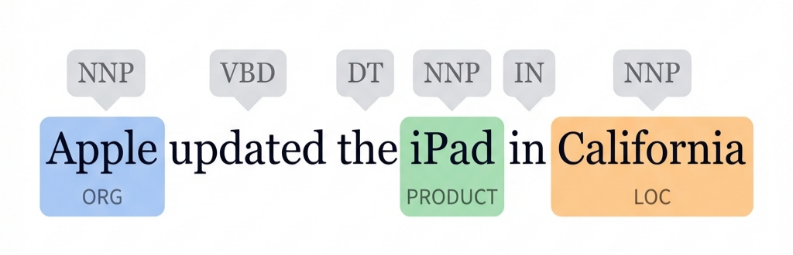

# Linguistic Foundations

*Prerequisite: None (Foundational).*

---

The essence of NLP is enabling computers to understand, process, and generate human language. Linguistics provides the theoretical foundation for all of this — even in the era of large models, these concepts define task boundaries and the upper limits of model capabilities.

## Contents

- [1. Levels of Linguistic Analysis](#1-levels-of-linguistic-analysis)
- [2. Phonetics & Phonology](#2-phonetics--phonology)
- [3. Morphology](#3-morphology)
- [4. Syntax](#4-syntax)
- [5. Semantics](#5-semantics)
- [6. Pragmatics](#6-pragmatics)

## 1. Levels of Linguistic Analysis

Language is a layered system. From low-level sound to high-level intent, each layer provides the foundation for the layer above:

```
Pragmatics            ← True intent in context
  ↑
Semantics             ← Literal meaning
  ↑
Syntax                ← Sentence structure and grammar
  ↑
Morphology            ← Internal structure of words
  ↑
Phonetics/Phonology   ← Sound signals
```

NLP systems operate at different linguistic levels depending on the task. For example, speech recognition primarily deals with the phonetic layer, while dialogue systems must reason at the pragmatic layer.

## 2. Phonetics & Phonology

**Phonetics** studies the sound system of language — how speech sounds are produced, transmitted, and perceived.

- **Phonetics**: The physical properties of sound — waveform frequencies, articulatory positions of phonemes
- **Phonology**: The systematic patterns of sound — syllable structure, tonal patterns

**Role in NLP**:
- Automatic Speech Recognition (ASR / Speech-to-Text): converting acoustic signals to text
- Text-to-Speech (TTS): converting text to spoken language
- Acoustic models depend on understanding phoneme distributions

> In text-focused NLP tasks, phonetics is rarely involved directly, but it is foundational for multimodal systems (e.g., Whisper).

## 3. Morphology

**Morphology** studies the internal structure of words and the rules of word formation.

### 3.1 Core Concepts

- **Morpheme**: The smallest meaningful unit of language
  - Free morphemes: can stand alone (e.g., "book", "run")
  - Bound morphemes: must attach to other morphemes (e.g., "-ing", "un-", "-tion")
- **Derivation**: Changes word meaning or part of speech (e.g., "happy" → "unhappy", "teach" → "teacher")
- **Inflection**: Changes grammatical function without changing meaning (e.g., "run" → "runs" → "running")

### 3.2 Applications in NLP

| Technique | Description | Example |
|:----------|:-----------|:--------|
| **Stemming** | Rule-based suffix stripping to approximate the word root | "running" → "run", "studies" → "studi" |
| **Lemmatization** | Dictionary-based reduction to canonical form | "running" → "run", "better" → "good" |
| **Subword Tokenization** | Splitting words into meaningful sub-units | "uninstagrammable" → "un" + "instagram" + "mable" |

Stemming and Lemmatization are staples of traditional NLP pipelines; subword tokenization (BPE, WordPiece) is the cornerstone of modern LLMs — see [02_Scientist/01_Architecture/04_Tokenizer.md](../../02_Scientist/01_Architecture/04_Tokenizer.md) for details.

## 4. Syntax

**Syntax** studies how words combine to form grammatically valid sentences.

### 4.1 Core Concepts

- **Part-of-Speech (POS)**: The grammatical role of each word — noun, verb, adjective, etc.
- **Phrase Structure**: Sentences are composed of nested phrases (Noun Phrase NP, Verb Phrase VP, etc.)
- **Dependency Relations**: Direct grammatical connections between words (subject, object, modifier, etc.)

### 4.2 Two Methods of Syntactic Analysis

**Constituency Parsing (Phrase Structure Trees)**:

```
         S
        / \
      NP    VP
      |    /   \
     The  V     NP
     cat  ate  the fish
```

**Dependency Parsing (Dependency Trees)**:

```
ate ──→ cat (nsubj)
ate ──→ fish (dobj)
fish ──→ the (det)
cat ──→ The (det)
```

### 4.3 Applications in NLP



- **POS Tagging**: Sequence labeling task (traditional: HMM/CRF; modern: fine-tuned BERT)
- **Dependency Parsing**: Foundation for information extraction and relation extraction
- **Grammar Checking**: Core component of grammar correction systems

## 5. Semantics

**Semantics** studies the meaning of linguistic expressions — from word level to sentence level.

### 5.1 Word-Level Semantics

- **Polysemy**: A single word with multiple related meanings
  - "bank": riverbank / financial institution / storage (blood bank)
- **Word Sense Disambiguation (WSD)**: Determining the correct meaning of a polysemous word based on context
  - "I went to the **bank** to deposit money" → financial institution
  - "The river **bank** was muddy" → riverbank
- **Synonyms and Antonyms**: Semantic relation networks (e.g., WordNet)

### 5.2 Sentence-Level Semantics

- **Semantic Role Labeling (SRL)**: Identifying "who did what to whom"
  - "Alice **gave** Bob a **book**" → Agent: Alice, Theme: book, Recipient: Bob
- **Logical Form**: Mapping natural language to formal representations
- **Textual Entailment**: Determining logical relationships between sentences

### 5.3 Significance in Modern NLP

Traditional WSD required explicit dictionaries and rules; modern Transformers implicitly resolve word sense disambiguation through **contextual embeddings** — the same word receives a different vector representation in different contexts.

## 6. Pragmatics

**Pragmatics** studies the actual meaning of language in specific contexts — beyond literal interpretation.

### 6.1 Core Phenomena

| Phenomenon | Description | Example |
|:-----------|:-----------|:--------|
| **Coreference Resolution** | Determining what a pronoun refers to | "Alice said **she** was tired" → she = Alice |
| **Metaphor** | Non-literal figurative expression | "Time is money" |
| **Irony / Sarcasm** | Saying the opposite of what is meant | "Oh, that's just great" (expressing dissatisfaction) |
| **Speech Acts** | Speaking as action | "It's cold in here" = request to close the window |
| **Implicature** | Implied meaning beyond what is said | "Your essay is... interesting" = possibly not rigorous enough |

### 6.2 Challenges in NLP

Pragmatic understanding is the most difficult level of NLP:
- Sarcasm detection in **sentiment analysis** remains an open challenge
- **Dialogue systems** must understand the user's true intent, not just the literal instruction
- **Large language models** have made significant progress in pragmatic reasoning, but still struggle with metaphor and culturally-dependent pragmatics

---

_Linguistics provides the problem definitions and analytical frameworks for NLP. Next, we move to the technical implementation of NLP — starting with traditional statistical methods._

_Next: [Text Preprocessing](../02_Classical_NLP/01_Text_Preprocessing.md)_
