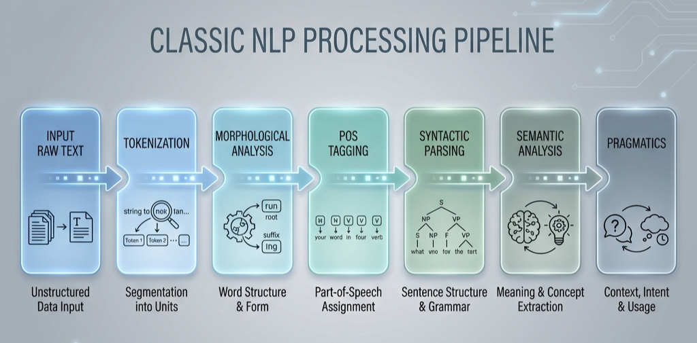

# Text Preprocessing

*Prerequisite: [../01_Linguistics/01_Linguistic_Foundations.md](../01_Linguistics/01_Linguistic_Foundations.md).*

---

Text preprocessing is the first step in any NLP pipeline — transforming raw, unstructured text into normalized input that algorithms can process. The quality of preprocessing directly determines the upper bound of downstream task performance.

## Contents

- [1. The Classic NLP Pipeline](#1-the-classic-nlp-pipeline)
- [2. Tokenization](#2-tokenization)
- [3. Text Normalization](#3-text-normalization)
- [4. Stop Words & Filtering](#4-stop-words--filtering)
- [5. Regular Expressions in NLP](#5-regular-expressions-in-nlp)

## 1. The Classic NLP Pipeline

Traditional NLP uses a stage-by-stage pipeline architecture, where each step provides annotations for subsequent steps:



```
Raw Text → Tokenization → Normalization → Stop Words Removal → Feature Extraction → Model
```

> In the deep learning era, many pipeline steps have been replaced by end-to-end models, but tokenization and text cleaning remain indispensable — even GPT needs a Tokenizer.

## 2. Tokenization

**Tokenization** is the process of splitting continuous text into discrete units (tokens). Different languages and different eras have adopted different strategies:

### 2.1 Rule-based Tokenization

- **English**: Split by whitespace and punctuation (relatively straightforward)
  - `"I don't know."` → `["I", "do", "n't", "know", "."]`
- **Chinese**: No natural delimiters — requires dedicated segmentation algorithms
  - Forward maximum matching, reverse maximum matching
  - Statistical segmentation: jieba uses HMM + Viterbi algorithm
  - `"自然语言处理"` → `["自然语言", "处理"]` or `["自然", "语言", "处理"]`

### 2.2 Subword Tokenization

The mainstream approach in modern LLMs — striking a balance between word-level and character-level:

| Algorithm | Strategy | Representative Models |
|:----------|:---------|:---------------------|
| **BPE** (Byte Pair Encoding) | Start from characters, iteratively merge the most frequent adjacent pairs | GPT family |
| **WordPiece** | Similar to BPE, but selects merges based on likelihood gain | BERT |
| **Unigram** | Start from a large vocabulary, progressively prune low-probability subwords | T5, LLaMA |

For detailed subword tokenization internals, see [02_Scientist/01_Architecture/04_Tokenizer.md](../../02_Scientist/01_Architecture/04_Tokenizer.md).

## 3. Text Normalization

Unifying text into a standard form to reduce meaningless variation:

### 3.1 Case Folding

```
"Natural Language Processing" → "natural language processing"
```

Note: Case information should be preserved for tasks like Named Entity Recognition.

### 3.2 Stemming

Rule-based suffix truncation — crude but fast:

```
Porter Stemmer:
  "running"    → "run"
  "studies"    → "studi"     ← may produce non-words
  "university" → "univers"
```

### 3.3 Lemmatization

Dictionary and morphological analysis-based reduction to canonical form:

```
WordNet Lemmatizer:
  "running" → "run"
  "better"  → "good"
  "studies" → "study"
```

### 3.4 Stemming vs Lemmatization

| Aspect | Stemming | Lemmatization |
|:-------|:---------|:-------------|
| Speed | Fast (pure rules) | Slow (requires dictionary lookup) |
| Accuracy | Low (may produce non-words) | High (guarantees valid words) |
| Use case | Information retrieval, search engines | Text analysis, semantic tasks |

## 4. Stop Words & Filtering

### 4.1 Stop Words

High-frequency but low-information words — "the", "is", "a", "of", etc.

- **Traditional approach**: Remove them to reduce noise and feature dimensionality
- **Modern approach**: LLMs do not remove stop words — the attention mechanism automatically learns to downweight low-information tokens

### 4.2 Other Cleaning Operations

- HTML tag removal
- URL / email address handling
- Number normalization (replace all numbers with `<NUM>`)
- Special character and emoji processing
- Repeated character compression ("soooo goood" → "so good")

## 5. Regular Expressions in NLP

Regular expressions are the "Swiss army knife" of text preprocessing:

### Common Patterns

```python
import re

# Email extraction
emails = re.findall(r'[\w.+-]+@[\w-]+\.[\w.-]+', text)

# URL extraction
urls = re.findall(r'https?://\S+', text)

# Chinese character matching
chinese = re.findall(r'[\u4e00-\u9fff]+', text)

# Remove excess whitespace
clean = re.sub(r'\s+', ' ', text).strip()
```

### Role in NLP Pipelines

Regular expressions are typically used for:
- The first pass of data cleaning (noise removal)
- Rule-based simple NER (e.g., extracting phone numbers, date formats)
- The preprocessing stage of tokenizers

---

_Next: [Feature Engineering](./02_Feature_Engineering.md) — How to convert text into numerical features that machines can process._
