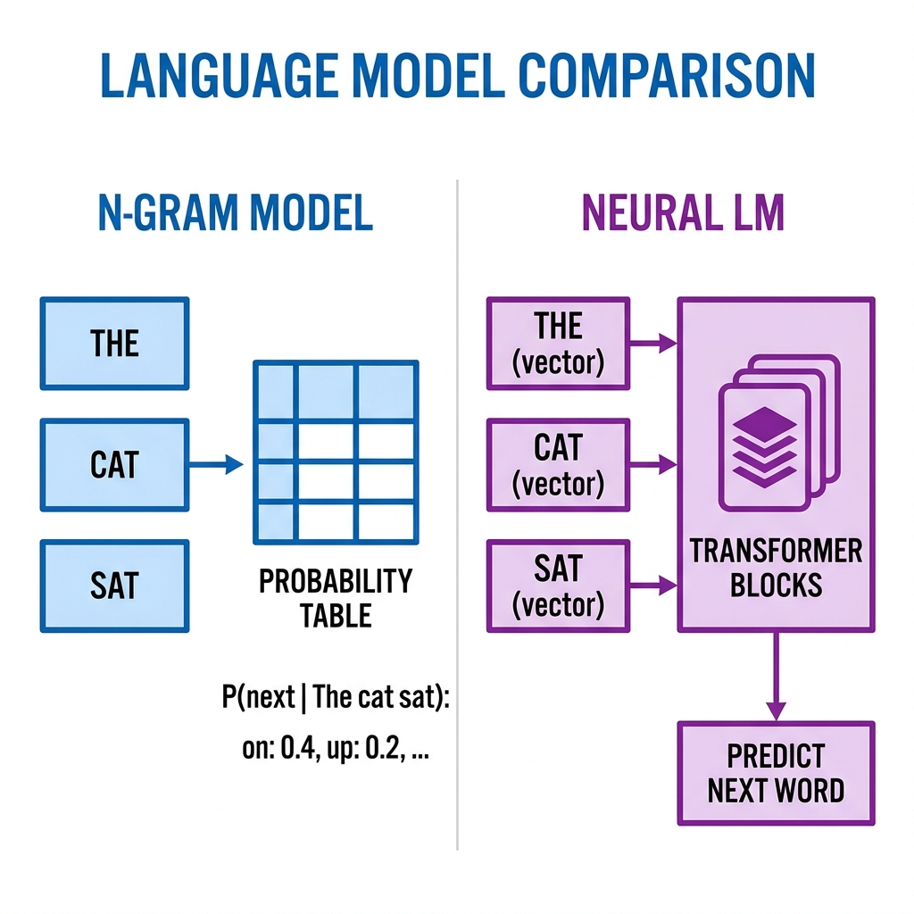
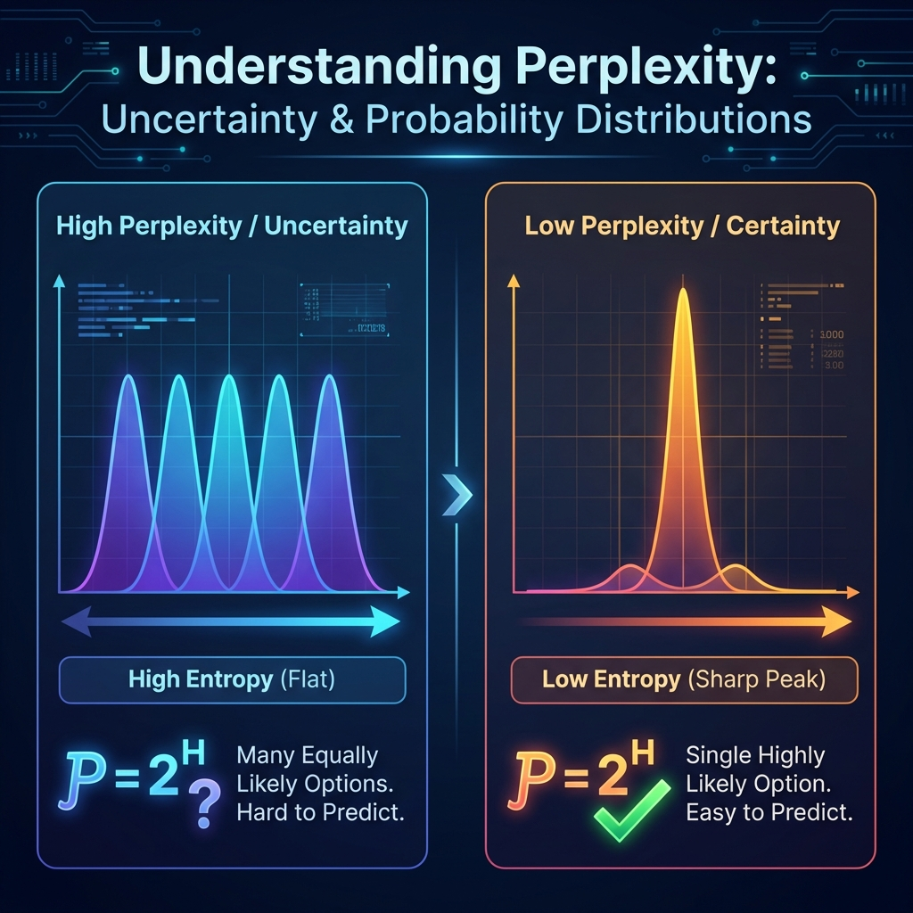

# Feature Engineering

*Prerequisite: [01_Text_Preprocessing.md](01_Text_Preprocessing.md).*

---

Before deep learning, the core challenge of NLP was: **how to convert text into fixed-length numerical vectors** that can be fed into traditional machine learning models. The methods from this era are based on statistical counting — simple but still widely used in lightweight scenarios today.

## Contents

- [1. Bag of Words (BoW)](#1-bag-of-words-bow)
- [2. TF-IDF](#2-tf-idf)
- [3. N-Gram Language Models](#3-n-gram-language-models)

## 1. Bag of Words (BoW)

The simplest text representation: treat a document as a collection of words, ignoring word order, and count frequencies.

### How It Works

```
Document 1: "the cat sat on the mat"
Document 2: "the dog sat on the log"

Vocabulary: [the, cat, sat, on, mat, dog, log]

Document 1 vector: [2, 1, 1, 1, 1, 0, 0]
Document 2 vector: [2, 0, 1, 1, 0, 1, 1]
```

### Characteristics

- **Pros**: Simple implementation, fast computation, highly interpretable
- **Cons**:
  - Loses word order ("dog bites man" and "man bites dog" have the same representation)
  - High-dimensional and sparse (vocabulary can reach tens of thousands, mostly zeros)
  - No semantic capture ("happy" and "glad" have completely orthogonal vectors)

## 2. TF-IDF

**TF-IDF (Term Frequency - Inverse Document Frequency)** adds a "uniqueness" weight on top of BoW — a word that appears frequently in a specific document but rarely across the entire corpus has high discriminative power for that document.

### Formula

$$\text{TF-IDF}(t, d) = \text{TF}(t, d) \times \text{IDF}(t)$$

Where:

$$\text{TF}(t, d) = \frac{\text{count of term } t \text{ in document } d}{\text{total terms in document } d}$$

$$\text{IDF}(t) = \log \frac{\text{total number of documents}}{\text{documents containing term } t + 1}$$

### Intuition

| Scenario | TF | IDF | TF-IDF | Explanation |
|:---------|:---|:----|:-------|:------------|
| "the" in any document | High | Low | **Low** | Appears everywhere, no discriminative power |
| "Transformer" in an AI paper | High | Medium | **High** | Domain-specific keyword |
| "quantum entanglement" in a physics paper | Medium | High | **High** | Highly specialized |

### Applications

- **Search engines**: Core ranking algorithm in traditional search (Elasticsearch's default scoring)
- **Keyword extraction**: Words with the highest TF-IDF are the document's keywords
- **Feature input for classifiers**: Paired with SVM, Logistic Regression, etc.

## 3. N-Gram Language Models

N-Gram models are the ancestor of **language models** — modeling language by counting the probability of the next word given the previous $N-1$ words.



### Mathematical Foundation

The core objective of a language model is to estimate the joint probability of a word sequence:

$$P(w_1, w_2, \dots, w_n) = \prod_{i=1}^n P(w_i | w_1, \dots, w_{i-1})$$

N-Gram simplifies this via the **Markov Assumption**: the current word depends only on the previous $N-1$ words.

### Common N-Grams

| Model | Condition | Example |
|:------|:----------|:--------|
| **Unigram** ($N=1$) | $P(w_i)$ | Completely ignores context |
| **Bigram** ($N=2$) | $P(w_i \| w_{i-1})$ | After "I", likely "am", "have", "think" |
| **Trigram** ($N=3$) | $P(w_i \| w_{i-2}, w_{i-1})$ | After "I am", likely "a", "not", "going" |

### Probability Estimation

Using **Maximum Likelihood Estimation (MLE)**:

$$P(w_n | w_{n-1}) = \frac{C(w_{n-1}, w_n)}{C(w_{n-1})}$$

Where $C(\cdot)$ is the count in the corpus.

### Smoothing

N-Grams unseen in the training corpus receive zero probability (the zero-probability problem). Solutions:

- **Laplace Smoothing**: Add 1 to every count
- **Kneser-Ney Smoothing**: Discount-based with backoff — the most effective method

### Limitations

- **Fixed window**: Can only see the previous $N-1$ words, unable to capture long-range dependencies
- **Data sparsity**: As $N$ grows, possible N-Gram combinations grow exponentially, with most counts being zero
- **No semantic understanding**: Purely based on statistical co-occurrence, with no comprehension of meaning

> These limitations drove the paradigm shift from statistical models to neural language models — replacing discrete count tables with continuous vector spaces.

### Evaluation: Perplexity (PPL)

The standard evaluation metric for language models — measuring how "perplexed" the model is by test data:



$$\text{PPL} = e^{H} = e^{-\frac{1}{N}\sum_{i=1}^N \log P(w_i | w_{<i})}$$

- **Low perplexity**: Model is confident and accurate (sharp probability distribution)
- **High perplexity**: Model is confused and uncertain (flat probability distribution)

---

_Next: [Statistical Models](./03_Statistical_Models.md) — Classical machine learning approaches to NLP tasks._
