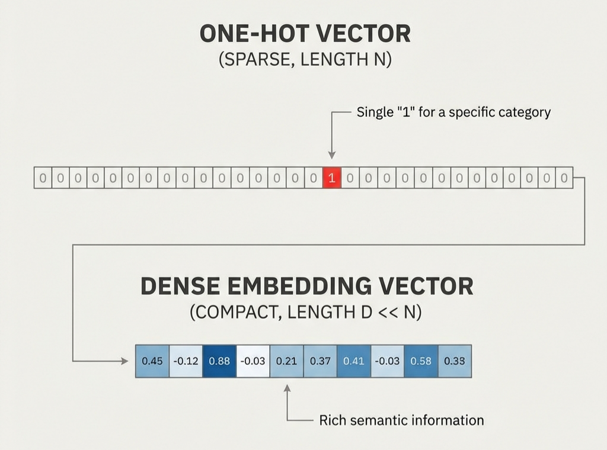
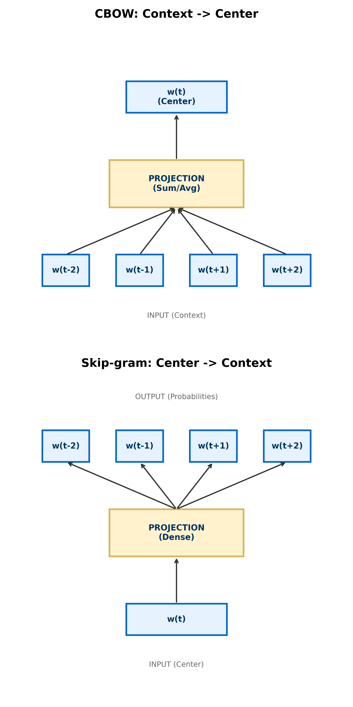
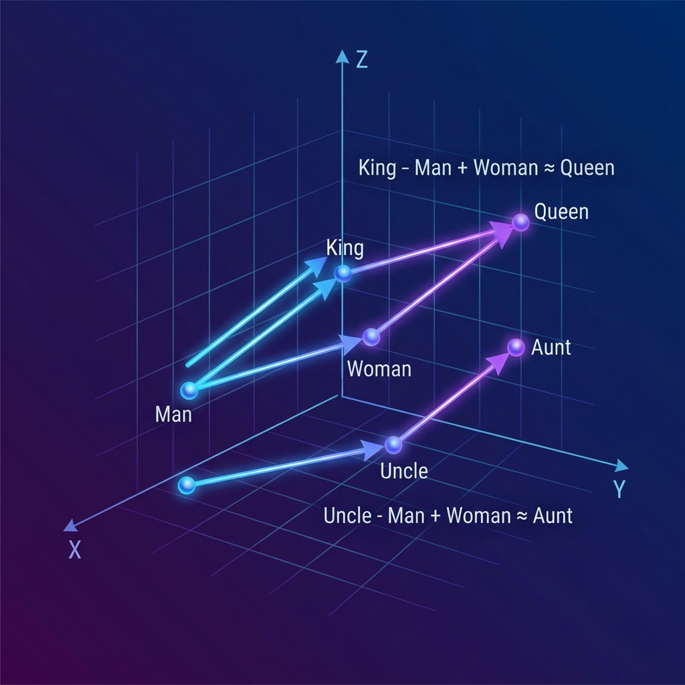

# Word Embeddings

*Prerequisite: [../02_Classical_NLP/03_Statistical_Models.md](../02_Classical_NLP/03_Statistical_Models.md).*

---

Word embeddings achieved the leap from "discrete symbols" to "continuous vectors" in NLP — giving words the ability to participate in mathematical operations. This marks the starting point of the deep learning era in NLP.

## Contents

- [1. The Distributional Hypothesis](#1-the-distributional-hypothesis)
- [2. One-Hot vs Dense Embeddings](#2-one-hot-vs-dense-embeddings)
- [3. Word2Vec](#3-word2vec)
- [4. GloVe](#4-glove)
- [5. FastText](#5-fasttext)
- [6. Semantic Arithmetic](#6-semantic-arithmetic)
- [7. Limitations of Static Embeddings](#7-limitations-of-static-embeddings)

## 1. The Distributional Hypothesis

> _"You shall know a word by the company it keeps"_ — J.R. Firth, 1957

The theoretical foundation of all modern word vectors: **words that appear in similar contexts tend to have similar meanings**.

- "The cat sat on the sofa" / "The dog sat on the sofa" → "cat" and "dog" share similar context → their vectors should be close
- This hypothesis transforms a semantic problem into a statistical co-occurrence problem

## 2. One-Hot vs Dense Embeddings



| Aspect | One-Hot | Dense Embedding |
|:-------|:--------|:----------------|
| Dimension | Vocabulary size $V$ (can be 50K+) | Fixed dimension (typically 100-300) |
| Sparsity | Extremely sparse (only one 1) | Dense (all floating-point values) |
| Semantic info | None (all words are pairwise orthogonal) | Yes (similar words have closer vectors) |
| Compute efficiency | Low (high-dimensional sparse matrices) | High (low-dimensional dense operations) |

## 3. Word2Vec

Word2Vec (Mikolov et al., 2013) pioneered the "learn word vectors by prediction" paradigm, using shallow neural networks to map words into a dense vector space.



### 3.1 CBOW (Continuous Bag-of-Words)

Predicts the center word from surrounding context words:

$$P(w_t | w_{t-c}, \dots, w_{t-1}, w_{t+1}, \dots, w_{t+c})$$

- Faster training, better for large corpora
- Works better for frequent words

### 3.2 Skip-gram

Predicts surrounding context words from the center word:

$$P(w_{t+j} | w_t), \quad -c \leq j \leq c, \; j \neq 0$$

- Better for rare words and smaller datasets
- More commonly used in practice

### 3.3 Negative Sampling

Full-vocabulary Softmax has $O(V)$ computational cost. Negative Sampling reduces this to binary classification:

- Each step updates only 1 positive sample (true context word) + $K$ negative samples (randomly sampled words)
- Reduces complexity from $O(V)$ to $O(K)$, where $K$ is typically 5-20
- Dramatically accelerates training while maintaining vector quality

## 4. GloVe

**GloVe (Global Vectors)** (Pennington et al., 2014) takes a different approach — leveraging global co-occurrence statistics.

### Core Idea

- First build a global **word-word co-occurrence matrix** $X$, where $X_{ij}$ counts how often word $i$ and word $j$ appear together within a window
- Training objective: make word vector dot products approximate the log of co-occurrence counts

$$\vec{w}_i \cdot \vec{w}_j + b_i + b_j = \log(X_{ij})$$

### vs Word2Vec

| Aspect | Word2Vec | GloVe |
|:-------|:---------|:------|
| Information source | Local context window | **Global co-occurrence statistics** |
| Training method | Online prediction (SGD) | Matrix factorization |
| Strength | Captures local syntactic patterns | Captures global semantic relationships |

In practice, both perform similarly. GloVe's pre-trained vectors (Wikipedia + Gigaword) have been widely adopted.

## 5. FastText

**FastText** (Bojanowski et al., 2017, Facebook) builds on Word2Vec by incorporating **subword information**.

### Core Improvement

Each word is represented as the sum of its character N-gram vectors:

```
"where" (n=3) → {"<wh", "whe", "her", "ere", "re>"}

vec("where") = vec("<wh") + vec("whe") + vec("her") + vec("ere") + vec("re>")
```

### Key Advantages

- **Handles OOV (Out-of-Vocabulary) words**: Even if "uninstagrammable" was never seen during training, a representation can be composed from known subword vectors
- **Morphologically rich languages**: Significant improvements for agglutinative languages like Turkish and Finnish
- **Spelling variant tolerance**: Misspelled words still receive reasonable vectors

## 6. Semantic Arithmetic

A fascinating emergent property of word vector spaces — relationships can be discovered through vector arithmetic:



$$\vec{King} - \vec{Man} + \vec{Woman} \approx \vec{Queen}$$

More examples:
- $\vec{Paris} - \vec{France} + \vec{Japan} \approx \vec{Tokyo}$
- $\vec{bigger} - \vec{big} + \vec{small} \approx \vec{smaller}$

This demonstrates that word vectors capture meaningful semantic relationship dimensions (gender, country-capital, comparative degree, etc.).

## 7. Limitations of Static Embeddings

Whether Word2Vec, GloVe, or FastText, they are all **static word vectors** — each word has exactly one fixed vector representation:

- **Polysemy problem**: "bank" (riverbank) and "bank" (financial institution) share the same vector
- **Context-independent**: Unable to adjust word meaning based on surrounding context
- **No syntactic information**: Word vectors do not encode grammatical roles

> These limitations directly gave rise to **contextual embeddings** in the Transformer era — BERT and GPT generate different vectors for the same word in different sentences. This is covered in [04_Transformer_Era](../04_Transformer_Era/).

---

_Next: [Sequence Models](./02_Sequence_Models.md) — From word vectors to sequence modeling: how RNNs process variable-length word sequences._
