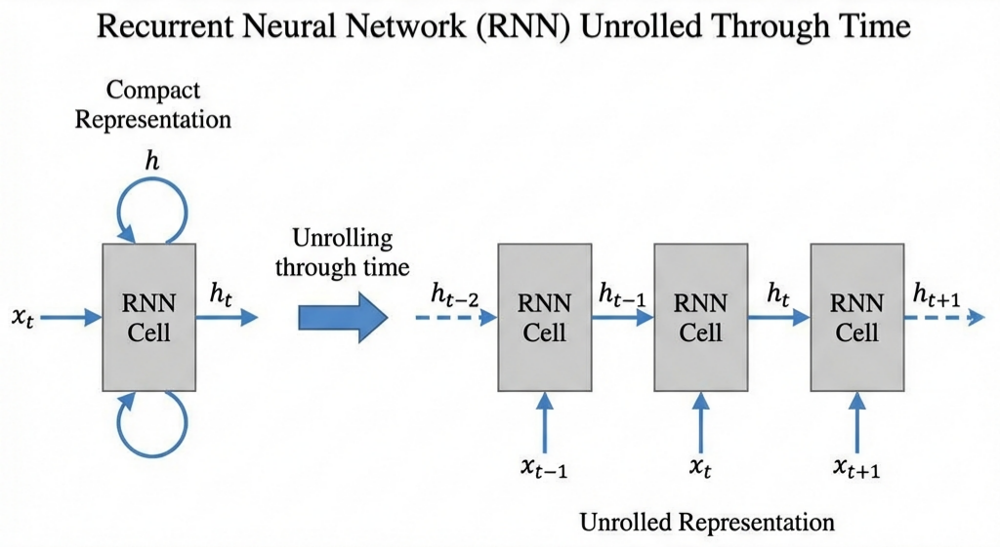
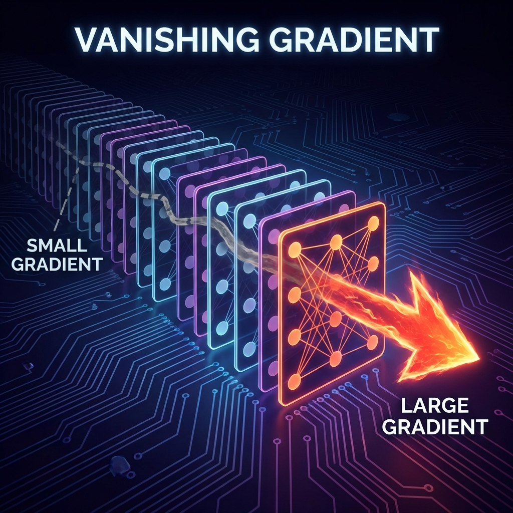
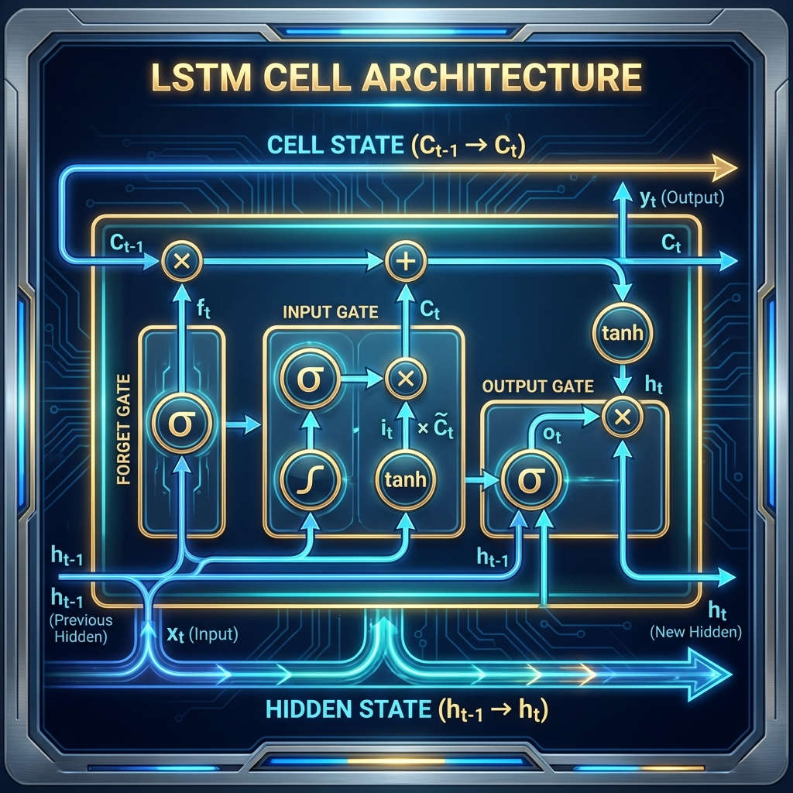

# Sequence Models

*Prerequisite: [01_Word_Embeddings.md](01_Word_Embeddings.md).*

---

With word vectors in hand, the next question is: **how do we model sequences of words?** Natural language is ordered — "dog bites man" and "man bites dog" have entirely different meanings. This chapter introduces three deep learning architectures for processing sequences.

## Contents

- [1. RNN: Unrolling Through Time](#1-rnn-unrolling-through-time)
- [2. The Vanishing Gradient Problem](#2-the-vanishing-gradient-problem)
- [3. LSTM & GRU: Gated Architectures](#3-lstm--gru-gated-architectures)
- [4. CNN for Text](#4-cnn-for-text)

## 1. RNN: Unrolling Through Time

A **Recurrent Neural Network (RNN)** processes a sequence by maintaining a **Hidden State** ($h_t$) that compresses historical information and passes it forward step by step.



### Recurrence Formula

$$h_t = f(W_h h_{t-1} + W_x x_t + b)$$

- $x_t$: Input at time step $t$ (a word vector)
- $h_{t-1}$: Hidden state from the previous step ("memory")
- $W_h, W_x$: Shared weight matrices (the same parameters are reused at every step)

### Characteristics

- Theoretically handles sequences of **arbitrary length**
- Parameter sharing makes the model compact
- **Sequential processing**: $h_t$ depends on $h_{t-1}$ — cannot be parallelized → limits training and inference speed

## 2. The Vanishing Gradient Problem

The most critical flaw of RNNs — gradients decay exponentially along the time dimension during backpropagation.



### Cause

Backpropagation requires chaining derivatives of $W_h$ across time steps:

$$\frac{\partial h_t}{\partial h_1} = \prod_{k=2}^{t} \frac{\partial h_k}{\partial h_{k-1}}$$

- If $\|W_h\| < 1$: gradients shrink exponentially → **vanishing gradient** (distant information cannot influence weight updates)
- If $\|W_h\| > 1$: gradients explode exponentially → **exploding gradient** (mitigated by Gradient Clipping)

### Consequence

- In practice, the model can only remember the most recent **10-20** steps
- "The cat, which had been sleeping on the warm mat all afternoon, suddenly **jumped**" → RNN may fail to associate "jumped" with "cat"

## 3. LSTM & GRU: Gated Architectures

The core idea behind gating: **let the network learn when to remember and when to forget**.

### 3.1 LSTM (Long Short-Term Memory)

LSTM introduces a **Cell State** ($C_t$) separate from the hidden state — a gate-protected information highway.



**Three Gates:**

| Gate | Function | Intuition |
|:-----|:---------|:----------|
| **Forget Gate** | Decides what to discard from the Cell State | "Context has changed, forget the old subject" |
| **Input Gate** | Decides what new information to write to the Cell State | "This new noun is important, remember it" |
| **Output Gate** | Decides what part of the Cell State to output as $h_t$ | "Need the subject info right now, output it" |

The Cell State bypasses continuous matrix multiplications via gating, allowing gradients to flow through directly → effectively mitigates vanishing gradients.

### 3.2 GRU (Gated Recurrent Unit)

GRU is a simplified LSTM — merging the forget and input gates into a single **Update Gate** and removing the separate Cell State.

| Comparison | LSTM | GRU |
|:-----------|:-----|:----|
| Number of gates | 3 | 2 (Update Gate + Reset Gate) |
| Separate Cell State | Yes | No (uses hidden state directly) |
| Parameter count | Higher | Lower |
| Performance | Slightly better on long sequences | Comparable on short sequences |
| Training speed | Slower | Faster |

In practice, both perform similarly on most tasks. GRU is preferred when the parameter budget is limited.

## 4. CNN for Text

**Convolutional Neural Networks**, famous for image processing, have also been successfully applied to text classification — using convolutional kernels to extract local N-gram features.

### Core Idea

Treat text as a one-dimensional "image": each row is a word's embedding vector, and convolutional kernels slide along the sequence dimension.

```
Input matrix (5 words × 300d embedding):
┌───────────────────────┐
│ The    [0.1, 0.3, …]  │  ─┐
│ movie  [0.4, 0.2, …]  │   ├─ Conv kernel (size=3)
│ was    [0.2, 0.5, …]  │  ─┘
│ really [0.3, 0.1, …]  │
│ great  [0.8, 0.4, …]  │
└───────────────────────┘
```

### TextCNN (Kim, 2014)

TextCNN uses multiple convolutional kernels of different sizes in parallel:

- **Kernel size=2**: Captures Bigram patterns ("very good", "not bad")
- **Kernel size=3**: Captures Trigram patterns ("not at all")
- **Kernel size=4**: Captures longer phrase patterns
- **Max Pooling**: Takes the maximum value from each kernel's output → fixed-length feature vector
- **Fully connected layer + Softmax**: Classification

### CNN vs RNN for Text

| Aspect | CNN | RNN/LSTM |
|:-------|:----|:---------|
| Strength | Short-range pattern extraction | Long-range dependency modeling |
| Parallelism | High (convolutions parallelize) | Low (sequential processing) |
| Suited for | Text classification, sentiment analysis | Sequence labeling, machine translation |
| Speed | Fast | Slow |

### Fundamental Limitations of RNN-family Models

Despite LSTM/GRU mitigating the vanishing gradient problem, RNN-family models have two fundamental bottlenecks:

1. **Sequential computation**: $h_t$ depends on $h_{t-1}$ — cannot leverage GPU parallelism
2. **Information bottleneck**: Long sequence information must pass through a fixed-dimension hidden state with limited capacity

> These two bottlenecks directly gave rise to the next chapter's protagonist — the **Attention Mechanism**.

---

_Next: [Seq2Seq](./03_Seq2Seq.md) — The Encoder-Decoder architecture and early machine translation._
