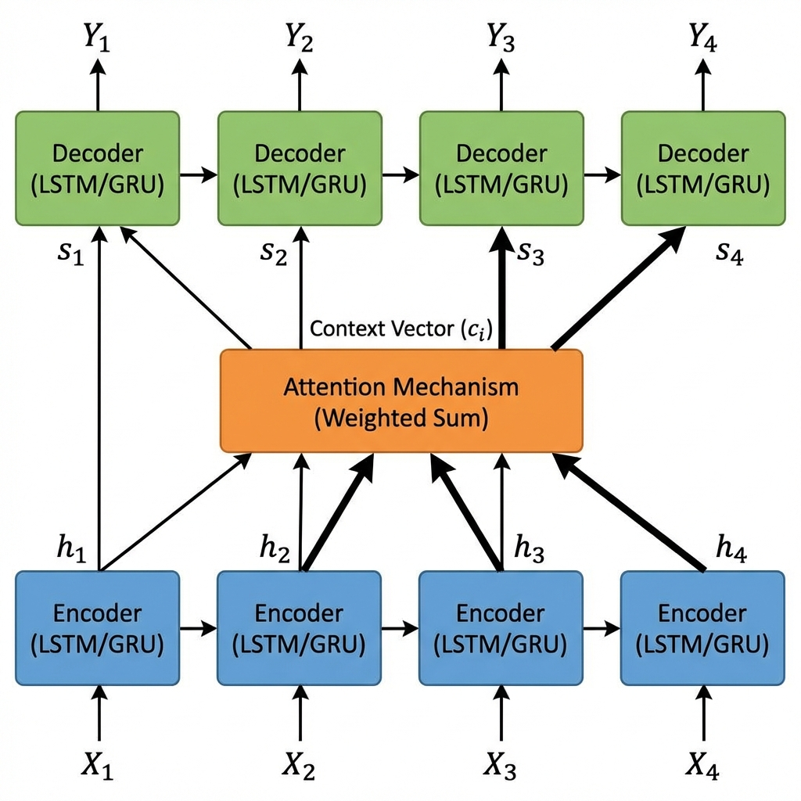
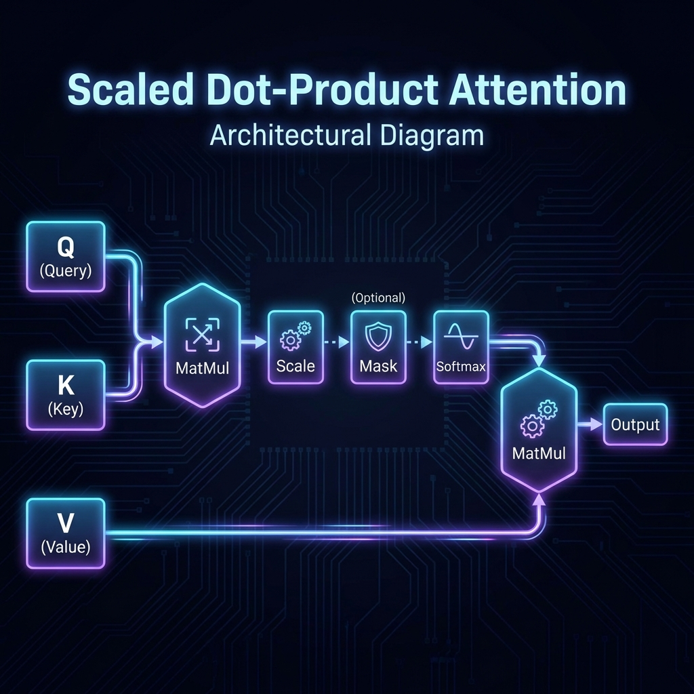

# Attention Mechanism

*Prerequisite: [../03_Deep_Learning/03_Seq2Seq.md](../03_Deep_Learning/03_Seq2Seq.md).*

---

Attention is the "soul" of modern NLP — it allows models to **dynamically focus** on the most relevant parts of the input, breaking through the information bottleneck of RNNs entirely.

## Contents

- [1. From Seq2Seq Bottleneck to Attention](#1-from-seq2seq-bottleneck-to-attention)
- [2. Scaled Dot-Product Attention: Q, K, V](#2-scaled-dot-product-attention-q-k-v)
- [3. Self-Attention](#3-self-attention)
- [4. The Road to Transformer](#4-the-road-to-transformer)

## 1. From Seq2Seq Bottleneck to Attention

In standard Seq2Seq, the Encoder's entire information is compressed into a single fixed vector. **Attention** (Bahdanau et al., 2014) introduces a key improvement: the Decoder can "look back" at **all** Encoder hidden states at every generation step.



### Workflow

1. The Encoder outputs hidden states at every time step: $h_1, h_2, \dots, h_T$
2. At each Decoder step $t$, compute a **relevance score** between the current Decoder state and each Encoder hidden state
3. Normalize scores into **attention weights** (softmax)
4. Compute a weighted sum of Encoder hidden states to get the context vector $c_t$ for this step

$$\alpha_{t,i} = \frac{\exp(\text{score}(s_t, h_i))}{\sum_j \exp(\text{score}(s_t, h_j))}$$

$$c_t = \sum_i \alpha_{t,i} h_i$$

- Each step's $c_t$ is different — the model dynamically selects what to focus on based on current needs

## 2. Scaled Dot-Product Attention: Q, K, V

The Transformer (Vaswani et al., 2017) distilled Attention into an elegant **Query-Key-Value** framework:



Three roles:

| Vector | Meaning | Intuition |
|:-------|:--------|:----------|
| **Query (Q)** | What I'm looking for | A search query |
| **Key (K)** | What I can offer | An index label |
| **Value (V)** | My actual content | The stored information |

### The Formula

$$\text{Attention}(Q, K, V) = \text{softmax}\left(\frac{QK^T}{\sqrt{d_k}}\right)V$$

### The Scaling Factor $\sqrt{d_k}$

When dimension $d_k$ is large, $QK^T$ values become very large, pushing softmax into saturation (gradients approach 0). Dividing by $\sqrt{d_k}$ keeps dot products in a reasonable range.

## 3. Self-Attention

Self-Attention is a special form of Attention — **the sequence interacts with itself**: Q, K, and V all come from the same sequence.

### Core Capabilities

**Contextual understanding**:

> "The animal didn't cross the street because **it** was too tired."

Self-Attention allows "it" to compute relevance with every other word in the sequence, strongly associating "it" with "animal" rather than "street."

**Parallel computation**:

- RNN: $h_t$ depends on $h_{t-1}$ — must be processed sequentially
- Self-Attention: All attention scores are computed **simultaneously** — fully parallel
- This is the key enabler for Transformer's massive scaling

### Computational Complexity

- Time: $O(n^2 \cdot d)$, where $n$ is sequence length and $d$ is dimension
- Space: $O(n^2)$ (the attention matrix)
- When $n$ is large (long text), this becomes a bottleneck → spawning various efficient attention variants (see [02_Scientist/01_Architecture/03_Efficient_Attention.md](../../02_Scientist/01_Architecture/03_Efficient_Attention.md))

## 4. The Road to Transformer

The evolution of Attention:

```
Soft Attention (2014, Bahdanau)    — Auxiliary to RNNs in Seq2Seq
       ↓
Self-Attention (2017, Vaswani)     — Global interaction within a sequence
       ↓
Transformer (2017)                 — Architecture built entirely on Attention
       ↓
BERT / GPT (2018)                  — The pre-training era begins
```

Attention evolved from an "auxiliary module for RNNs" to the core of the entire architecture — the next chapter covers how the Transformer assembles Self-Attention into a complete neural network architecture.

---

_Next: [Transformer](./02_Transformer.md) — The fully attention-based modern architecture._
