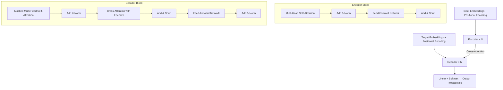

# Transformer Architecture

*Prerequisite: [01_Attention.md](01_Attention.md).*

---

The Transformer (Vaswani et al., 2017, "Attention Is All You Need") completely abandons RNNs and CNNs, building entirely on Self-Attention. It achieves highly parallel computation and long-range dependency modeling, becoming the foundational architecture of modern LLMs.

This chapter provides an architectural overview. Component details (efficient attention, positional encoding variants, KV Cache, etc.) are covered in [02_Scientist/01_Architecture/](../../02_Scientist/01_Architecture/).

## Contents

- [1. Architecture Overview](#1-architecture-overview)
- [2. Key Components](#2-key-components)
- [3. Why Transformer Wins](#3-why-transformer-wins)
- [4. Static vs Contextual Representations](#4-static-vs-contextual-representations)

## 1. Architecture Overview

The Transformer consists of an **Encoder** and a **Decoder**, each containing $N$ identical stacked layers (Blocks):

### Encoder

- Input: Source sequence → Embedding + Positional Encoding
- Each layer: Self-Attention → Add & Norm → FFN → Add & Norm
- Output: Contextualized representations of the source sequence

### Decoder

- Input: Target sequence (during training) / previously generated tokens (during inference)
- Each layer: **Masked** Self-Attention → Cross-Attention (interacts with Encoder) → FFN
- Masked: The Decoder can only attend to the current and preceding positions — prevents "peeking" at the future

## 2. Key Components

### 2.1 Multi-Head Attention (MHA)

Splits Q, K, V into $H$ heads, each computing attention independently before concatenation:

$$\text{MultiHead}(Q,K,V) = \text{Concat}(\text{head}_1, \dots, \text{head}_H)W^O$$

- Each head can learn to attend to different linguistic features (syntactic relations, semantic similarity, coreference, etc.)
- Multi-head mechanism increases the model's representational power

### 2.2 Positional Encoding

The Transformer is permutation-invariant — without positional encoding, "cat eats fish" and "fish eats cat" would have identical representations.

The original Transformer uses sinusoidal positional encoding:

$$PE_{(pos, 2i)} = \sin(pos / 10000^{2i/d})$$
$$PE_{(pos, 2i+1)} = \cos(pos / 10000^{2i/d})$$

> Modern LLMs have developed more efficient positional encoding schemes such as RoPE and ALiBi — see [02_Scientist/01_Architecture/06_Position_Encoding.md](../../02_Scientist/01_Architecture/06_Position_Encoding.md).

### 2.3 Residual Connections & Layer Normalization

$$\text{Output} = \text{LayerNorm}(x + \text{Sublayer}(x))$$

- **Residual Connections**: Allow gradients to "skip" sublayers and flow directly, supporting deep network training
- **Layer Normalization**: Normalizes across the feature dimension, stabilizing the training process

### 2.4 Feed-Forward Network (FFN)

A position-wise fully connected network applied after Attention in each layer:

$$\text{FFN}(x) = \text{ReLU}(xW_1 + b_1)W_2 + b_2$$

- Processes each token independently (no inter-token interaction)
- Role: After Attention handles token-to-token interaction, FFN applies a non-linear transformation to each token's representation
- Hidden dimension is typically 4× the model dimension

## 3. Why Transformer Wins

| Dimension | RNN/LSTM | Transformer |
|:----------|:---------|:------------|
| Parallelism | Sequential processing, no parallelism | **Fully parallel** |
| Long-range dependencies | Information decays over many steps | **Direct connection at any distance** ($O(1)$ path) |
| Training efficiency | Low GPU utilization | **Highly optimized for GPU parallelism** |
| Scalability | Difficult to scale up | **Scaling Law: bigger is better** |

These advantages made "scaling up" a viable strategy — parameters grew from hundreds of millions (BERT) to trillions (GPT-4), with continuous performance improvements.

## 4. Static vs Contextual Representations

The fundamental shift brought by Transformers — from **static** word vectors to **contextualized** representations:

| Type | Representatives | "bank" representation |
|:-----|:---------------|:---------------------|
| **Static** | Word2Vec, GloVe | **Identical** in "river bank" and "bank account" |
| **Contextual** | BERT, GPT | **Dynamically different** — "bank" gets a distinct vector in each sentence |

This means:
- Polysemy is implicitly resolved
- Each token's representation encodes contextual information from the entire sentence
- Downstream tasks no longer require complex feature engineering

---

_The Transformer is a general architecture. Different pre-training strategies produce different model paradigms on top of it — this is the final step toward LLMs._

_Next: [Pre-Training Paradigms](./03_Pre_Training_Paradigms.md) — BERT, GPT, and T5: three paradigms at a glance._
