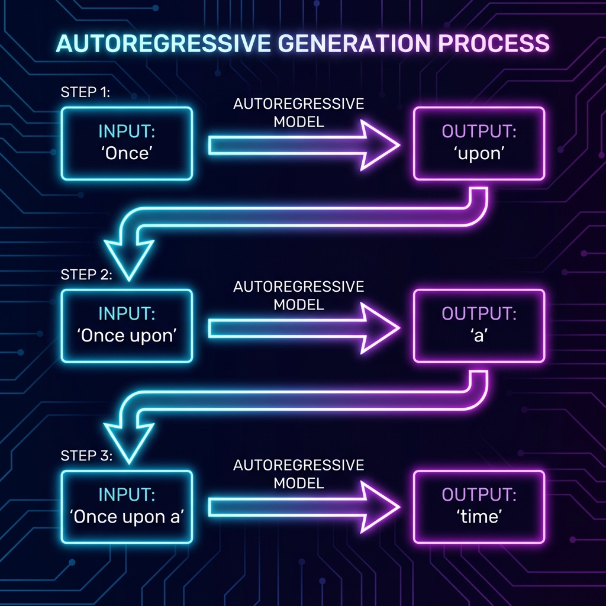

# Pretrain Paradigms: BERT, GPT & T5

*Prerequisite: [02_Transformer.md](02_Transformer.md).*

---

The Transformer is a universal "engine." Different **pre-training objectives** and **architecture choices** produce three distinct model paradigms on the same engine — they define the landscape of modern NLP and serve as the gateway to Large Language Models.

## Contents

- [1. The Pretrain-Finetune Paradigm](#1-the-pretrain-finetune-paradigm)
- [2. Encoder-only: BERT](#2-encoder-only-bert)
- [3. Decoder-only: GPT](#3-decoder-only-gpt)
- [4. Encoder-Decoder: T5 & BART](#4-encoder-decoder-t5--bart)
- [5. Paradigm Comparison](#5-paradigm-comparison)
- [6. Bridge to LLM](#6-bridge-to-llm)

## 1. The Pretrain-Finetune Paradigm

After 2018, NLP entered the **"Pretrain + Finetune"** era — first learn general language capabilities on massive unlabeled text, then adapt to specific tasks with a small amount of labeled data.

```
Phase 1: Pre-training (Unsupervised)
  Massive text (Wikipedia, Common Crawl, Books)
       ↓
  General language model (learns grammar, semantics, world knowledge)

Phase 2: Fine-tuning (Supervised)
  Small labeled dataset (sentiment analysis, NER, translation)
       ↓
  Task-specific model
```

The three major instantiations of this paradigm — BERT, GPT, and T5 — each use different parts of the Transformer.

## 2. Encoder-only: BERT

**BERT (Bidirectional Encoder Representations from Transformers)** (Devlin et al., 2018)

### Architecture

Uses only the Transformer **Encoder** — performs **bidirectional** encoding of the input sequence. Each token can simultaneously see all context to its left and right.

### Pre-training Objectives

**Masked Language Model (MLM)** — "Fill in the blank":

```
Input:  "The [MASK] sat on the mat"
Target: Predict [MASK] = "cat"
```

- Randomly masks 15% of tokens and trains the model to predict the masked words
- Bidirectional context enables the model to leverage both left and right information

**Next Sentence Prediction (NSP)**:
- Predicts whether two sentences are consecutive (later research showed NSP's contribution is limited)

### Strengths (NLU — Natural Language Understanding)

- Text classification (sentiment analysis, intent recognition)
- Sequence labeling (NER, POS Tagging)
- Sentence pair tasks (semantic similarity, natural language inference)
- Reading comprehension (extractive question answering)

### Limitations

- **Cannot generate text**: The Encoder has no autoregressive decoding capability
- Bidirectional encoding makes it unsuitable for "word-by-word generation" scenarios

## 3. Decoder-only: GPT

**GPT (Generative Pre-trained Transformer)** (Radford et al., 2018)

### Architecture

Uses only the Transformer **Decoder** (without Cross-Attention layers) — processes **unidirectionally** from left to right. Each token can only see itself and the context to its left.

### Pre-training Objective

**Causal Language Modeling (CLM)** — "Next word prediction":

```
Input:  "The cat sat on"
Target: Predict the next word "the"
```

$$\mathcal{L} = -\sum_t \log P(w_t | w_1, \dots, w_{t-1})$$

- Predicts the next token from left to right
- Naturally suited for text generation tasks



### Strengths (NLG — Natural Language Generation)

- Text generation (continuation, creative writing)
- Dialogue (the foundation of ChatGPT)
- Code generation (Copilot / Codex)
- Emergent In-Context Learning after scaling (GPT-3)

### GPT Evolution

| Model | Parameters | Key Breakthrough |
|:------|:-----------|:-----------------|
| GPT-1 (2018) | 117M | Validated the pretrain + finetune paradigm |
| GPT-2 (2019) | 1.5B | Zero-shot capabilities emerged |
| GPT-3 (2020) | 175B | In-Context Learning, Few-shot |
| GPT-4 (2023) | Undisclosed | Multimodal, qualitative leap in reasoning |

## 4. Encoder-Decoder: T5 & BART

### T5 (Text-to-Text Transfer Transformer)

Unifies **all NLP tasks as "text in → text out"**:

```
Translation:   "translate English to French: The cat is on the mat" → "Le chat est sur le tapis"
Classification: "sst2 sentence: This movie is great" → "positive"
Summarization:  "summarize: [long text]" → "[summary]"
```

### BART (Bidirectional and Auto-Regressive Transformer)

- Encoder uses bidirectional attention (like BERT)
- Decoder uses autoregressive attention (like GPT)
- Pre-training: Applies noise to input (deletion, shuffling, masking), Decoder reconstructs the original

### Strengths

- Text summarization (Encoder understands the full text, Decoder generates the summary)
- Machine translation (the classic Seq2Seq task)
- Generative question answering (input: question + context, output: answer)

## 5. Paradigm Comparison

| Dimension | Encoder-only (BERT) | Decoder-only (GPT) | Encoder-Decoder (T5) |
|:----------|:-------------------|:-------------------|:---------------------|
| Attention direction | Bidirectional | Unidirectional (left-to-right) | Encoder bidirectional + Decoder unidirectional |
| Pre-training objective | MLM (fill in the blank) | CLM (next word prediction) | Span Corruption / Denoising |
| Core capability | **Understanding** (NLU) | **Generation** (NLG) | **Understanding + Generation** |
| Representative models | BERT, RoBERTa, ModernBERT | GPT, LLaMA, Qwen | T5, BART, mT5 |
| Typical tasks | Classification, NER, QA | Dialogue, continuation, code | Translation, summarization |
| Scaling trend | Stabilizing (< 1B) | **Mainstream direction** (1B → 1T+) | Used in specific scenarios |

## 6. Bridge to LLM

The current mainstream LLM direction is **Decoder-only** (GPT series, LLaMA, Qwen, etc.), for the following reasons:

1. **Unified generative paradigm**: A single model adapts to all tasks via prompting — no task-specific architectural modifications needed
2. **Scaling Law friendly**: Decoder-only performance improvements are most predictable as parameters and data scale up
3. **Emergent abilities**: Beyond certain scale thresholds, capabilities like In-Context Learning and Chain-of-Thought reasoning emerge

From here, NLP enters the **"Large Language Model"** era — for in-depth LLM architecture, training, alignment, and deployment knowledge, proceed to the [02_Scientist](../../02_Scientist/) track.

---

_Next: [Text Classification](../05_Applications/01_Text_Classification.md) — The first of the NLP industrial application chapters._
