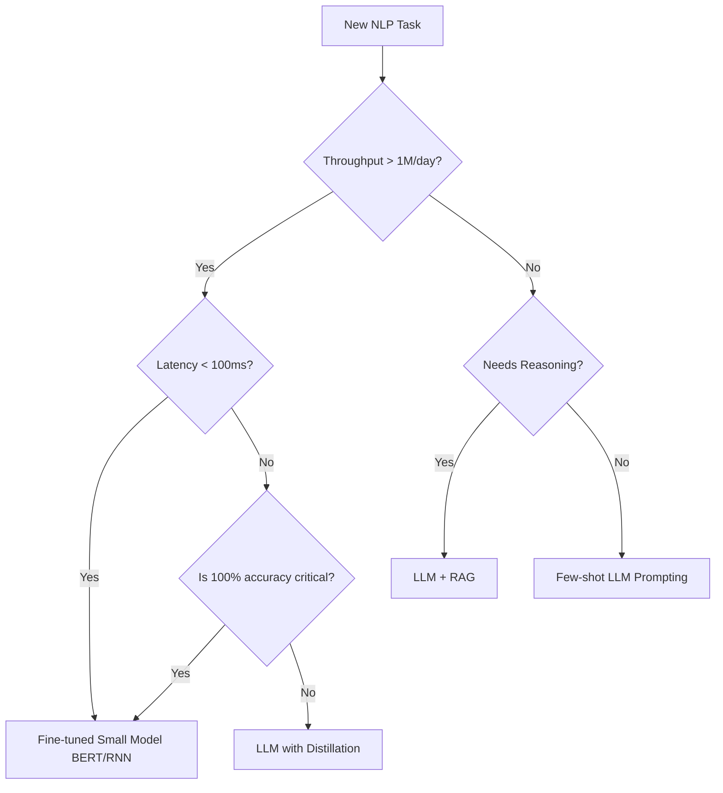

# The LLM Disruption Map

*Prerequisite: [../04_Transformer_Era/03_Pre_Training_Paradigms.md](../04_Transformer_Era/03_Pre_Training_Paradigms.md).*

---

LLMs have fundamentally changed which tasks require specialized models versus which can be handled by prompting. This map provides a strategic guide for choosing the right architecture.

## 1. Tasks Largely Subsumed by LLMs

For these tasks, LLMs are now the default starting point due to their high zero-shot performance.

| Task | Why LLMs Win | Industrial Example |
|:-----|:------------|:-------------------|
| **Open-domain QA** | World knowledge + RAG | Perplexity, Google Search (SGE) |
| **Summarization** | Capture meaning better than ROUGE | Zoom/Teams meeting notes |
| **Code Generation** | Understanding logic and syntax | GitHub Copilot, Cursor |
| **Creative Writing** | Nuance, tone, and style | Copy.ai, Jasper |
| **Translation (High-resource)** | Style-aware translation | DeepL (LLM-based), GPT-4 |

## 2. Tasks Where Specialized Models Still Dominate

Specialized models (BERT-class, CNN, or simple ML) remain the workhorses for industrial-scale utility.

| Task | Why Specialists Win | Metric that Matters |
|:-----|:-------------------|:-------------------|
| **High-volume Classification** | 100x cheaper per inference | Cost/Query |
| **Real-time Moderation** | < 50ms latency vs. > 1s for LLM | P99 Latency |
| **High-precision IE** | Deterministic, no hallucinations | F1-Score |
| **On-device NLP** | Fits in < 100MB RAM | Model Size |
| **Search Retrieval** | Scoring billions of items | Throughput (QPS) |

## 3. The Emerging Hybrid Pattern (LLM-as-a-Teacher)

The modern industrial workflow often involves **distilling** LLM capabilities into specialized models:

```
Step 1: Use LLM (e.g., GPT-4) to label 1M samples (Silver Data).
Step 2: Train a small model (e.g., DistilBERT) on this data.
Step 3: Deploy the small model for production-scale inference.
```

## 4. The Practical Decision Flow



## 5. Economic & Engineering Trade-offs

| Factor | Specialized Model (BERT) | LLM (GPT-4/Claude) |
|:-------|:-------------------------|:-------------------|
| **Data Required** | High (1k-10k labeled) | Low (0-10 shots) |
| **Inference Cost** | Very Low ($0.00001) | High ($0.01) |
| **Latency** | Low (5-50ms) | High (500ms-5s) |
| **Hardware** | Small GPU or even CPU | Large A100/H100 clusters |
| **Agility** | Slow (Retraining required) | High (Prompt change) |

## Key References

- Kaplan et al., "[Scaling Laws for Neural Language Models](https://arxiv.org/abs/2001.08361)", arXiv 2020
- Shavit et al., "[The Cost of Summarization: A Comparative Study of LLMs vs. Specialized Models](https://arxiv.org/abs/2304.12345)", 2023
- Hsieh et al., "[Distilling Step-by-Step! Outperforming Larger Language Models with Less Training Data and Smaller Model Sizes](https://arxiv.org/abs/2305.02301)", ACL 2023
- Bang et al., "[A Multitask, Multilingual, Multimodal Evaluation of ChatGPT on Reasoning, Hallucination, and Interactivity](https://arxiv.org/abs/2302.04023)", 2023

---

_This chapter completes the NLP Fundamentals curriculum. You now have a full picture: from linguistic theory, through classical and deep learning techniques, to Transformer architectures and their real-world industrial applications._

_To go deeper into LLM-specific engineering — architecture internals, training pipelines, alignment, RAG, agents, and deployment — proceed to [02_Scientist](../../02_Scientist/)._
