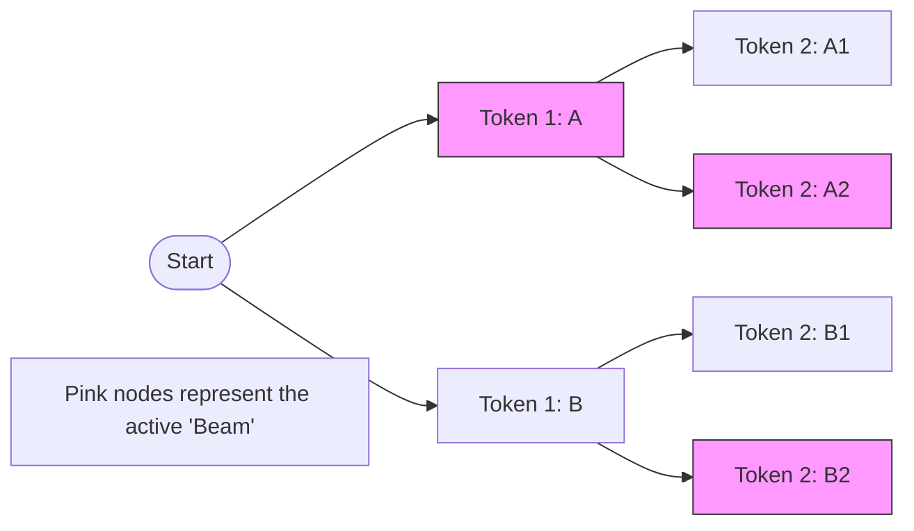

# Decoding Strategies

*Prerequisite: [01_Transformer.md](01_Transformer.md) (auto-regressive generation basics).*

Once a language model is trained, it outputs a probability distribution over the entire vocabulary at each generation step. **Decoding** is the process of choosing the next token from this distribution. Different strategies trade off between quality, diversity, and speed.

---

## 1. Deterministic Decoding

### 1.1 Greedy Search

The simplest method: always pick the token with the highest probability at each step.

- **Pros**: Fast and deterministic.
- **Cons**: Greedy at each step — may miss globally high-probability sequences by being too "short-sighted" (local optima).

### 1.2 Beam Search

Maintains $B$ (beam width) of the most likely partial sequences at each step.

- **Process**: At each step, expand all $B$ sequences by considering every possible next token, then keep the top $B$ overall.
- **Use Case**: Common in Machine Translation and Summarization where coherence matters more than creativity.
- **Trade-off**: Larger $B$ = better quality but slower; $B = 1$ reduces to Greedy Search.



## 2. Stochastic Decoding (Sampling)

Deterministic methods tend to produce repetitive, "safe" text. Sampling introduces randomness for more diverse and creative outputs.

### 2.1 Temperature ($T$)

Controls the "sharpness" of the probability distribution before sampling.

$$P'(w_i) = \frac{\exp(z_i / T)}{\sum_j \exp(z_j / T)}$$

| Temperature | Effect | Use Case |
|:------------|:-------|:---------|
| $T < 1$ | Sharper distribution (more confident, less random) | Factual Q&A, code generation |
| $T = 1$ | Original distribution | Balanced generation |
| $T > 1$ | Flatter distribution (more random, more diverse) | Creative writing, brainstorming |

### 2.2 Top-K Sampling

Only sample from the top $K$ most likely tokens, redistributing probability mass among them.

- **Pros**: Prevents sampling extremely unlikely tokens (reduces gibberish).
- **Cons**: Fixed $K$ may be too restrictive for flat distributions or too loose for peaked ones.

### 2.3 Top-P (Nucleus) Sampling

Sample from the smallest set of tokens whose cumulative probability exceeds $P$ (e.g., 0.9).

- **Adaptive**: For confident predictions (peaked distribution), the nucleus is small; for uncertain predictions, it expands.
- **Advantage over Top-K**: Automatically adjusts the candidate set size based on the model's confidence.

### 2.4 Combining Strategies

In practice, these strategies are often combined:

```
Temperature → Top-K → Top-P → Sample
```

Example: `temperature=0.8, top_k=50, top_p=0.95` — first sharpen the distribution, then filter to top 50 tokens, then further filter by cumulative probability, then sample.

## 3. Strategy Selection Guide

| Scenario | Recommended Strategy | Typical Parameters |
|:---------|:--------------------|:-------------------|
| Machine Translation | Beam Search | $B = 4\text{-}6$ |
| Code Generation | Greedy / Low Temperature | $T = 0.2\text{-}0.4$ |
| Creative Writing | Top-P Sampling | $T = 0.8\text{-}1.0, P = 0.9\text{-}0.95$ |
| Chatbot (Balanced) | Top-P + Temperature | $T = 0.7, P = 0.9$ |
| Diverse Candidate Generation | High Temperature + Top-K | $T = 1.2, K = 100$ |

---

## 4. Key References

1. **Holtzman et al. (2019)**: *The Curious Case of Neural Text Degeneration* (Top-P / Nucleus Sampling).
2. **Fan et al. (2018)**: *Hierarchical Neural Story Generation* (Top-K Sampling).
3. **Freitag & Al-Onaizan (2017)**: *Beam Search Strategies for Neural Machine Translation*.
