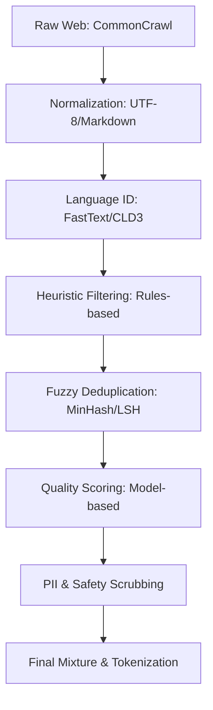

# Pre-training Data at Scale: Engineering 15T+ Tokens

*Prerequisite: None (Foundational). References the engineering rigor of Meta's Llama 3 and HuggingFace's FineWeb technical reports.*
*See Also: [../../04_Solutions/03_Domain_Data_Strategy.md](../../04_Solutions/03_Domain_Data_Strategy.md) (domain-level data strategy), [04_Synthetic_Data_Engineering.md](04_Synthetic_Data_Engineering.md) (synthetic data generation).*

---

## 1. The Industrial Data Pipeline

Building a foundation model is 90% data engineering. A production pipeline must handle petabytes of raw text while maintaining extreme "purity."

### 1.1 Pipeline Architecture

---

## 2. Massive Scale Deduplication

Redundant data wastes compute and can lead to "memorization" rather than "generalization."

### 2.1 Exact Substring Deduplication
Using **Suffix Arrays** or **Suffix Trees** to find exact matches of $N$ tokens (typically $N=50$).
- **Impact**: Crucial for code datasets (GitHub) where the same boilerplate or license file appears millions of times.
- **Complexity**: $O(N \log N)$ to build, $O(M)$ to query.

### 2.2 Fuzzy Deduplication (MinHash + LSH)
For documents that are "nearly identical" (e.g., different ads on the same news article).
1.  **Shingling**: Convert doc to set of k-grams.
2.  **MinHash**: Hash shingles and take the minimum value for $M$ permutations.
3.  **LSH (Locality Sensitive Hashing)**: Group hashes into bands to find candidate pairs with Jaccard similarity $J > 0.8$.

---

## 3. Quality Filtering: The "Scientist" Approach

### 3.1 Heuristic Classifiers
Rules used by FineWeb and Llama 3:
- **Line length variance**: High variance suggests OCR errors or junk.
- **Stop-word ratio**: Too low suggests gibberish; too high suggests SEO spam.
- **Punctuation ratio**: Excessive "..." or "!!!" indicates low-quality forum/chat data.

### 3.2 Model-Based Scoring (PPL & Classifiers)
- **Perplexity (PPL)**: Use a small, high-quality reference model (e.g., trained on Wikipedia). Documents with **extremely high PPL** are discarded as uninformative junk. Documents with **extremely low PPL** are also discarded — these are highly repetitive, templated, or boilerplate texts (e.g., spam with repeated phrases). Both tails of the PPL distribution are filtered.
- **FastText Classifiers**: Train a linear classifier to distinguish "Educational Value" (Wikipedia/Textbooks) from "Junk" (Random Web).

---

## 4. Data Mixture & Curriculum

The "Data Mixture" is the secret sauce of frontier models.

### 4.1 The Llama 3 Recipe
> **Important**: Meta did NOT publicly disclose exact domain percentages in the Llama 3 technical report. Any specific table claiming "60% web, 15% code..." is fabricated. What the paper *does* confirm:

| Confirmed Detail | Source |
| :--- | :--- |
| **15T total tokens** (7x Llama 2) | Llama 3 paper §2 |
| **Multilingual: ~5%** covering 30 languages | Llama 3 paper §2 |
| **Code ratio increased** vs Llama 2 | Llama 3 paper §2 |
| **Llama 2 used to bootstrap quality classifiers** | Llama 3 paper §2 |
| **Exact domain % not disclosed** | Meta policy |

### 4.2 Domain Annealing (领域退火)
In the final stages of training, models are often "annealed" on a mixture of **100% high-quality data** (Textbooks, clean code, synthesized reasoning) to maximize benchmark performance.

---

## 5. Data Contamination Defense

To ensure valid evaluation, benchmark data (MMLU, GSM8K, etc.) must be removed from the training set.
- **Strategy**: 13-gram or 15-gram overlap check against all public benchmarks.
- **Challenge**: "Paraphrased contamination" where the model sees the same problem with different numbers.

---

## 6. Key References

1.  **Meta AI (2024)**: *The Llama 3 Herd of Models*.
2.  **HuggingFace (2024)**: *FineWeb: Decanting the Web for the Finest Text*.
3.  **Penedo et al. (2023)**: *The RefinedWeb Dataset for Falcon LLM: Outperforming Curated Corpora with Web Data, and Web Data Only* (1.2T **tokens**, not parameters — Falcon's largest model is 180B parameters).
