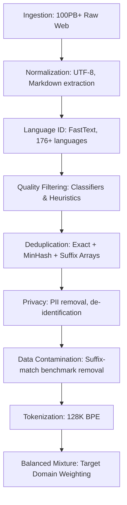

# Data Pipelines for LLM Pre-training: Engineering at 15T Scale

*Prerequisite: [../02_Dataset/01_Pre_Training_Data_at_Scale.md](../02_Dataset/01_Pre_Training_Data_at_Scale.md).*

---

## 1. Pipeline Architecture and Theory

### 1.1 The Information Bottleneck of Pre-training
Successful pre-training is a process of **maximizing information gain** while **minimizing noise and redundancy**.

#### 1.1.1 Theoretical Framework
Let $X$ be the raw corpus and $Y$ the desired model knowledge. The pipeline seeks to maximize:

$$I(X'; Y) \text{ subject to } H(X') \ll H(X)$$

Where $X'$ is the filtered dataset. Recent research (Llama 3, 2024) indicates that **Data Quality Exponent** $\alpha_Q$ scales faster than **Data Quantity Exponent** $\alpha_D$ once a base capability is reached.

#### 1.1.2 End-to-End industrial Pipeline (Llama 3 Scale)


---

## 2. Advanced Quality Filtering

### 2.1 Multi-Stage Classifier Strategy

#### 2.1.1 Llama 3 Quality Classifier (Meta, 2024)
Meta used a **distilled classifier approach**:
1. **Teacher**: Llama 2 70B labeling a 1M sample "Golden Set" (Educational vs. Junk).
2. **Student**: A small, fast DistilRoBERTa model trained on teacher labels.
3. **Execution**: Scored 100B documents, keeping only top 15%.

#### 2.1.2 Perplexity-Based Filtering Theory
Filter documents based on log-likelihood under a reference model $\mathcal{M}_{ref}$ (typically trained on Wikipedia/arXiv):

$$\text{score}(x) = \frac{1}{N} \sum_{i=1}^N \log P_{\mathcal{M}_{ref}}(x_i | x_{<i})$$

**Optimal Threshold Selection**:
Select threshold $\tau$ to minimize **Validation Loss Change** $dL/d\tau$.
- **Too strict**: Loss of diversity, high training loss.
- **Too loose**: Gradient noise from low-quality tokens.

### 2.2 Heuristic Evolution (FineWeb, 2024)
HuggingFace's FineWeb study identified the most effective heuristics:

| Metric | Threshold | Why? |
|:--|:--|:--|
| **Line Length Variance** | $> 0.15$ | Filters listicles, code-dumps, and scrambled OCR. |
| **Stop Word Ratio** | $0.2 < r < 0.8$ | Too low = gibberish; Too high = repetitive SEO spam. |
| **URL density** | $< 10\%$ | Filters navigation menus and footer junk. |
| **Curation Score** | Per-source | Academic > News > Forum > Random Web. |

---

## 3. Scalable Deduplication

### 3.1 Global Fuzzy Deduplication (MinHash-LSH)

#### 3.1.1 The MinHash Algorithm
1. **Shingling**: Convert document to set of k-grams.
2. **Hashing**: Apply $N$ permutations $\pi_i$ to shingle set $S$.
3. **Signature**: $h_i(x) = \min \{ \pi_i(s) : s \in S \}$.
4. **Jaccard Estimate**: $J(A, B) \approx \frac{1}{N} \sum_{i=1}^N \mathbb{1}[h_i(A) = h_i(B)]$.

#### 3.1.2 Locality Sensitive Hashing (LSH)
Group signatures into $b$ bands of $r$ rows. Two documents are candidates if they match in at least one band.

**Probability of collision**: $P(\text{match}) = 1 - (1 - s^r)^b$
Where $s$ is true Jaccard similarity.

### 3.2 Suffix Array Deduplication (Scale: 10T+ Tokens)
Exact substring deduplication for code and technical documents.

**Suffix Array $SA[i]$**: The starting position of the $i$-th lexicographically smallest suffix.
**LCP (Longest Common Prefix)**: $LCP[i]$ is the length of common prefix between $SA[i]$ and $SA[i-1]$.

**Deduplication logic**:
If $LCP[i] > 50$ tokens, the substring is a candidate for removal. This is critical for **CodeLlama** to prevent "Project Leakage" where the same function appears in 1,000 repos.

---

## 4. Privacy and Safety Engineering

### 4.1 PII Removal at Scale
```python
class PIIFilter:
    """Production-scale PII removal (Llama 3 style)."""

    def __init__(self):
        self.patterns = {
            'email': r'[a-zA-Z0-9_.+-]+@[a-zA-Z0-9-]+\.[a-zA-Z0-9-.]+',
            'phone': r'(\+?\d{1,3})?[-.\s]?\(?\d{3}\)?[-.\s]?\d{3}[-.\s]?\d{4}',
            'ipv4': r'\b\d{1,3}\.\d{1,3}\.\d{1,3}\.\d{1,3}\b'
        }
        # Transformer-based NER for names/addresses
        self.ner_model = pipeline("ner", model="dslim/bert-base-NER")

    def sanitize(self, text: str) -> str:
        # 1. Regex scrubbing (Fast)
        for name, pattern in self.patterns.items():
            text = re.sub(pattern, f"<{name.upper()}>", text)

        # 2. NER scrubbing (Slow, samples only or high-confidence sources)
        entities = self.ner_model(text[:1000]) # First 1K chars
        # ... logic to mask names ...
        return text
```

### 4.2 Adversarial Toxicity Filtering
Instead of just keyword blocking, use **Safety-Bench Classifiers**:
- **ToxicChat Classifier**: Detects user intent to provoke harmful output.
- **Contextual Safety**: Llama 3 uses a multi-head safety adapter during pre-training to down-weight toxic gradients without fully removing the data (keeping the model aware of what "toxic" means).

---

## 5. Mixture Optimization and Data Contamination

### 5.1 The Data Mixture Problem (Llama 3 Case)
Meta found that **Curriculum Mixing** is superior to static mixing:

| Stage | Tokens | Mixture Focus |
|:--|:--|:--|
| **Base** | 0-10T | High-throughput general web (diversity) |
| **Middle** | 10T-13T | Increased Code, STEM, and Reasoning data |
| **Annealing** | 13T-15T | Very high quality (Wikipedia, arXiv, textbooks) |

#### 5.1.1 Probing for the Optimal Mix
1. Train several 1B models with different mixtures.
2. Observe downstream benchmark performance.
3. Use **Optimal Experimental Design** to predict the 70B performance.

### 5.2 Benchmark Contamination Prevention
**Critical for valid evaluation**:
1. Extract N-gram suffixes of all benchmark questions (MMLU, GSM8K).
2. Scan 15T tokens for exact suffix matches.
3. Remove or "de-weight" contaminated documents.
4. **Llama 3 result**: Removed ~2.1B contaminated tokens.

---

## 6. Tokenizer Design (128K Vocabulary)

### 6.1 BPE Scaling Laws
As vocabulary size $V$ increases:
- **Pros**: Better compression (fewer tokens per word), better representation of non-English languages.
- **Cons**: Larger embedding matrix memory, harder to train rare tokens.

**Compression Ratio Comparison**:
| Model | Vocab | English (char/tok) | Chinese (char/tok) |
|:--|:--|:--|:--|
| Llama 2 | 32K | 3.8 | 0.8 |
| Llama 3 | 128K | 4.2 | 1.8 |
| GPT-4 | 100K | 4.1 | 1.5 |

### 6.2 Implementation Detail: Tiktoken-style BPE
- **Byte-level BPE**: Ensures 100% UTF-8 coverage.
- **Regex-splitting**: Prevents numbers/punctuation from merging with words (e.g., "100m" -> "100" + "m").

---

## 7. Distributed Data Processing Infrastructure

### 7.1 Petabyte-Scale Engineering (The Ray/Spark Stack)
```yaml
# Data Pipeline Cluster Configuration
infrastructure:
  framework: "Ray on Kubernetes"
  nodes: 500 (CPU optimized)
  storage: "S3 / GCS Data Lake"
  processing_rate: "20TB / hour"

stages:
  - name: "Language Identification"
    resources: {cpu: 2, mem: "4GB"}
  - name: "Suffix Array Dedup"
    resources: {cpu: 32, mem: "512GB"} # Memory heavy
```

### 7.2 Data Valuation and Shapley Value
Estimate the "contribution" of a data source $S_i$ to final accuracy $A$:

$$v(S_i) = \sum_{C \subseteq \{S_1...S_n\} \setminus \{i\}} \frac{|C|!(n-|C|-1)!}{n!} (A(C \cup \{i\}) - A(C))$$

**Industry Insight**: Meta identified that 1% of high-quality reasoning data contributes 30% to the model's logic capability.

---

## 8. Connection to Applications

The data pipelines described here feed directly into the industrial NLP systems:
- **RAG Systems**: Rely on the clean indexing techniques perfected in pre-training pipelines.
- **Search Ranking**: Uses the same quality classifiers to distinguish spam from authoritative content.
- **Safety Guardrails**: Pre-training toxicity filters are the basis for real-time safety LLMs.

---

## 9. Key References

1. **Meta AI (2024)**: *The Llama 3 Herd of Models* - The definitive guide to 15T token processing.
2. **HuggingFace (2024)**: *The FineWeb Datasets: Decanting the Web for the Finest Text*.
3. **Penedo et al. (2023)**: *RefinedWeb: The Dataset for the 1.2T Parameter Falcon Model*.
4. **Laurençon et al. (2022)**: *The BigScience ROOTS Corpus*.
5. **Gao et al. (2020)**: *The Pile: An 800GB Dataset of Diverse Text for Language Modeling*.
6. **Soldaini et al. (2024)**: *Dolma: Open Dataset, Tools, and Methods for Pre-training*.

---

*Document follows the 15T-scale engineering standards of the Meta Llama 3 technical report (2024).*
