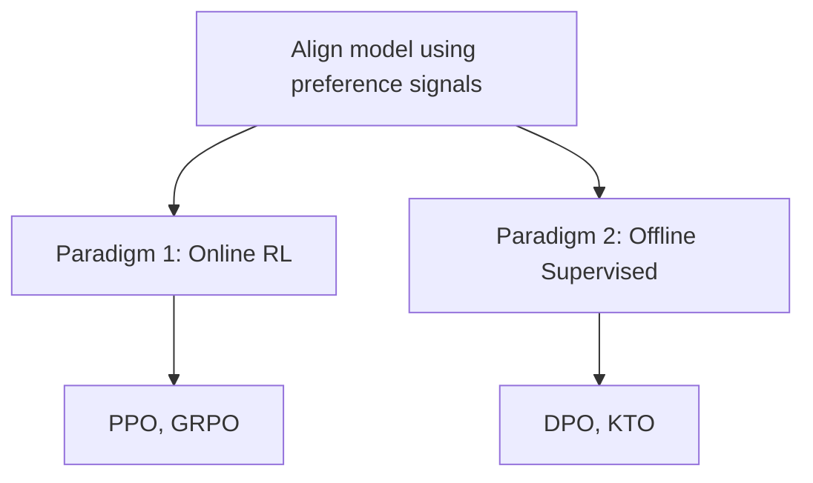
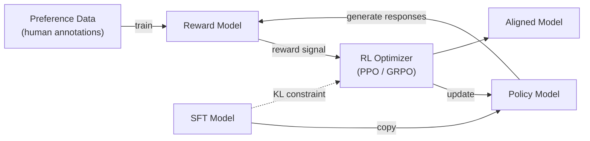
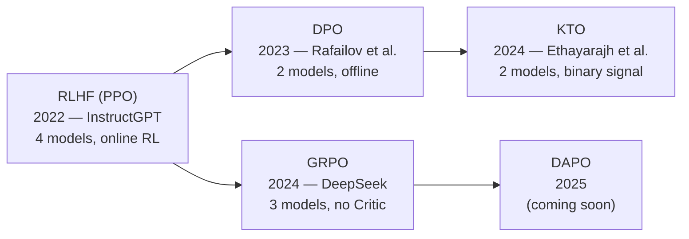

# Preference Alignment Overview

*Prerequisite: [../01_Overview.md](../01_Overview.md) (4-stage paradigm).*

This document covers the Preference Alignment stage of LLM post-training — techniques that tune a model's behavior to match human values, safety requirements, and conversational style using preference signals.

> **A note on naming**: This module is titled "RLHF" for historical reasons — RLHF (Reinforcement Learning from Human Feedback) is the term that popularized preference-based alignment (InstructGPT, 2022). In practice, the field has evolved well beyond RL: methods like DPO and KTO achieve alignment through supervised learning, with no RL involved. We use "RLHF" as an industry-standard umbrella term, consistent with how Stanford CS224N, CMU, and most textbooks organize this material.

---

## 1. The LLM Training Pyramid

```
        ┌─────────────┐
        │  Alignment   │  ← Fewer tokens, highest-quality signal
        │ (RLHF / DPO) │     Preference data or rule-based rewards
        ├─────────────┤
        │     SFT      │  ← Curated instruction-response pairs
        │ (Fine-tuning) │     ~10K – 100K examples
        ├─────────────┤
        │ Pre-training  │  ← Massive raw text corpus
        │               │     Trillions of tokens
        └─────────────┘
```

| Stage | Data | Objective | Outcome |
|:--|:--|:--|:--|
| Pre-training | Raw web text (trillions of tokens) | Next Token Prediction | Powerful text completion engine — no concept of "good" vs "bad" |
| SFT | Curated (instruction, response) pairs | Next Token Prediction on demonstrations | Instruction-following assistant — but only imitates, no preference signal |
| **Alignment** | **Preference / reward signal** | **Maximize human-aligned reward** | **Safe, helpful, honest assistant** |

## 2. Why Alignment?

Pre-training and SFT are powerful but insufficient for producing a safe, helpful assistant.

### 2.1 Pre-training: Powerful but Unaligned

Pre-training optimizes next-token prediction on massive web corpora:

$$
\mathcal{L}_{PT} = -\sum_t \log P(x_t \mid x_{<t})
$$

The result is a powerful text completion engine — but one with no concept of "good" vs "bad." It learns harmful content, misinformation, and low-quality text just as readily as high-quality text.

### 2.2 SFT: Necessary but Insufficient

SFT fine-tunes the model on curated (instruction, response) pairs, teaching it to "respond like an assistant." This is a critical step, but SFT has fundamental limitations:

| # | Limitation | Explanation |
|:--|:--|:--|
| 1 | **No negative signal** | SFT only shows "what to do," never "what NOT to do." The model imitates demonstrations but cannot learn fine-grained preference distinctions. It doesn't know why one wrong answer is worse than another — it's merely imitating, with no notion of relative quality. |
| 2 | **Exposure bias** | Training uses teacher forcing (ground truth at every step), but inference uses the model's own outputs. One deviation causes all subsequent tokens to drift into a distribution never seen during training — errors compound. |
| 3 | **Annotation ceiling** | SFT quality is bounded by the demonstration data. Writing the "best possible answer" is hard for annotators; judging "A is better than B" is much easier. RLHF exploits this asymmetry. |

### 2.3 The Solution: Preference Signals

Alignment introduces **preference signals** — information about which outputs are better or worse — to overcome SFT's limitations. Instead of demonstrations ("this is the right answer"), alignment uses comparisons ("A is better than B") or binary judgments ("this is good / this is bad").

This preference-based approach can be implemented through two distinct technical paradigms (§ 3).

## 3. Two Paradigms for Preference-Based Alignment

The alignment methods in this module share a common goal (optimize model behavior using preference signals) but take fundamentally different technical approaches:



### 3.1 Online RL: Train a Reward Model, Then Optimize via RL (PPO, GRPO)

**Core idea**: Learn a reward function from preference data, then use reinforcement learning to optimize the policy against that reward.

**Why RL?** Human judgment is a **non-differentiable reward signal** — a human rates a response, but there is no gradient path from that rating back through the generation process. Policy gradient methods (PPO, GRPO) provide exactly the framework to optimize against such signals.

**Flow**: Preference Data → Reward Model → RL Optimizer → Aligned Model

**Methods**: [PPO](./02_PPO.md) (4 models, full pipeline), [GRPO](../03_Reasoning_Alignment/02_GRPO.md) (3 models, no Critic)

**Architecture Comparison**:

```
PPO (4 models):                        GRPO (3 models):
┌─────────────────────────────┐        ┌─────────────────────────────┐
│  Actor π_θ      (trainable) │        │  Actor π_θ      (trainable) │
│  Critic V_φ     (trainable) │  ───►  │  [Critic removed]           │
│  Reference π_ref  (frozen)  │        │  Reference π_ref  (frozen)  │
│  Reward Model r_ψ (frozen)  │        │  Reward Model r_ψ (frozen)  │
└─────────────────────────────┘        └─────────────────────────────┘
  Advantage: GAE via Critic               Advantage: Z-score within group
  A_t = Σ(γλ)^l · δ_{t+l}               A_i = (r_i − mean(r)) / std(r)
```

GRPO replaces the Critic's neural network estimation with group-relative statistics: for each prompt, G responses are sampled in parallel, and each response's advantage is its reward normalized by the group mean and std.

### 3.2 Why Reinforcement Learning vs. Supervised Fine-Tuning?

While SFT is effective for teaching models to imitate demonstrations, RL provides fundamental advantages for achieving true alignment. The core differences stem from six critical dimensions:

**1. Optimization Horizon: Global vs Local**
- **SFT**: Local next-token prediction — short-sighted, maximizes immediate token probability
- **RL**: Global sequence-level optimization — considers long-term impact via cumulative reward
- **Core insight**: RL shifts from "token-level fitting" to "policy optimization" across entire response

**2. Credit Assignment: Precise vs Averaged**
- **SFT**: Averaged loss — errors spread across entire sequence, penalizing all tokens equally
- **RL**: Token-level advantage — Critic model + advantage function identify precisely which token caused success/failure
- **Core insight**: RL provides fine-grained attribution of success/failure to specific actions (tokens)

**3. Reward Signal: Non-differentiable vs Differentiable**
- **SFT**: Requires perfect demonstrations, cannot use sparse/discrete signals (test results, human preferences)
- **RL**: Can optimize against human judgments, code test results, math correctness — uses policy gradient methods
- **Core insight**: RL bridges the asymmetry: generating perfect answers is hard; judging quality is easier

**4. Exploration vs Imitation: Active vs Passive**
- **SFT**: Imitation learning — limited by human demonstration quality, cannot exceed annotator capability
- **RL**: Active exploration — through sampling and self-play, discovers novel solutions beyond human demonstrations
- **Core insight**: RL enables emergent capabilities not present in training data

**5. Training-Inference Alignment: On-policy vs Mismatch**
- **SFT**: Exposure bias — teacher forcing during training ≠ autoregressive generation during inference
- **RL**: On-policy training — learns from its own (often imperfect) generations, building robustness to errors
- **Core insight**: RL trains in the same distribution it will operate in during deployment

**6. Behavioral Boundaries: Shaped vs Only Positive**
- **SFT**: Only positive examples — shows "what to do," cannot effectively teach "what NOT to do"
- **RL**: Negative reinforcement — defines semantic boundaries via punishment signals (KL penalty, negative rewards)
- **Core insight**: RL establishes clear decision boundaries in high-dimensional output space

**Key Theoretical Shift**: SFT treats LLM as a **sequence classifier** (pattern matcher), while RL treats it as an **adaptive policy** that learns through interaction with a reward environment (intelligent agent).

### 3.3 Offline Supervised: Optimize Directly on Preference Pairs (DPO, KTO)

**Core idea**: The RL optimization objective has a **closed-form solution** — we can express the reward function in terms of the policy itself, eliminating the need for a separate reward model and RL loop entirely.

**Why no RL needed?** DPO shows that maximizing reward subject to a KL constraint yields an optimal policy that can be written analytically. Substituting this into the preference model gives a supervised classification loss on preference pairs — standard gradient descent, no RL involved.

**Flow**: Preference Data → Supervised Loss → Aligned Model

**Methods**: [DPO](./03_DPO.md) (paired preferences), [KTO](./04_KTO.md) (binary good/bad signal)

## 4. The Classic RLHF Pipeline

This section describes the original RL-based pipeline (Paradigm 1). For the supervised alternative, see [03_DPO.md](./03_DPO.md).

### 4.1 Definitions

**Reinforcement Learning (RL)**: Training a model through trial and error in a dynamic environment — the model takes actions, receives feedback (reward), and adjusts its behavior to maximize cumulative reward.

**RLHF**: A feedback loop where the model generates outputs, those outputs are scored (by a reward model trained on human preferences), and the scores are fed back to fine-tune the model.

### 4.2 Historical Origin

Christiano et al. (2017), "Deep Reinforcement Learning from Human Preferences":

- Direct human feedback on every output is too expensive (requires hundreds/thousands of hours).
- Core idea: **learn a reward function from human feedback, then optimize against it**.
- This two-step approach (learn reward → optimize policy) became the foundation of modern RLHF.

### 4.3 The RLHF Flow



## 5. Key Terminology

| Term | Definition |
|:--|:--|
| **Policy** | The model's strategy for generating outputs — in LLM terms, the token probability distribution $\pi_\theta(y \mid x)$ |
| **Reward Model (RM)** | A separate model that scores / ranks outputs based on human preferences |
| **RL Optimizer** | The algorithm that updates the policy to maximize reward (PPO, GRPO, etc.) |
| **KL Divergence Penalty** | Prevents the model from drifting too far from the reference (SFT) model — avoids reward hacking and mode collapse |
| **Clipping** | Bounds the magnitude of policy updates per step — stabilizes training |
| **Reference Model** | A frozen copy of the SFT model used as an anchor for the KL constraint |
| **Preference Data** | Pairs of (chosen, rejected) responses for the same prompt, annotated by humans or AI (see example below) |

**Preference Data Example:**

| Prompt | Chosen ✅ | Rejected ❌ |
|:--|:--|:--|
| When was Einstein born? | Albert Einstein was born on March 14, 1879, in Ulm, in the Kingdom of Württemberg in the German Empire. | Einstein? Oh, I think he was born sometime in the 1800s, maybe 1870-something? |

Each row is one training sample: a prompt paired with one preferred (chosen) and one dispreferred (rejected) response. The reward model (or DPO loss) learns from thousands of such pairs.

## 6. Method Evolution



Each step in the evolution addresses specific pain points of its predecessors:

| Transition | Problem Solved |
|:--|:--|
| PPO → DPO | Eliminates RM training, Critic, and RL loop — reduces to supervised learning |
| DPO → KTO | Eliminates need for paired preference data — only needs binary good/bad signal |
| PPO → GRPO | Removes Critic via group-relative advantage — retains online RL benefits |

## 7. Method Comparison

| Property | PPO | DPO | KTO | GRPO |
|:--|:--|:--|:--|:--|
| **Paradigm** | Online RL | Offline Supervised | Offline Supervised | Online RL |
| **Models in memory** | 4 | 2 | 2 | 3 |
| **Data requirement** | Preference pairs (to train RM) | Preference pairs | Binary (good/bad) | Prompts + reward signal (RM or rules) |
| **Needs Reward Model** | Yes | No | No | Yes (or rules) |
| **Needs Critic** | Yes | No | No | No |
| **Stability** | Low (hard to tune) | High | High | Medium-high |
| **Exploration** | Yes (on-policy) | No (offline) | No (offline) | Yes (on-policy) |
| **Best for** | General alignment | Preference tuning | Abundant binary feedback | Tasks with objective criteria |

## 8. Common Challenges Across All Methods

1. **Unstable training** — RL-based methods (PPO, GRPO) are sensitive to hyperparameters; loss spikes and reward collapse are common.
2. **Many moving parts** — Multiple models, datasets, and training stages compound potential failure modes.
3. **Expensive data** — Human preference labeling is costly and slow.
4. **Human preferences vary** — Internal inconsistencies within preference datasets make learning harder (annotator A prefers X, annotator B prefers Y for the same prompt).
5. **Reward hacking** — Models find shortcuts to maximize reward without genuinely improving (length exploitation, sycophancy, repetition).
6. **Alignment tax** — Alignment can degrade performance on standard benchmarks (MMLU, coding, math).

## 9. Module Index

| # | Document | Topic |
|:--|:--|:--|
| 01 | **This file** | Overview, motivation, paradigms, and terminology |
| 02 | [PPO](./02_PPO.md) | Proximal Policy Optimization — full RLHF pipeline |
| 03 | [DPO](./03_DPO.md) | Direct Preference Optimization — RL-free alignment |
| 04 | [KTO](./04_KTO.md) | Kahneman-Tversky Optimization — binary-signal alignment |
| 05 | [RLAIF](./05_RLAIF.md) | Reinforcement Learning from AI Feedback |
| 06 | [Constitutional AI](./06_Constitutional_AI.md) | Rule-based self-critique alignment |
| 07 | [Safety Fine-Tuning](./07_Safety_Fine_Tuning.md) | Safety-specific alignment techniques |

## 10. Key References

- Christiano et al., "Deep Reinforcement Learning from Human Preferences" (2017) — RLHF origin
- Ouyang et al., "Training Language Models to Follow Instructions with Human Feedback" (InstructGPT, 2022) — PPO applied to LLMs
- Rafailov et al., "Direct Preference Optimization: Your Language Model is Secretly a Reward Model" (2023) — DPO
- Ethayarajh et al., "KTO: Model Alignment as Prospect Theoretic Optimization" (2024) — KTO
- Shao et al., "DeepSeekMath: Pushing the Limits of Mathematical Reasoning" (2024) — GRPO
