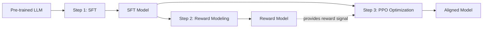
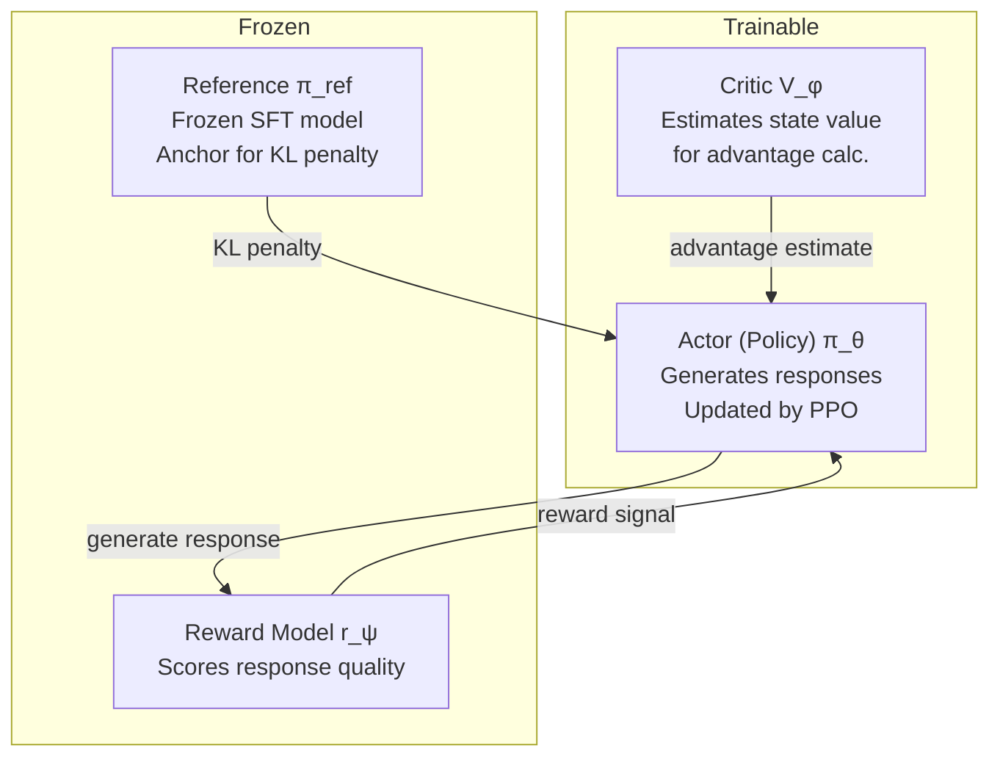
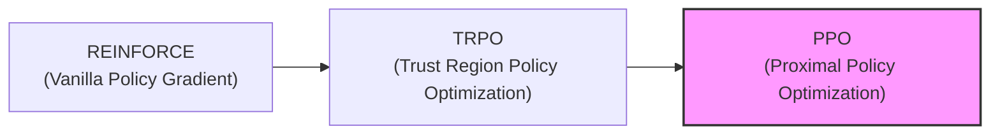
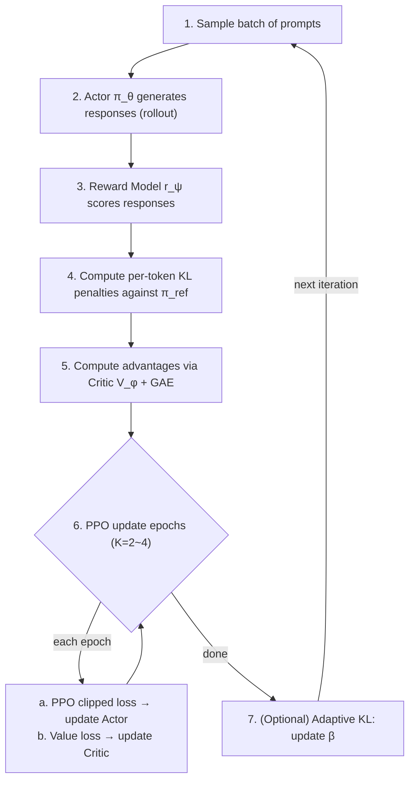

# PPO (Proximal Policy Optimization) in RLHF

*Prerequisite: [01_Overview.md](01_Overview.md).*

The standard RLHF pipeline from OpenAI (InstructGPT, 2022) uses PPO as its core RL algorithm. This document covers the full pipeline: from reward modeling to PPO optimization mechanics.

> **Historical origin**: Christiano et al. (2017), "Deep Reinforcement Learning from Human Preferences" — established the core idea of learning a reward function from human feedback rather than requiring direct human scoring of every output. This two-step approach (learn reward → optimize policy) became the foundation of modern RLHF.

## 1. Why RL for Alignment?

The [Overview (§ 2)](./01_Overview.md) explains why SFT alone is insufficient for alignment: no negative signal, exposure bias, and annotation ceiling. All alignment methods — PPO, DPO, GRPO, KTO — address these limitations through preference signals. But **PPO and GRPO specifically use reinforcement learning**. Why?

### 1.1 The Non-Differentiable Reward Problem

Human judgment is a **non-differentiable reward signal**. The model generates a response, a human rates it, but there is no gradient path from that rating back through the generation process — we cannot compute $\partial(\text{human\_score})/\partial\theta$. Reinforcement learning (specifically, policy gradient methods) provides exactly the framework to optimize against non-differentiable reward signals.

> **Note**: DPO bypasses this problem entirely by deriving a closed-form solution that avoids the need for an explicit reward model. See [03_DPO.md](./03_DPO.md).

### 1.2 How PPO Solves SFT's Limitations

| SFT Problem | PPO Solution |
| :---------------------------------------- | :------------------------------------------------------------------------------------------------------------------------------ |
| No explicit negative signal | Reward Model scores both good and bad responses; PPO simultaneously increases good and decreases bad |
| Exposure Bias | PPO trains on the model's own generation distribution (on-policy), directly optimizing generation quality |
| Annotation data ceiling | Uses preference data (A > B comparisons) instead of demonstration data (writing the best answer), far more annotation-efficient |

### 1.3 Intuition for the RLHF Pipeline

An analogy for the three-step pipeline:

1. **SFT = Apprenticeship**: Learn by imitating the master's work (imitation learning)
2. **Reward Model = Examiner**: Learn to judge the quality of work (learn scoring criteria from human preferences)
3. **PPO = Independent practice + feedback**: The apprentice creates on their own, the examiner scores it, the apprentice improves based on the score (reinforcement learning)

The key difference: SFT is open-loop ("just imitate"), RLHF adds a closed loop ("generate → evaluate → improve").

## 2. The RLHF Pipeline Overview



### Step 1: SFT (Supervised Fine-tuning)

- Fine-tune the base model on curated human-expert responses (imitation learning)
- Teaches the model the desired output format and basic instruction-following
- The SFT model serves as both the starting point for PPO and the reference model ($\pi_{ref}$)

### Step 2: Reward Modeling (RM)

- Train a reward model on human preference data: given a prompt and two responses, which is better?
- Data format: (prompt, chosen_response, rejected_response) pairs
- The RM learns to assign scalar scores that reflect human preferences
- Typically initialized from the SFT model with the LM head replaced by a scalar output head

### Step 3: PPO Alignment

- Optimize the SFT model to maximize reward from the RM
- Subject to a KL divergence constraint against the original SFT model (prevents reward hacking)
- This is where the core PPO algorithm operates

## 3. Reward Model Training

The reward model is the bridge between human judgment and gradient descent — it translates subjective preferences into a scalar signal that PPO can optimize against. Getting this right is critical: the aligned model can only be as good as its reward model.

### 3.1 Preference Data Collection

Human annotators compare pairs of model outputs for the same prompt and indicate preference. Candidate responses are typically generated by the SFT model using diverse sampling (temperature 0.7–1.0) to ensure meaningful variation between outputs.

```
Prompt: "Explain quantum entanglement simply."
Response A: "It's when particles are connected..."    ← Preferred
Response B: "Quantum entanglement is a phenomenon..."  ← Rejected
```

Ranking formats:

- **Pairwise**: A > B (most common, lowest cognitive load, highest consistency)
- **K-wise ranking**: Rank K responses, decomposed into C(K,2) pairwise comparisons (InstructGPT used K=4 to K=9)
- **Scalar scoring**: Rate each response 1-5 (less common, noisier due to calibration differences across annotators)

### 3.2 Bradley-Terry Model

The standard formulation models preference probability using the Bradley-Terry model — the same theoretical foundation behind Elo ratings in chess:

$$
P(y_w \succ y_l \mid x) = \sigma\big(r(x, y_w) - r(x, y_l)\big)
$$

Where:

- $y_w$ = preferred (winning) response, $y_l$ = rejected (losing) response
- $r(x, y)$ = reward model score for response $y$ given prompt $x$
- $\sigma$ = sigmoid function

### 3.3 Training Loss

$$
\mathcal{L}_{RM} = -\mathbb{E}\Big[\log \sigma\big(r(x, y_w) - r(x, y_l)\big)\Big]
$$

Minimize the negative log-likelihood of the observed preferences. This pushes the reward model to assign higher scores to human-preferred responses.

### 3.4 Practical Considerations

- **Model size**: RM is often the same size or smaller than the policy model
- **Data quality**: Noisy labels are common; inter-annotator agreement is typically 60–75%
- **Reward overoptimization**: The RM is an imperfect proxy for human preferences — optimizing too aggressively against it leads to reward hacking (Goodhart's Law)
- **Calibration**: Reward scores are relative, not absolute. Only the difference between scores matters

### 3.5 Code: Reward Model Loss

```python
import torch
import torch.nn as nn

class RewardModel(nn.Module):
    def __init__(self, base_model):
        super().__init__()
        self.backbone = base_model                          # e.g. LLaMA without LM head
        self.reward_head = nn.Linear(base_model.config.hidden_size, 1)

    def forward(self, input_ids, attention_mask):
        hidden = self.backbone(input_ids, attention_mask=attention_mask).last_hidden_state
        # Use the last non-padding token's hidden state as the sequence representation
        seq_lengths = attention_mask.sum(dim=1) - 1
        reward = self.reward_head(hidden[torch.arange(hidden.size(0)), seq_lengths])
        return reward.squeeze(-1)                           # (batch_size,)

def reward_model_loss(rm, chosen_ids, chosen_mask, rejected_ids, rejected_mask):
    """Bradley-Terry pairwise ranking loss."""
    r_chosen  = rm(chosen_ids, chosen_mask)                 # (B,)
    r_rejected = rm(rejected_ids, rejected_mask)            # (B,)
    loss = -torch.log(torch.sigmoid(r_chosen - r_rejected)).mean()
    return loss, (r_chosen - r_rejected).mean().item()      # loss + reward margin for logging
```

## 4. The 4-Model Architecture of PPO Training

With the reward model trained, we can now set up the PPO training system. Unlike standard fine-tuning which only needs one model, PPO-based RLHF requires 4 models in memory simultaneously — the primary engineering challenge:



### 4.1 Model Roles

| Model                                   | Role                                                       | Trainable | Typical Size                           |
| :-------------------------------------- | :--------------------------------------------------------- | :-------- | :------------------------------------- |
| **Actor (Policy)** $\pi_\theta$ | Generates responses, updated by PPO gradients              | Yes       | Same as SFT model                      |
| **Critic** $V_\phi$             | Estimates value function$V(s)$ for advantage calculation | Yes       | Often same architecture, separate head |
| **Reference** $\pi_{ref}$       | Frozen SFT model, anchor for KL penalty                    | No        | Same as Actor                          |
| **Reward Model** $r_\psi$       | Scores response quality                                    | No        | Same or smaller                        |

### 4.2 Why the Critic? (Precision in Credit Assignment)

A common point of confusion is why a Critic model is needed when the Reward Model already scores the entire response. The reason lies in the **credit assignment problem**:

- **Sparse Reward**: The Reward Model typically provides a single scalar score at the end of the entire sequence (the last token). It says, "this overall answer is an 8/10."
- **Token-level Decisions**: PPO updates the policy based on individual token choices. To do this effectively, it needs to know: *which specific token contributed to the 8/10 score?* Did a brilliant opening set the stage, or did a factual error in the middle drag it down?
- **The Critic as a Predictor**: The Critic $V_\phi(s_t)$ learns to estimate the expected final reward from any intermediate state $s_t$ (the prompt + tokens generated so far).
- **Advantage Calculation**: By comparing the actual outcome (reward) to the Critic's prediction, we calculate the **Advantage** $A_t = R_t - V_\phi(s_t)$.
    - If a token makes the final score higher than the Critic expected, it has a positive advantage (it's a "good" move).
    - If it makes it lower, it has a negative advantage.

Without the Critic, PPO would have to apply the final reward uniformly to every token in the sequence (the "连坐" or collective punishment approach), which is extremely noisy and slow to converge.

### 4.3 Memory Implication

For a 7B parameter model, you need ~4×7B = 28B parameters in memory. This is why RLHF with PPO is expensive and why alternatives like DPO (no RM, no Critic) are attractive.

## 5. From Policy Gradient to PPO

Before diving into the math, it helps to understand where PPO sits in the RL algorithm family:



### 5.1 REINFORCE (Vanilla Policy Gradient)

Update the policy by:

$$
\nabla_\theta J = \mathbb{E}_{\tau \sim \pi_\theta}\big[\nabla_\theta \log \pi_\theta(a_t \mid s_t) \cdot G_t\big]
$$

Where $G_t = \sum_{k=t}^{T} \gamma^{k-t} r_k$ is the cumulative return from step $t$. A common variance reduction technique is to subtract a baseline $b(s_t)$ (typically the value function $V(s_t)$), yielding the advantage $A_t = G_t - V(s_t)$ — this is known as REINFORCE with baseline.

Simple but has two critical limitations: high variance, and **each batch of data can only be used once**. Why? The expectation is over trajectories sampled from $\pi_\theta$ — the gradient estimate is only unbiased when the data was collected by the *current* policy. After one gradient step, $\pi_\theta$ changes, and the old data no longer represents the correct distribution. You must throw it away and sample again.

### 5.2 The Importance Sampling Bridge

The key question: can we reuse data collected by an old policy $\pi_{old}$ to update a new policy $\pi_\theta$?

Yes — via **importance sampling**. Instead of requiring samples from $\pi_\theta$, we correct for the distribution mismatch using a probability ratio:

$$
\nabla_\theta J = \mathbb{E}_{\tau \sim \pi_{old}}\bigg[\frac{\pi_\theta(a_t \mid s_t)}{\pi_{old}(a_t \mid s_t)} \cdot \nabla_\theta \log \pi_\theta(a_t \mid s_t) \cdot A_t\bigg]
$$

The ratio $\rho_t = \frac{\pi_\theta(a_t \mid s_t)}{\pi_{old}(a_t \mid s_t)}$ reweights each sample to account for the fact that it came from $\pi_{old}$, not $\pi_\theta$. This is mathematically exact — but in practice, when $\pi_\theta$ drifts far from $\pi_{old}$, the ratio can become very large or very small, causing high variance and destructive updates. Both TRPO and PPO solve this problem in different ways.

### 5.3 TRPO (Trust Region Policy Optimization, 2015)

TRPO formalizes the "don't drift too far" idea as a constrained optimization problem using the importance-sampled surrogate objective:

$$
\max_\theta \; \mathbb{E}\bigg[\frac{\pi_\theta(a_t \mid s_t)}{\pi_{old}(a_t \mid s_t)} \cdot A_t\bigg] \quad \text{s.t.} \quad D_{KL}\big[\pi_{old} \| \pi_\theta\big] \leq \delta
$$

The hard KL constraint guarantees monotonic policy improvement, but enforcing it requires expensive second-order optimization (conjugate gradient + Fisher vector products + line search).

### 5.4 PPO (Proximal Policy Optimization, 2017)

PPO achieves TRPO's stability with a simple first-order method — instead of a hard KL constraint, it **clips the probability ratio** to prevent large updates:

$$
\mathcal{L}_{PPO} = \mathbb{E}\Big[\min\big(\rho_t \cdot A_t, \; \text{clip}(\rho_t, 1-\epsilon, 1+\epsilon) \cdot A_t\big)\Big]
$$

No second-order math, no line search — just a `torch.clamp`. Nearly as stable as TRPO, much easier to implement.

### 5.5 The Key Insight

**Collect a batch of experience with the current policy $\pi_{old}$, then reuse that batch for K epochs of gradient updates** (impossible with vanilla PG). Importance sampling makes the reuse mathematically valid; clipping keeps it practically stable. This is why PPO is far more sample-efficient than REINFORCE.

#### 💡 Deep Dive: Mathematical Intuition

To understand why REINFORCE fails and PPO succeeds in industrial settings, we must examine two "death traps" of vanilla Policy Gradient:

1.  **High Variance (The Unstable Sand)**: REINFORCE uses absolute returns $G_t$. If a model produces two responses with scores 90 and 91, it aggressively reinforces both. This causes massive, oscillating gradient updates. PPO solves this by using the **Advantage** ($A = G_t - b$), focusing only on the *relative* improvement over the baseline.
2.  **Sample Inefficiency (The Disposable Data)**: REINFORCE is strictly **on-policy**. The moment you update $\theta$, your old data is no longer from the current distribution, making its gradient estimate biased ("The Carving a Mark on a Moving Boat" problem).

**How Importance Sampling offsets the bias:**
Mathematically, we transform the expectation from the current policy $\pi_\theta$ to the sampling policy $\pi_{old}$ via the identity:
$$\mathbb{E}_{x \sim P} [f(x)] = \mathbb{E}_{x \sim Q} \left[ \frac{P(x)}{Q(x)} f(x) \right]$$

In PPO, this manifests as the probability ratio $\rho_t = \frac{\pi_\theta(a_t \mid s_t)}{\pi_{old}(a_t \mid s_t)}$. This ratio acts as a **statistical correction factor**: it re-weights old experience so that it provides a valid, unbiased gradient direction for the *new* policy. This allows us to train on the same data for multiple epochs, drastically reducing the cost of the expensive "Rollout" phase.

## 6. PPO Algorithm Mechanics

### 6.1 RL Formulation for Language

Mapping language generation to RL concepts:

| RL Concept                         | In RLHF                                                              |
| :--------------------------------- | :------------------------------------------------------------------- |
| **State** $s_t$            | Prompt + tokens generated so far$(x, y_{<t})$                      |
| **Action** $a_t$           | Next token$y_t$                                                    |
| **Policy** $\pi(a \mid s)$ | Token probability distribution from the LM                           |
| **Reward** $r$             | Reward model score (given at end of sequence) + per-token KL penalty |
| **Episode**                  | Generating one complete response                                     |

### 6.2 The Reward Signal

The total reward for generating response y given prompt x:

$$
R(x, y) = r_\psi(x, y) - \beta \cdot D_{KL}\big[\pi_\theta(\cdot \mid x) \| \pi_{ref}(\cdot \mid x)\big]
$$

Where:

- $r_\psi(x, y)$ = reward model score (sequence-level, given at the last token)
- $\beta$ = KL penalty coefficient (hyperparameter, typically 0.01–0.2)
- $D_{KL}[\cdot]$ = KL divergence between current policy and reference policy

The KL penalty can be decomposed per-token:

$$
KL_t = \log \pi_\theta(y_t \mid x, y_{<t}) - \log \pi_{ref}(y_t \mid x, y_{<t})
$$

### 6.3 Why KL Divergence Matters

Without KL constraint, the policy will:

1. **Reward hack**: Find degenerate outputs that exploit RM weaknesses (e.g., excessively long, repetitive, or sycophantic responses)
2. **Mode collapse**: Converge to a narrow set of high-reward responses, losing diversity
3. **Catastrophic forgetting**: Drift far from the SFT model's general capabilities

The KL penalty keeps the aligned model "close" to the SFT model — learning to be helpful without forgetting how to be a language model.

### 6.4 Advantage Estimation (GAE)

PPO doesn't use raw rewards directly. It uses the advantage function $A(s, a)$ — how much better an action is compared to the expected value of the state.

**Generalized Advantage Estimation (GAE)**:

$$
\hat{A}_t^{GAE} = \sum_{l=0}^{T-t} (\gamma \lambda)^l \cdot \delta_{t+l}
$$

$$
\delta_t = r_t + \gamma \cdot V(s_{t+1}) - V(s_t) \quad \text{(TD residual)}
$$

- $\gamma$ = discount factor (typically 1.0 for RLHF — no discounting within a response)
- $\lambda$ = GAE parameter (0.95 typical, balances bias vs variance)
- $V(s_t)$ = Critic's value estimate at state $s_t$
- $\delta_t$ = temporal difference error

In practice for RLHF:

- Reward is sparse (only at the last token from RM), but KL penalties are per-token
- The Critic learns to predict the expected total reward from each token position onward
- **Advantage normalization** is critical: $\hat{A}_t \leftarrow \frac{\hat{A}_t - \mu(\hat{A})}{\sigma(\hat{A})}$ per mini-batch, stabilizing gradient magnitudes and preventing reward scale from dominating training dynamics

### 6.5 PPO Clipped Objective

The core PPO loss that updates the Actor:

$$
\mathcal{L}_{PPO} = \mathbb{E}\Big[\min\big(\rho_t \cdot \hat{A}_t, \; \text{clip}(\rho_t, \, 1-\epsilon, \, 1+\epsilon) \cdot \hat{A}_t\big)\Big]
$$

Where:

- $\rho_t = \frac{\pi_\theta(a_t \mid s_t)}{\pi_{old}(a_t \mid s_t)}$ — probability ratio between new and old policy
- $\epsilon$ = clipping parameter (typically 0.2)
- $\hat{A}_t$ = advantage estimate from GAE

> **$\pi_{old}$ vs $\pi_{ref}$ — don't confuse them:**
>
> - $\pi_{old}$ = the policy snapshot at the start of each PPO iteration (before the K update epochs). It changes every iteration. The ratio $\rho_t$ measures how far the current update has moved from this snapshot.
> - $\pi_{ref}$ = the frozen SFT model, fixed throughout all of training. It anchors the KL penalty to prevent the model from drifting too far from its original capabilities.

**Why clipping?** It prevents the policy from changing too much in a single update:

- If $\hat{A}_t > 0$ (good action): $\rho_t$ is capped at $1+\epsilon$, limiting how much we increase this action's probability
- If $\hat{A}_t < 0$ (bad action): $\rho_t$ is capped at $1-\epsilon$, limiting how much we decrease it

This is the "proximal" in Proximal Policy Optimization — staying close to the previous policy.

### 6.6 Critic (Value Function) Loss

The Critic is trained to minimize value prediction error:

$$
\mathcal{L}_{Critic} = \mathbb{E}\Big[\big(V_\phi(s_t) - R_t\big)^2\Big]
$$

Where $R_t$ is the discounted return (actual cumulative reward from step $t$ onward). Some implementations also clip the value function update for stability.

### 6.7 Combined Training Objective

The original PPO paper (for Atari/MuJoCo with shared actor-critic parameters) defines a combined objective:

$$
\mathcal{L}_{total} = \mathcal{L}_{PPO} - c_1 \cdot \mathcal{L}_{Critic} + c_2 \cdot H(\pi_\theta)
$$

- $c_1$ = value loss coefficient (typically 0.5–1.0)
- $c_2$ = entropy bonus coefficient (encourages exploration, typically 0.01)
- $H(\pi_\theta)$ = entropy of the policy (prevents premature convergence)

> **Note on LLM RLHF practice:** In LLM-based PPO, the Actor and Critic typically have **separate parameters and separate optimizers**, so the three terms are optimized independently rather than as a single combined loss. The entropy bonus $c_2 \cdot H(\pi_\theta)$ is also often omitted in LLM RLHF — the KL penalty against $\pi_{ref}$ already serves a similar regularization role. The code in Section 6.8 and 7.2 reflects this practical convention.

### 6.8 Code: PPO Core Components

```python
import torch
import torch.nn.functional as F

def get_per_token_logprobs(model, input_ids):
    """Extract per-token log-probabilities for the generated tokens."""
    with torch.no_grad() if not model.training else torch.enable_grad():
        logits = model(input_ids).logits[:, :-1, :]        # (B, T-1, V) — shift right
        logprobs = F.log_softmax(logits, dim=-1)
        token_logprobs = logprobs.gather(2, input_ids[:, 1:].unsqueeze(-1)).squeeze(-1)
    return token_logprobs                                   # (B, T-1)

def compute_kl_penalty(logprobs, ref_logprobs):
    """Per-token KL divergence: log π_θ(y_t|...) - log π_ref(y_t|...)."""
    return logprobs - ref_logprobs                          # (B, T_response)

def compute_rewards_with_kl(rm_scores, kl_per_token, beta, response_mask):
    """Combine RM score (last token) with per-token KL penalty."""
    # rm_scores: (B,)  kl_per_token: (B, T_response)  response_mask: (B, T_response)
    rewards = -beta * kl_per_token                          # per-token KL penalty
    # Add RM score at the last response token
    last_token_idx = response_mask.sum(dim=1).long() - 1
    rewards[torch.arange(rewards.size(0)), last_token_idx] += rm_scores
    return rewards                                          # (B, T_response)

def compute_gae(rewards, values, gamma=1.0, lam=0.95):
    """Generalized Advantage Estimation."""
    T = rewards.size(1)
    advantages = torch.zeros_like(rewards)
    gae = 0
    for t in reversed(range(T)):
        next_value = values[:, t + 1] if t + 1 < T else 0
        delta = rewards[:, t] + gamma * next_value - values[:, t]
        gae = delta + gamma * lam * gae
        advantages[:, t] = gae
    returns = advantages + values                           # R_t = A_t + V(s_t)
    return advantages, returns

def ppo_clipped_loss(new_logprobs, old_logprobs, advantages, epsilon=0.2):
    """PPO clipped surrogate objective."""
    # Advantage normalization
    advantages = (advantages - advantages.mean()) / (advantages.std() + 1e-8)
    # Probability ratio
    ratio = torch.exp(new_logprobs - old_logprobs)          # ρ_t = π_θ / π_old
    clipped_ratio = torch.clamp(ratio, 1 - epsilon, 1 + epsilon)
    loss = -torch.min(ratio * advantages, clipped_ratio * advantages).mean()
    return loss

def critic_loss(values, returns, clip_value=None, old_values=None):
    """Value function loss, optionally with clipping."""
    if clip_value and old_values is not None:
        clipped_values = old_values + torch.clamp(values - old_values, -clip_value, clip_value)
        loss = torch.max((values - returns) ** 2, (clipped_values - returns) ** 2).mean()
    else:
        loss = F.mse_loss(values, returns)
    return loss
```

## 7. PPO Training Loop

The following diagram shows one complete PPO iteration — from sampling prompts to updating model parameters:



### 7.1 Adaptive KL Control

Instead of a fixed $\beta$, many implementations use adaptive KL targeting:

$$
\beta \leftarrow \begin{cases} 2\beta & \text{if } D_{KL}^{actual} > 1.5 \cdot D_{KL}^{target} \quad \text{(policy drifting too far)} \\ \beta / 2 & \text{if } D_{KL}^{actual} < D_{KL}^{target} / 1.5 \quad \text{(policy too conservative)} \\ \beta & \text{otherwise} \end{cases}
$$

This keeps the KL divergence in a target range without manual tuning.

### 7.2 Code: PPO Training Loop

```python
@torch.no_grad()
def rollout(actor, ref_model, reward_model, critic, prompts, tokenizer, max_new_tokens=256):
    """Phase 1: Collect experience with current policy."""
    # Generate responses
    input_ids = tokenizer(prompts, return_tensors="pt", padding=True).input_ids.cuda()
    outputs = actor.generate(input_ids, max_new_tokens=max_new_tokens, do_sample=True)
    prompt_len = input_ids.size(1)
    response_ids = outputs[:, prompt_len:]
    response_mask = (response_ids != tokenizer.pad_token_id).float()

    # Compute log-probs from actor (π_old) and reference (π_ref)
    # get_per_token_logprobs returns (B, T_total-1); slice to response tokens only.
    # Index prompt_len-1 aligns with the first response token's log-prob.
    all_old_logprobs = get_per_token_logprobs(actor, outputs)
    all_ref_logprobs = get_per_token_logprobs(ref_model, outputs)
    old_logprobs = all_old_logprobs[:, prompt_len - 1:]    # (B, T_response)
    ref_logprobs = all_ref_logprobs[:, prompt_len - 1:]    # (B, T_response)

    # Score with reward model
    rm_scores = reward_model(outputs, attention_mask=(outputs != tokenizer.pad_token_id))

    # Critic value estimates (response tokens only)
    values = critic(outputs).squeeze(-1)[:, prompt_len:]   # (B, T_response)

    return {
        "output_ids": outputs, "prompt_len": prompt_len,
        "response_mask": response_mask, "old_logprobs": old_logprobs,
        "ref_logprobs": ref_logprobs, "rm_scores": rm_scores, "values": values,
    }

def ppo_train_step(actor, critic, ref_model, reward_model,
                   prompts, tokenizer, actor_optim, critic_optim,
                   beta=0.1, epsilon=0.2, ppo_epochs=4, kl_target=6.0):
    """One full PPO iteration: rollout → compute advantages → K epochs of updates."""
    # --- Phase 1: Rollout ---
    batch = rollout(actor, ref_model, reward_model, critic, prompts, tokenizer)

    # --- Phase 2: Compute rewards & advantages ---
    kl = compute_kl_penalty(batch["old_logprobs"], batch["ref_logprobs"])
    rewards = compute_rewards_with_kl(batch["rm_scores"], kl, beta, batch["response_mask"])
    advantages, returns = compute_gae(rewards, batch["values"])

    # --- Phase 3: PPO update epochs ---
    for epoch in range(ppo_epochs):
        # Slice logprobs and values to response tokens only (matching rollout)
        prompt_len = batch["prompt_len"]
        new_logprobs = get_per_token_logprobs(actor, batch["output_ids"])[:, prompt_len - 1:]
        new_values = critic(batch["output_ids"]).squeeze(-1)[:, prompt_len:]

        # Actor loss (PPO clipped)
        actor_loss = ppo_clipped_loss(new_logprobs, batch["old_logprobs"], advantages, epsilon)
        actor_optim.zero_grad()
        actor_loss.backward()
        torch.nn.utils.clip_grad_norm_(actor.parameters(), max_norm=1.0)
        actor_optim.step()

        # Critic loss
        c_loss = critic_loss(new_values, returns)
        critic_optim.zero_grad()
        c_loss.backward()
        torch.nn.utils.clip_grad_norm_(critic.parameters(), max_norm=1.0)
        critic_optim.step()

    # --- Phase 4: Adaptive KL control ---
    with torch.no_grad():
        actual_kl = kl.mean().item()
    if actual_kl > kl_target * 1.5:
        beta *= 2
    elif actual_kl < kl_target / 1.5:
        beta /= 2

    return {"actor_loss": actor_loss.item(), "critic_loss": c_loss.item(),
            "reward": batch["rm_scores"].mean().item(), "kl": actual_kl, "beta": beta}
```

## 8. Challenges and Practical Issues

### 8.1 Reward Hacking

The policy finds shortcuts to maximize reward without genuinely improving:

- Generating excessively long responses (if RM correlates length with quality)
- Sycophantic agreement with the user's premise
- Repeating high-reward phrases

Mitigations: KL penalty, reward model ensembles, length normalization, periodic RM retraining

### 8.2 Training Instability

PPO for LLMs is notoriously unstable:

- Loss spikes, reward collapse, KL divergence explosion
- Sensitive to learning rate, batch size, clipping parameter

Mitigations: Large batch sizes, conservative learning rates ($1 \times 10^{-6}$ to $5 \times 10^{-6}$), gradient clipping, careful warmup

### 8.3 Computational Cost

4 models in memory + generation + multiple update epochs per batch = very expensive.

| Model Scale | Minimum GPU Memory (approx.)        |
| :---------- | :---------------------------------- |
| 7B          | 4 × ~14GB = ~56GB (bf16)           |
| 13B         | 4 × ~26GB = ~104GB                 |
| 70B         | Requires multi-node, hundreds of GB |

### 8.4 Reward Model Quality Ceiling

The aligned model can only be as good as the reward model. If the RM has systematic biases (e.g., prefers verbose answers), PPO will amplify those biases.

## 9. PPO vs Alternatives

The challenges above (4-model memory cost, training instability, reward hacking) motivated the community to develop simpler alignment methods:

| Method              | Reward Model        | Critic Model | KL Reference | Total Models | Stability          |
| :------------------ | :------------------ | :----------- | :----------- | :----------- | :----------------- |
| **PPO**       | Yes                 | Yes          | Yes          | 4            | Low (hard to tune) |
| **DPO**       | No                  | No           | Yes          | 2            | High               |
| **GRPO**      | Yes (or rule-based) | No           | Yes          | 3            | Medium             |
| **REINFORCE** | Yes                 | No           | Yes          | 3            | Low                |

PPO remains the most theoretically principled approach but is being displaced in practice by simpler methods (DPO, GRPO) that achieve comparable results with far less engineering overhead.

## 10. Key References

- Schulman et al., "Proximal Policy Optimization Algorithms" (2017) — Original PPO paper
- Schulman et al., "High-Dimensional Continuous Control Using Generalized Advantage Estimation" (2016) — GAE
- Ouyang et al., "Training language models to follow instructions with human feedback" (InstructGPT, 2022) — PPO applied to LLMs
- Ziegler et al., "Fine-Tuning Language Models from Human Preferences" (2019) — Early RLHF work
- Stiennon et al., "Learning to summarize from human feedback" (2020) — RLHF for summarization

## 11. Development Tools

- **TRL (HuggingFace)**: `PPOTrainer` — most accessible implementation
- **DeepSpeed Chat**: End-to-end RLHF pipeline with efficient multi-model orchestration
- **OpenRLHF**: Distributed RLHF training framework, supports large-scale PPO
- **ColossalChat**: Colossal-AI based RLHF implementation
