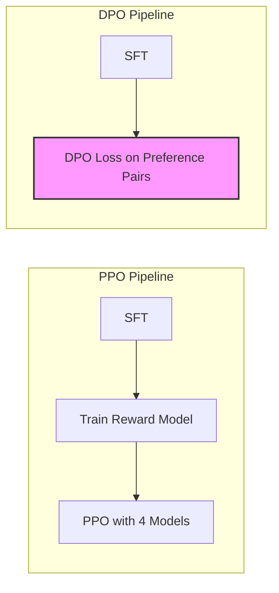
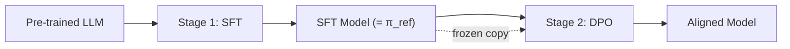
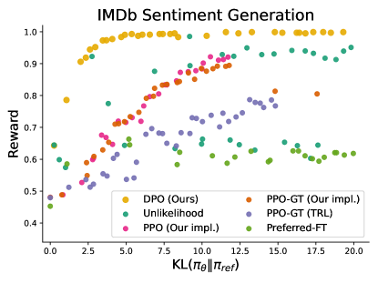
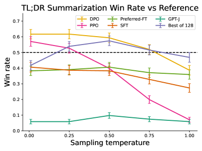
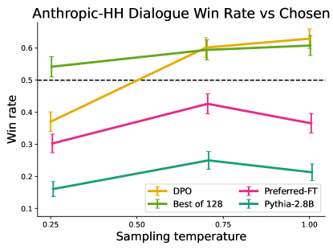
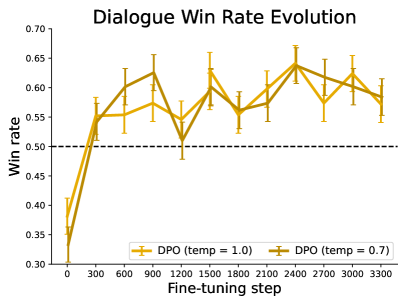
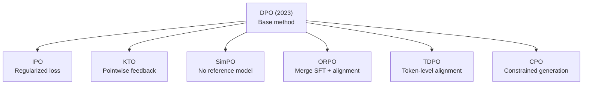

# DPO (Direct Preference Optimization)

*Prerequisite: [02_PPO.md](02_PPO.md).*

PPO-based RLHF achieves strong alignment but at significant engineering cost: 4 models in memory, unstable training, and complex hyperparameter tuning. DPO (Rafailov et al., 2023; **NeurIPS 2023 Outstanding Main Track Runner-Up**) offers an elegant alternative — it shows that the same KL-constrained alignment objective can be optimized with a simple classification loss, eliminating the reward model, critic, and RL loop entirely.

## 1. Why DPO?

### 1.1 PPO's Engineering Pain Points

As detailed in [02_PPO.md](02_PPO.md), PPO-based RLHF works but comes with heavy costs:

| Pain Point               | Detail                                                                                       |
| :----------------------- | :------------------------------------------------------------------------------------------- |
| **4-model memory**       | Actor + Critic + Reference + Reward Model. A 7B model needs ~56GB just for parameters in bf16 (with optimizer states and activations, realistically 120–160GB) |
| **Training instability** | Loss spikes, reward collapse, KL explosion. Sensitive to learning rate, batch size, clipping  |
| **Complex pipeline**     | Three sequential stages: SFT → Reward Model training → PPO. Each requires its own tuning     |
| **On-policy sampling**   | PPO must generate responses at each iteration (slow), cannot reuse pre-collected data         |
| **Reward hacking**       | Policy exploits RM weaknesses (length bias, sycophancy) — requires additional mitigations     |

### 1.2 The Key Question

Can we get the benefits of RLHF (preference-based alignment with a KL constraint) **without actually doing RL**?

### 1.3 DPO's Core Insight

Yes. The RLHF objective (maximize reward subject to KL constraint) has a **closed-form optimal policy**. This means we can:

1. Express the reward function in terms of the optimal policy and reference policy
2. Substitute this into the Bradley-Terry preference model
3. Obtain a loss function that directly optimizes the policy on preference pairs — no RM, no critic, no RL loop

The result: alignment reduces to a **supervised classification problem** on (prompt, chosen, rejected) triples.



| Aspect           | PPO                              | DPO                                       |
| :--------------- | :------------------------------- | :---------------------------------------- |
| Models in memory | 4 (Actor, Critic, Ref, RM)       | 2 (Policy, Reference)                     |
| Training stages  | 3 (SFT → RM → PPO)              | 2 (SFT → DPO)                             |
| Data requirement | Online generation each iteration | Offline preference dataset (reusable)      |
| Stability        | Low (hard to tune)               | High (standard supervised training)        |
| Loss function    | RL surrogate (clipped objective) | Cross-entropy on preference pairs          |

## 2. From RLHF Objective to DPO Loss

This section walks through the complete derivation — the mathematical core of DPO. Each step is self-contained.

### 2.1 The RLHF Objective (Recap)

The standard RLHF objective maximizes expected reward while staying close to the reference (SFT) model:

$$
\max_\pi \; \mathbb{E}_{x \sim \mathcal{D},\, y \sim \pi(\cdot|x)}\big[r(x, y)\big] - \beta \, D_{KL}\big[\pi(\cdot|x) \,\|\, \pi_{ref}(\cdot|x)\big]
$$

Expanding the KL divergence:

$$
\max_\pi \; \mathbb{E}_{x,\, y \sim \pi}\bigg[r(x, y) - \beta \log \frac{\pi(y|x)}{\pi_{ref}(y|x)}\bigg]
$$

This is the same objective that PPO optimizes via RL. DPO solves it analytically.

### 2.2 Step 1: Closed-Form Optimal Policy

This KL-constrained optimization has a well-known analytical solution (a standard result in variational calculus, identical in form to the Boltzmann distribution in statistical mechanics):

$$
\pi^*(y|x) = \frac{1}{Z(x)} \, \pi_{ref}(y|x) \, \exp\!\bigg(\frac{r(x, y)}{\beta}\bigg)
$$

Where $Z(x) = \sum_y \pi_{ref}(y|x) \exp\!\big(\frac{r(x,y)}{\beta}\big)$ is the partition function (normalization constant, intractable to compute).

**Intuition**: The optimal policy is the reference policy **reweighted** by exponentiated reward. High-reward responses get amplified; low-reward ones get suppressed. $\beta$ controls how aggressively: small $\beta$ = exploit reward hard, large $\beta$ = stay close to reference.

### 2.3 Step 2: Reparameterize the Reward

The key algebraic move. From the optimal policy, solve for $r(x, y)$:

$$
\pi^*(y|x) = \frac{1}{Z(x)} \, \pi_{ref}(y|x) \, \exp\!\bigg(\frac{r(x,y)}{\beta}\bigg)
$$

$$
\frac{\pi^*(y|x)}{\pi_{ref}(y|x)} = \frac{1}{Z(x)} \exp\!\bigg(\frac{r(x,y)}{\beta}\bigg)
$$

Take log of both sides:

$$
\log \frac{\pi^*(y|x)}{\pi_{ref}(y|x)} = \frac{r(x,y)}{\beta} - \log Z(x)
$$

Rearrange to isolate the reward:

$$
\boxed{r(x, y) = \beta \log \frac{\pi^*(y|x)}{\pi_{ref}(y|x)} + \beta \log Z(x)}
$$

The reward is now expressed entirely in terms of policies and a partition function — no reward model anywhere.

### 2.4 Step 3: Substitute into Bradley-Terry → DPO Loss

Recall from [02_PPO.md § 3.2](02_PPO.md) that the Bradley-Terry preference model defines:

$$
P(y_w \succ y_l \mid x) = \sigma\big(r(x, y_w) - r(x, y_l)\big)
$$

Substitute the reparameterized reward:

$$
r(x, y_w) - r(x, y_l) = \beta \log \frac{\pi^*(y_w|x)}{\pi_{ref}(y_w|x)} + \cancel{\beta \log Z(x)} - \beta \log \frac{\pi^*(y_l|x)}{\pi_{ref}(y_l|x)} - \cancel{\beta \log Z(x)}
$$

**The partition function $Z(x)$ cancels!** This is the crucial step — $Z(x)$ is intractable, but we never need to compute it.

$$
P(y_w \succ y_l \mid x) = \sigma\!\bigg(\beta \log \frac{\pi^*(y_w|x)}{\pi_{ref}(y_w|x)} - \beta \log \frac{\pi^*(y_l|x)}{\pi_{ref}(y_l|x)}\bigg)
$$

Now replace $\pi^*$ with a learnable policy $\pi_\theta$ and take the negative log-likelihood:

$$
\boxed{\mathcal{L}_{DPO}(\theta) = -\mathbb{E}_{(x,\, y_w,\, y_l) \sim \mathcal{D}}\bigg[\log \sigma\!\bigg(\beta \log \frac{\pi_\theta(y_w|x)}{\pi_{ref}(y_w|x)} - \beta \log \frac{\pi_\theta(y_l|x)}{\pi_{ref}(y_l|x)}\bigg)\bigg]}
$$

This is the DPO loss. It's a binary classification loss: maximize the probability that the model assigns a higher **implicit reward** to the chosen response than the rejected one.

Define the implicit reward:

$$
\hat{r}_\theta(x, y) = \beta \log \frac{\pi_\theta(y|x)}{\pi_{ref}(y|x)}
$$

Then the loss simplifies to:

$$
\mathcal{L}_{DPO} = -\mathbb{E}\Big[\log \sigma\!\big(\hat{r}_\theta(x, y_w) - \hat{r}_\theta(x, y_l)\big)\Big]
$$

This has the exact same form as the reward model loss in [02_PPO.md § 3.3](02_PPO.md) — except instead of training a separate RM, the policy **is** the reward model.

### 2.5 Gradient Analysis: What DPO Actually Optimizes

The gradient reveals DPO's learning dynamics. Let $u = \hat{r}_\theta(x, y_w) - \hat{r}_\theta(x, y_l)$:

$$
\nabla_\theta \mathcal{L}_{DPO} = -\beta \, \mathbb{E}\bigg[\underbrace{\sigma(-u)}_{\text{adaptive weight}} \Big(\underbrace{\nabla_\theta \log \pi_\theta(y_w|x)}_{\text{increase chosen}} - \underbrace{\nabla_\theta \log \pi_\theta(y_l|x)}_{\text{decrease rejected}}\Big)\bigg]
$$

> **Derivation:** $\frac{\partial}{\partial u}[-\log \sigma(u)] = -\frac{\sigma(u)(1-\sigma(u))}{\sigma(u)} = -(1-\sigma(u)) = -\sigma(-u)$. Apply chain rule; $\pi_{ref}$ is frozen so its gradient is zero.

The gradient direction is always: **increase $\pi_\theta(y_w|x)$, decrease $\pi_\theta(y_l|x)$**. But the magnitude is controlled by $\sigma(-u)$ — the probability that the implicit reward model currently gets this pair wrong:

| Model's current state                                      | $\sigma(-u)$ | Gradient magnitude | Behavior               |
| :--------------------------------------------------------- | :----------- | :------------------ | :--------------------- |
| Already ranks chosen >> rejected ($u \gg 0$)               | $\approx 0$  | Small               | Don't bother updating  |
| Uncertain or ranks them equally ($u \approx 0$)            | $\approx 0.5$| Medium              | Standard update        |
| Incorrectly ranks rejected > chosen ($u \ll 0$)            | $\approx 1$  | Large               | Update strongly        |

This is **self-curriculum learning**: hard examples (where the model is currently wrong) automatically receive higher gradient weight. No explicit hard-negative mining needed.

### 2.6 Sequence-Level Log-Probabilities

In the formulas above, $\log \pi_\theta(y|x)$ for a response $y = (y_1, y_2, \ldots, y_T)$ is the sum of per-token log-probabilities:

$$
\log \pi_\theta(y|x) = \sum_{t=1}^{T} \log P_\theta(y_t \mid x, y_1, \ldots, y_{t-1})
$$

This is computed with a single forward pass through the model — standard autoregressive language modeling.

## 3. DPO Training Pipeline

### 3.1 Two-Stage Pipeline: SFT → DPO



1. **Stage 1 — SFT**: Fine-tune the base model on instruction-response pairs. This produces the SFT model, which serves double duty as both the initialization for DPO training and the frozen reference model $\pi_{ref}$.

2. **Stage 2 — DPO**: Train the SFT model on preference pairs using the DPO loss. The reference model is a frozen copy of the SFT checkpoint.

### 3.2 Preference Data

DPO uses the same data format as reward model training: $(x, y_w, y_l)$ triples where $y_w$ is preferred over $y_l$ for prompt $x$.

**Concrete example — one training sample:**

| Field | Content |
|:--|:--|
| **Prompt** $x$ | When was Einstein born? |
| **Chosen** $y_w$ ✅ | Albert Einstein was born on March 14, 1879, in Ulm, in the Kingdom of Württemberg in the German Empire. |
| **Rejected** $y_l$ ❌ | Einstein? Oh, I think he was born sometime in the 1800s, maybe 1870-something? |

The DPO loss trains the policy to assign higher implicit reward $\hat{r}_\theta(x, y_w) > \hat{r}_\theta(x, y_l)$ — i.e., the log-probability ratio $\log \frac{\pi_\theta(y|x)}{\pi_{ref}(y|x)}$ should be larger for the chosen response than for the rejected one.

**Human-annotated datasets:**

| Dataset              | Source                   | Scale  | Note                                      |
| :------------------- | :----------------------- | :----- | :---------------------------------------- |
| Anthropic HH-RLHF   | Anthropic                | 170K   | Helpfulness + harmlessness preferences     |
| HelpSteer2           | NVIDIA                   | 21K    | Multi-attribute quality ratings            |
| OpenAssistant (OASST)| Community                | 66K    | Multilingual conversation trees            |

**AI-assisted (synthetic) datasets:**

| Dataset              | Source                   | Scale  | Note                                      |
| :------------------- | :----------------------- | :----- | :---------------------------------------- |
| UltraFeedback        | Cui et al.               | 64K    | GPT-4 scored, 4 responses per prompt       |
| Nectar               | Starling team            | 183K   | 7-wise ranking via GPT-4                   |
| Orca DPO Pairs       | Intel                    | 13K    | GPT-4 vs GPT-3.5 pairs                    |

> **Data quality matters more than quantity.** A clean 10K dataset often outperforms a noisy 100K dataset. Key quality signals: clear preference margin, diverse prompts, and minimal labeling noise.

### 3.3 The Role of the Reference Model

The reference model $\pi_{ref}$ serves the same purpose as in PPO — it anchors the KL constraint, preventing the policy from:

1. **Reward hacking**: Exploiting degenerate patterns that happen to score well
2. **Mode collapse**: Collapsing to a narrow set of responses
3. **Capability loss**: Drifting so far that general language ability degrades

In DPO, the KL constraint is implicit: it's embedded directly in the loss function through the log-ratio $\log \frac{\pi_\theta(y|x)}{\pi_{ref}(y|x)}$. There's no explicit KL computation — the reference model participation in the loss naturally penalizes divergence.

### 3.4 Code: DPO Loss and Training Loop

```python
import torch
import torch.nn.functional as F

def get_batch_logprobs(model, input_ids, attention_mask, label_mask):
    """Compute sum of per-token log-probs for response tokens.

    Args:
        input_ids:      (B, T) — full sequence [prompt | response | padding]
        attention_mask:  (B, T) — 1 for real tokens, 0 for padding
        label_mask:      (B, T) — 1 for response tokens, 0 for prompt/padding
    Returns:
        logprobs:        (B,) — Σ log P(y_t | x, y_{<t}) over response tokens
    """
    logits = model(input_ids, attention_mask=attention_mask).logits
    # Shift alignment: logits[:, t, :] predicts input_ids[:, t+1]
    logits = logits[:, :-1, :]                              # (B, T-1, V)
    labels = input_ids[:, 1:]                               # (B, T-1)
    mask = label_mask[:, 1:]                                # (B, T-1) — shift mask to match

    per_token_logps = F.log_softmax(logits, dim=-1)
    per_token_logps = per_token_logps.gather(2, labels.unsqueeze(-1)).squeeze(-1)
    # NOTE: More memory-efficient alternative (avoids materializing full (B, T-1, V) tensor):
    #   per_token_logps = logits.gather(2, labels.unsqueeze(-1)).squeeze(-1) \
    #                   - torch.logsumexp(logits, dim=-1)
    return (per_token_logps * mask).sum(dim=1)              # (B,)


def dpo_loss(policy_model, ref_model,
             chosen_ids, chosen_mask, chosen_label_mask,
             rejected_ids, rejected_mask, rejected_label_mask,
             beta=0.1):
    """DPO loss with logging metrics."""
    # Policy log-probs
    pi_chosen  = get_batch_logprobs(policy_model, chosen_ids, chosen_mask, chosen_label_mask)
    pi_rejected = get_batch_logprobs(policy_model, rejected_ids, rejected_mask, rejected_label_mask)

    # Reference log-probs (frozen)
    with torch.no_grad():
        ref_chosen  = get_batch_logprobs(ref_model, chosen_ids, chosen_mask, chosen_label_mask)
        ref_rejected = get_batch_logprobs(ref_model, rejected_ids, rejected_mask, rejected_label_mask)

    # Implicit rewards (log-ratios)
    chosen_logratio  = pi_chosen - ref_chosen               # log π_θ(y_w|x) / π_ref(y_w|x)
    rejected_logratio = pi_rejected - ref_rejected          # log π_θ(y_l|x) / π_ref(y_l|x)

    # DPO loss
    logits = beta * (chosen_logratio - rejected_logratio)
    loss = -F.logsigmoid(logits).mean()

    # Metrics
    with torch.no_grad():
        reward_margin = (beta * (chosen_logratio - rejected_logratio)).mean().item()
        accuracy = (logits > 0).float().mean().item()

    return loss, {"reward_margin": reward_margin, "accuracy": accuracy}


def dpo_train_step(policy_model, ref_model, batch, optimizer, beta=0.1):
    """One DPO training step."""
    policy_model.train()

    loss, metrics = dpo_loss(
        policy_model, ref_model,
        batch["chosen_ids"], batch["chosen_mask"], batch["chosen_label_mask"],
        batch["rejected_ids"], batch["rejected_mask"], batch["rejected_label_mask"],
        beta=beta,
    )

    optimizer.zero_grad()
    loss.backward()
    torch.nn.utils.clip_grad_norm_(policy_model.parameters(), max_norm=1.0)
    optimizer.step()

    return loss.item(), metrics
```

**Contrast with PPO**: The entire DPO training loop is a standard supervised training loop — forward pass, loss, backward, step. No rollout, no GAE, no clipping, no critic update.

## 4. Hyperparameters and Practical Challenges

### 4.1 β: The KL Regularization Strength

$\beta$ controls how much the policy is allowed to deviate from the reference model:

| $\beta$ value          | Behavior                                                                     |
| :--------------------- | :--------------------------------------------------------------------------- |
| Small ($\beta$ < 0.1)  | Weak constraint — policy can diverge significantly, higher risk of overfitting |
| Medium ($\beta$ ≈ 0.1–0.5) | Standard range — balances alignment strength with stability              |
| Large ($\beta$ > 0.5)  | Strong constraint — conservative updates, policy stays close to SFT model    |

**Practical guidance:**
- Start with $\beta = 0.1$ (the original paper's default)
- If reward margin grows too fast or accuracy hits 1.0 quickly → increase $\beta$
- If the model barely changes from SFT → decrease $\beta$
- Monitor the implicit reward margin: it should grow steadily, not spike

### 4.2 Overfitting on Preference Data

DPO is particularly prone to overfitting because:

1. **Fixed offline dataset**: Unlike PPO (which generates fresh data each iteration), DPO trains repeatedly on the same preference pairs
2. **Binary signal**: Each pair provides only 1 bit of preference information
3. **Accuracy saturation**: Once the model correctly ranks all training pairs (accuracy → 1.0), further training degrades generalization

**Mitigations:**
- Early stopping based on validation preference accuracy (stop around 65–75%, not 100%)
- Short training: typically 1–3 epochs, rarely more
- Label smoothing: soften the target from $\sigma(u)$ toward 0.5 slightly
- Larger $\beta$: stronger KL regularization

### 4.3 Implicit Reward Hacking

Even without an explicit reward model, DPO can exhibit reward hacking through its implicit reward $\hat{r}_\theta(x, y) = \beta \log \frac{\pi_\theta(y|x)}{\pi_{ref}(y|x)}$:

- **Length exploitation**: If longer responses are systematically preferred in training data, the model learns to be verbose
- **Style mimicry**: The model may learn surface patterns of preferred responses (e.g., starting with "Certainly!") rather than genuine quality improvements
- **Degenerate log-ratio maximization**: The model can satisfy the loss by aggressively pushing down $\pi_\theta(y_l|x)$ toward zero (making the rejected log-ratio $\log \frac{\pi_\theta(y_l|x)}{\pi_{ref}(y_l|x)}$ extremely negative), rather than genuinely improving $\pi_\theta(y_w|x)$ — this widens the implicit reward gap without improving generation quality, and harms diversity

**Mitigations**: Strong $\beta$, early stopping, diverse preference data

### 4.4 Alignment Tax

A general concern across all alignment methods: alignment can degrade performance on standard NLP benchmarks (MMLU, coding, math). The model trades some general capability for better instruction-following and safety behavior.

DPO's alignment tax is typically **smaller** than PPO's because DPO stays closer to the SFT model (off-policy, fewer updates). But it's still non-zero — monitor downstream benchmarks during training.

### 4.5 Empirical Performance

Key findings from the original DPO paper (Rafailov et al., 2023):

**Figure 2 — GPT-J 6B**

| | |
|:--:|:--:|
|  |  |
| DPO Pareto-dominates all baselines on the reward–KL frontier | DPO win rate stable across temperatures; PPO drops at high temp |

**Figure 3 — Pythia 2.8B**

| | |
|:--:|:--:|
|  |  |
| DPO is the **only** method that improves over chosen summaries | Win rate converges stably over ~3 000 steps, insensitive to temperature |

| Experiment | Model | Key Finding |
|:--|:--|:--|
| IMDb Sentiment Generation | GPT-J 6B | DPO achieves the highest expected reward for **all** KL divergence values — Pareto-dominates PPO, Unlikelihood, and Preferred-FT on the reward–KL frontier |
| TL;DR Summarization | GPT-J 6B | DPO win rate remains stable (~0.6) across sampling temperatures 0.0–1.0; PPO drops sharply at higher temperatures |
| Anthropic-HH Dialogue | Pythia 2.8B | DPO is the **only** method that improves over the chosen summaries in the test set |
| Training Stability | Pythia 2.8B | Win rate converges stably over ~3 000 training steps, with minimal sensitivity to sampling temperature (0.7 vs 1.0) |

**Temperature robustness** is particularly notable for production deployment: DPO maintains consistent performance regardless of sampling temperature, whereas PPO's quality degrades at higher temperatures. This makes DPO more reliable when serving users with varying generation parameters.

### 4.6 DPO vs PPO: When to Use Which

| Criterion                        | Favor DPO                          | Favor PPO                                 |
| :------------------------------- | :--------------------------------- | :---------------------------------------- |
| Engineering resources            | Limited GPU, small team            | Large cluster, dedicated infra             |
| Preference data available        | Large existing dataset             | Need to generate on-the-fly               |
| Training stability priority      | High (need reliable convergence)   | Can afford tuning runs                     |
| Distribution match               | Preference data covers target dist | Target distribution differs from data      |
| Iterative alignment              | Not well-suited (offline)          | Natural fit (online generation)            |
| Maximum alignment quality        | Good, sometimes slightly below PPO | Potentially higher ceiling with tuning     |

> **Key tradeoff**: DPO is off-policy (trains on pre-collected data), PPO is on-policy (trains on its own generations). Off-policy is simpler but means the training distribution may not match the model's actual generation distribution — a theoretical limitation that sometimes matters in practice.

## 5. DPO Variants

The DPO framework inspired a family of methods that address its specific limitations. Each variant modifies a specific aspect of vanilla DPO.



### 5.1 IPO (Identity Preference Optimization)

**Problem**: DPO assumes the Bradley-Terry preference model is correct. When real human preferences don't follow B-T (noisy labels, intransitive preferences), DPO can overfit to the B-T assumption.

**Key change**: Replace the log-sigmoid loss with a squared loss that directly regularizes the log-ratio gap toward a target margin:

$$
\mathcal{L}_{IPO} = \mathbb{E}\bigg[\bigg(\log \frac{\pi_\theta(y_w|x)}{\pi_{ref}(y_w|x)} - \log \frac{\pi_\theta(y_l|x)}{\pi_{ref}(y_l|x)} - \frac{1}{2\beta}\bigg)^2\bigg]
$$

**Intuition**: Instead of pushing the log-ratio gap to infinity (as DPO's sigmoid loss incentivizes), IPO pushes it toward a fixed target $\frac{1}{2\beta}$. This prevents overfitting by capping the implicit reward margin.

**When to use**: Noisy preference labels, high inter-annotator disagreement.

### 5.2 KTO (Kahneman-Tversky Optimization)

Replaces paired preference data with **binary good/bad signal**, inspired by Kahneman & Tversky's Prospect Theory (loss aversion). Only needs thumbs-up/thumbs-down labels — no paired comparisons required.

**→ Full treatment: [04_KTO.md](./04_KTO.md)**

### 5.3 SimPO (Simple Preference Optimization)

**Problem**: DPO requires a reference model in memory (doubling VRAM). Also, DPO's sequence-level log-probability is biased toward longer responses.

**Key changes**: (1) Drop the reference model entirely — use the policy's own average log-probability as the implicit reward. (2) Length-normalize the reward. (3) Add a target reward margin $\gamma$:

$$
\mathcal{L}_{SimPO} = -\mathbb{E}\bigg[\log \sigma\!\bigg(\frac{\beta}{|y_w|}\log \pi_\theta(y_w|x) - \frac{\beta}{|y_l|}\log \pi_\theta(y_l|x) - \gamma\bigg)\bigg]
$$

- $\frac{1}{|y|}$ normalizes by response length, removing length bias
- $\gamma > 0$ is a target margin that prevents the loss from saturating too early
- No $\pi_{ref}$ anywhere — only 1 model in memory

**When to use**: Memory-constrained settings, when length bias is a concern.

### 5.4 ORPO (Odds-Ratio Preference Optimization)

**Problem**: DPO requires a separate SFT stage before alignment. Can we do both in a single training phase?

**Key change**: Combine SFT loss on chosen responses with an odds-ratio preference penalty in a single objective:

$$
\mathcal{L}_{ORPO} = \underbrace{\mathcal{L}_{NLL}(y_w)}_{\text{SFT on chosen}} + \lambda \underbrace{\bigg(-\log \sigma\!\bigg(\log \frac{\text{odds}_\theta(y_w|x)}{\text{odds}_\theta(y_l|x)}\bigg)\bigg)}_{\text{odds-ratio preference}}
$$

Where $\text{odds}_\theta(y|x) = \frac{P_\theta(y|x)}{1 - P_\theta(y|x)}$ and $P_\theta(y|x) = \exp\!\big(\frac{1}{|y|}\sum_t \log \pi_\theta(y_t|x, y_{<t})\big)$.

- No reference model needed
- No separate SFT stage — monolithic training
- The most memory-efficient alignment method

**When to use**: Maximum efficiency, single-stage training desired, limited compute.

### 5.5 TDPO (Token-level Direct Preference Optimization)

**Problem**: DPO assigns reward at the sequence level — it cannot distinguish which tokens contributed to the preference. A mostly-good response with one bad sentence gets the same treatment as a uniformly-good response.

**Key change**: Decompose the sequence-level DPO objective into token-level constraints using the Bellman equation. Each token position gets its own alignment signal through a forward KL divergence term:

$$
\mathcal{L}_{TDPO} = \mathcal{L}_{DPO} + \alpha \sum_{t=1}^{T} D_{KL}\big[\pi_\theta(\cdot | x, y_{<t}) \,\|\, \pi_{ref}(\cdot | x, y_{<t})\big]
$$

The additional per-token KL term provides fine-grained regularization, preventing the policy from deviating from the reference at any individual generation step.

**When to use**: Tasks requiring fine-grained quality control at the token level.

### 5.6 CPO (Contrastive Preference Optimization)

**Problem**: In constrained generation tasks (e.g., machine translation), outputs must satisfy hard constraints (preserve meaning, follow format). Standard DPO may violate these constraints.

**Key change**: Add an explicit SFT term on chosen responses to the DPO objective, ensuring the model doesn't just rank correctly but also generates fluent, constraint-satisfying outputs:

$$
\mathcal{L}_{CPO} = \mathcal{L}_{DPO} + \alpha \, \mathcal{L}_{NLL}(y_w)
$$

The NLL term ensures the model can reproduce chosen (high-quality) responses, while the DPO term teaches it to prefer them over alternatives.

**When to use**: Machine translation, structured generation, tasks with hard output constraints.

### 5.7 Variant Summary

| Method     | Ref Model | Paired Data | SFT Stage | Key Innovation                       | Models in Memory |
| :--------- | :-------- | :---------- | :-------- | :----------------------------------- | :--------------- |
| **DPO**    | Yes       | Yes         | Separate  | Baseline: implicit reward via log-ratio | 2              |
| **IPO**    | Yes       | Yes         | Separate  | Squared loss, bounded margin          | 2                |
| **KTO**    | Yes       | No          | Separate  | Pointwise good/bad feedback ([details](./04_KTO.md)) | 2                |
| **SimPO**  | No        | Yes         | Separate  | Length-normalized, reference-free      | 1                |
| **ORPO**   | No        | Yes         | Merged    | Single-stage SFT + alignment          | 1                |
| **TDPO**   | Yes       | Yes         | Separate  | Token-level Bellman constraints        | 2                |
| **CPO**    | Yes       | Yes         | Separate  | NLL constraint for generation quality  | 2                |

## 6. Engineering Practice

### 6.1 Tools

| Tool            | DPO Support                                   | Note                                       |
| :-------------- | :-------------------------------------------- | :----------------------------------------- |
| **TRL**         | `DPOTrainer` — most accessible                 | HuggingFace ecosystem, supports all variants |
| **Axolotl**     | YAML-based config, easy multi-method switching  | Good for experimentation                    |
| **Llama-Factory** | GUI + CLI, extensive model zoo               | Strong CJK language support                 |
| **OpenRLHF**    | Distributed DPO training                        | For large-scale training                    |

### 6.2 Memory Optimization

DPO requires 2 full models (policy + reference) in memory. For a 7B model in bf16, that's ~28GB — manageable but still significant. Optimization strategies:

| Technique            | Memory Saving                | Tradeoff                         |
| :------------------- | :--------------------------- | :------------------------------- |
| **LoRA/QLoRA**       | Train only ~0.1% of params   | Slight quality loss on some tasks |
| **Flash Attention 2** | Reduces attention memory     | None (pure optimization)          |
| **Gradient checkpointing** | ~30–50% reduction       | Slower training (recomputation)   |
| **Reference model offloading** | Offload $\pi_{ref}$ to CPU | Slower forward pass          |

### 6.3 Evaluation Metrics

| Metric                  | What It Measures                                          | Healthy Range         |
| :---------------------- | :-------------------------------------------------------- | :-------------------- |
| **Preference accuracy** | % of training pairs ranked correctly by implicit reward    | 65–75% (NOT 100%)     |
| **Reward margin**       | Mean $\hat{r}_\theta(y_w) - \hat{r}_\theta(y_l)$         | Steadily increasing   |
| **KL divergence**       | $D_{KL}[\pi_\theta \| \pi_{ref}]$                        | < 10 nats typically   |
| **Loss curve**          | Training loss                                              | Smooth decrease       |

> **Warning sign**: Preference accuracy reaching 100% early in training almost always indicates overfitting. The model has memorized the preference dataset rather than learning generalizable alignment. Stop training or increase $\beta$.

## 7. Key References

- Rafailov et al., "Direct Preference Optimization: Your Language Model is Secretly a Reward Model" (2023) — Original DPO paper; NeurIPS 2023 Outstanding Main Track Runner-Up
- Azar et al., "A General Theoretical Paradigm to Understand Learning from Human Feedback" (IPO, 2023)
- Ethayarajh et al., "KTO: Model Alignment as Prospect Theoretic Optimization" (2024)
- Meng et al., "SimPO: Simple Preference Optimization with a Reference-Free Reward" (2024)
- Hong et al., "ORPO: Monolithic Preference Optimization without Reference Model" (2024)
- Zeng et al., "Token-level Direct Preference Optimization" (TDPO, 2024)
- Xu et al., "Contrastive Preference Optimization" (CPO, 2024)
