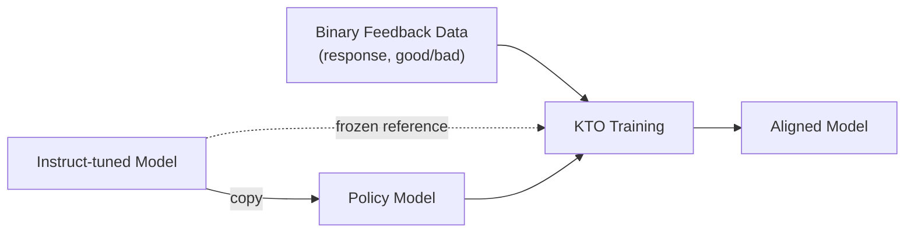

# KTO (Kahneman-Tversky Optimization)

*Prerequisite: [03_DPO.md](03_DPO.md).*

KTO (Ethayarajh et al., 2024) is an alignment algorithm **inspired by behavioral economics**. Unlike DPO which requires paired preference data (chosen vs rejected), KTO only needs **binary signal** — individual responses labeled as "good" or "bad".

> Named after Daniel Kahneman (Nobel Prize in Economics) and Amos Tversky, co-creators of **Prospect Theory**.

---

## 1. Why KTO?

### 1.1 DPO's Data Problem

DPO requires **paired preferences**: for the same prompt, you need both a chosen and a rejected response. This data format is:

- **Expensive** to collect — annotators must compare two outputs side by side.
- **Scarce** — most real-world feedback is pointwise (thumbs up/down, ratings), not pairwise.

### 1.2 Real-World Feedback is Binary

Binary quality signals are abundant everywhere:

- Thumbs up / thumbs down on chatbot responses
- Upvotes / downvotes on forum answers
- Accept / reject on code suggestions
- Star ratings (binarized at a threshold)

KTO is designed to work directly with this kind of data.

### 1.3 The Behavioral Economics Insight

**Prospect Theory** (Kahneman & Tversky, 1979) describes how humans actually make decisions under uncertainty — not rationally, but with systematic biases:

**Loss Aversion**: The perceived pain of losing something is greater than the perceived pleasure of gaining the equivalent amount.

```
     Value
      ↑
  +20 ─ · · · · · · · · · · ·╱
      │                     ╱
      │                   ╱
      │                 ╱      Gains (concave — diminishing returns)
      │               ╱
──────┼─────────────╱──────────→ Outcome
      │           ╱
      │         ╱  Losses (convex — accelerating pain)
      │       ╱
  −40 ─ · · ╱
      │
```

Key observation: a $0.05 loss feels roughly twice as painful (value ≈ −40) as a $0.05 gain feels good (value ≈ +20). KTO applies this asymmetry to model alignment.

## 2. From Prospect Theory to KTO

### 2.1 What KTO Borrows

KTO is **inspired by, not derived from** Prospect Theory. It borrows:

- The concept of a **value function** with a **reference point** — outcomes are evaluated relative to expectations, not in absolute terms.
- The **asymmetry** between gains and losses — bad outputs should be penalized more heavily than good outputs are rewarded.

### 2.2 What KTO Simplifies

KTO discards:

- The **probability weighting function** (how humans distort probabilities) — not applicable to LLM alignment.
- The exact **exponent-based value function** from Prospect Theory.

Instead, KTO uses a **sigmoid** as the value function — it has a similar S-shaped curve to the Prospect Theory value function but is differentiable and easy to optimize:

| Prospect Theory Value Function | KTO's Sigmoid |
|:--|:--|
| Asymmetric S-curve with kink at origin | Smooth symmetric S-curve |
| Exponent-based, from experimental psychology | Standard sigmoid $\sigma(x) = \frac{1}{1+e^{-x}}$ |
| Gains: concave, Losses: convex | Symmetric, with asymmetry introduced via $\lambda$ weights |

### 2.3 The KTO Loss Function

$$\mathcal{L}_{KTO} = \mathbb{E}_{(x,y) \sim \mathcal{D}^+}\!\Big[\lambda_D \cdot \sigma\big(\beta(z_0 - r_\theta(x,y))\big)\Big] + \mathbb{E}_{(x,y) \sim \mathcal{D}^-}\!\Big[\lambda_U \cdot \sigma\big(\beta(r_\theta(x,y) - z_0)\big)\Big]$$

Where:

- $r_\theta(x,y) = \log \frac{\pi_\theta(y|x)}{\pi_{ref}(y|x)}$ — implicit reward (log-ratio between policy and reference)
- $z_0 = \mathbb{E}_\mathcal{D}\big[D_{KL}[\pi_\theta \| \pi_{ref}]\big]$ — reference point (expected KL divergence, serving as the "neutral" baseline)
- $\mathcal{D}^+$ = desirable examples, $\mathcal{D}^-$ = undesirable examples
- $\lambda_D$ = weight for desirable outputs, $\lambda_U$ = weight for undesirable outputs
- $\beta$ = controls risk aversion (same role as in DPO/PPO)

**Intuition**:

- For a **good** response: penalize if the implicit reward $r_\theta$ is **below** the reference point $z_0$ (the model should be doing at least as well as average).
- For a **bad** response: penalize if the implicit reward $r_\theta$ is **above** the reference point $z_0$ (the model should not be rewarding bad behavior).

## 3. KTO Dataset Format

### 3.1 Data Structure

KTO uses unpaired binary feedback — each example is independent:

```
DPO format:   (prompt, chosen_response, rejected_response)  ← paired
KTO format:   (prompt, response, label)                      ← unpaired
              where label ∈ {desirable, undesirable}
```

**Concrete example — same prompt, two independent KTO samples:**

| Prompt | Response | Label |
|:--|:--|:--|
| When was Einstein born? | Albert Einstein was born on March 14, 1879, in Ulm, in the Kingdom of Württemberg in the German Empire. | 👍 desirable |
| When was Einstein born? | Einstein? Oh, I think he was born sometime in the 1800s, maybe 1870-something? | 👎 undesirable |

Unlike DPO, these two rows are **not paired** — they are independent training samples. They could come from different annotators, different time periods, or even different data sources. KTO does not require that every prompt has both a good and a bad response.

### 3.2 Data Sourcing Advantages

| Advantage | Explanation |
|:--|:--|
| **Abundant in the real world** | Thumbs up/down feedback is everywhere — chatbots, forums, code assistants |
| **Can be derived from preference data** | One preference pair (chosen, rejected) can be split into two independent KTO examples — effectively **doubling** the dataset size |
| **Works with imbalanced data** | KTO functions well even with 9:1 desirable/undesirable ratios — $\lambda_D$ and $\lambda_U$ compensate |

### 3.3 Pipeline



Same 2-model architecture as DPO (Policy + Reference). No Reward Model, no Critic.

## 4. Advantages

1. **Matches or exceeds DPO performance** — tested across 1B to 30B parameter models.
2. **Data is more available and cheaper** — binary feedback is far easier to collect than paired preferences.
3. **Resilient to inconsistencies** — handles noisy, contradictory labels better than DPO (see § 5).
4. **Tuneable asymmetry** — $\lambda_D$ and $\lambda_U$ let you control how much the model prioritizes avoiding bad outputs vs. producing good ones.
5. **Works without SFT** — can skip the SFT stage entirely and align directly from a pre-trained model (though SFT generally still helps).

## 5. Theoretical Properties

### 5.1 Proposition 4.1: Implicit Noise Filtering

A key theoretical finding from the KTO paper:

> As the implied reward of $(x, y)$ tends to $\pm\infty$, the KTO gradient update tends to zero.

**What this means in practice**:

| Scenario | KTO Gradient | Effect |
|:--|:--|:--|
| Very easy example (clearly good/bad, $r_\theta \to \pm\infty$) | $\approx 0$ | Ignored — already well-handled |
| Noisy / mislabeled example (extreme outlier) | $\approx 0$ | **Implicitly filtered out** |
| Informative example (moderate reward) | Normal | Standard gradient update |

This is a **built-in robustness** property: KTO automatically ignores samples that are "too easy" or likely mislabeled, without any explicit data cleaning.

### 5.2 Implications

- **Blessing**: In noisy real-world settings (inconsistent annotators, label errors), KTO is naturally robust — it won't overfit to bad labels.
- **Risk**: On complex distributions where extreme examples carry real signal, KTO may underfit — the gradient suppression doesn't distinguish noise from genuine hard examples.

## 6. Hyperparameters

| Parameter | Role | Guidance |
|:--|:--|:--|
| $\beta$ | Controls risk aversion / KL strength | Same range as DPO (0.1 – 0.5). Higher = more conservative. |
| $\lambda_D$ | Weight for desirable examples | Default: 1.0. Increase if desirable data is scarce. |
| $\lambda_U$ | Weight for undesirable examples | Default: 1.0. Increase to emphasize "avoid bad" over "produce good". Paper recommends setting $\lambda_D, \lambda_U$ to **compensate for class imbalance** in the dataset. |

## 7. KTO vs DPO vs PPO

| Property | PPO | DPO | **KTO** |
|:--|:--|:--|:--|
| **Data format** | Preference pairs + RM | Preference pairs | **Binary good/bad** |
| **Models in memory** | 4 | 2 | **2** |
| **Training mode** | Online RL | Offline | **Offline** |
| **Noise resilience** | Low | Medium | **High (Prop. 4.1)** |
| **Data availability** | Low (expensive) | Medium | **High (abundant)** |
| **Theoretical basis** | Policy gradient | Closed-form optimal policy | **Prospect Theory** |

The evolution in data requirements:

```
PPO:  Preference pairs → Train RM → RL loop           (most complex)
DPO:  Preference pairs → Supervised loss               (simpler)
KTO:  Binary labels    → Supervised loss               (simplest data)
```

## 8. Key References

- Ethayarajh et al., "KTO: Model Alignment as Prospect Theoretic Optimization" (2024) — Original KTO paper
- Kahneman & Tversky, "Prospect Theory: An Analysis of Decision under Risk" (1979) — Theoretical foundation
- Rafailov et al., "Direct Preference Optimization" (2023) — DPO baseline for comparison
