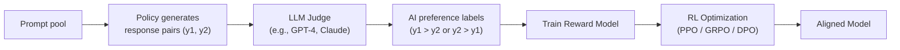
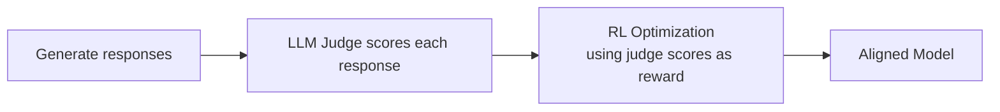
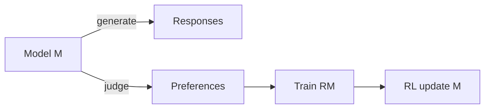

# RLAIF (Reinforcement Learning from AI Feedback)

*Prerequisite: [02_PPO.md](02_PPO.md), [03_DPO.md](03_DPO.md).*

RLAIF replaces human annotators with an **AI model (typically an LLM)** as the source of preference feedback. The core insight: if an LLM can reliably judge which of two responses is better, we can use it to label preference data at scale — eliminating the bottleneck of human annotation.

> **Relationship to RLHF**: RLAIF and RLHF share the same downstream pipeline (train RM → RL optimization). The only difference is **who provides the preference labels**: humans (RLHF) or an AI model (RLAIF).

---

## 1. Why Replace Human Feedback?

| Problem with Human Feedback | Explanation |
|:--|:--|
| **Expensive** | Hiring qualified annotators for preference labeling costs $15–50/hour; labeling 100K pairs can cost $500K+ |
| **Slow** | Human annotation throughput is ~50–200 pairs/day per annotator; scaling to millions of pairs is impractical |
| **Inconsistent** | Inter-annotator agreement is typically 60–75% — different people have different preferences |
| **Hard to scale** | Some tasks require domain expertise (medicine, law, code) — expert annotators are even scarcer |
| **Hard to iterate** | Changing guidelines or criteria requires re-annotation from scratch |

RLAIF addresses all five problems: an LLM can label millions of pairs in hours, at near-zero marginal cost, with perfect consistency (given the same prompt).

## 2. The RLAIF Pipeline



Compare with RLHF:

| Step | RLHF | RLAIF |
|:--|:--|:--|
| **Generate response pairs** | Same | Same |
| **Label preferences** | Human annotators | **LLM Judge** |
| **Train reward model** | Same | Same |
| **RL optimization** | Same | Same |

The only difference is Step 2 — everything else is identical.

## 3. LLM-as-Judge: How AI Feedback Works

### 3.1 Basic Setup

The judge LLM receives a prompt with two candidate responses and outputs a preference:

```
System: You are a helpful assistant that evaluates responses.

User: Given the following question and two responses, which response
is better? Consider accuracy, helpfulness, and safety.

Question: {prompt}
Response A: {response_1}
Response B: {response_2}

Which is better, A or B? Explain your reasoning briefly,
then state your final choice.
```

### 3.2 Common Techniques to Improve Judge Quality

| Technique | Description | Effect |
|:--|:--|:--|
| **Position debiasing** | Swap A/B order, average judgments | Reduces position bias (LLMs tend to prefer the first response) |
| **Chain-of-thought** | Ask judge to reason before judging | Improves accuracy, especially on complex tasks |
| **Rubric-based scoring** | Provide explicit criteria and scales | More consistent, interpretable judgments |
| **Multi-judge ensemble** | Use multiple LLMs, take majority vote | Reduces individual model bias |
| **Constitutional principles** | Provide a list of rules the judge should follow | Guides judgment toward specific values (see [Constitutional AI](./06_Constitutional_AI.md)) |

### 3.3 Position Bias

A well-documented issue: LLMs tend to prefer whichever response appears first. The standard fix is **position debiasing**:

1. Score with Response A first, Response B second → get preference P1
2. Score with Response B first, Response A second → get preference P2
3. If P1 and P2 agree → use that preference
4. If P1 and P2 disagree → discard (or mark as tie)

This doubles the cost but significantly improves label quality.

## 4. Key Results: RLAIF vs RLHF

### 4.1 Lee et al. (2023) — "RLAIF: Scaling Reinforcement Learning from Human Feedback with AI Feedback"

Google's study directly compared RLAIF and RLHF on the same task (summarization):

| Method | Human preference win rate |
|:--|:--|
| SFT baseline | — |
| RLHF (human labels) | 71% vs SFT |
| RLAIF (PaLM 2 labels) | 73% vs SFT |
| RLAIF vs RLHF (head-to-head) | 50% — **no significant difference** |

**Key finding**: RLAIF achieved performance **on par with RLHF** — AI feedback was as effective as human feedback for training the reward model.

### 4.2 Why Does AI Feedback Work So Well?

Several factors explain RLAIF's effectiveness:

1. **Judging is easier than generating** — Even a model that can't write a perfect response can often tell which of two responses is better
2. **Consistency** — AI judges give the same answer for the same input (unlike humans), reducing noise in the RM training data
3. **Scale** — More labeled data can compensate for slightly lower per-sample quality
4. **Strong judges available** — Frontier models (GPT-4, Claude) are strong enough to provide reliable preference signals for most tasks

## 5. Variants of AI Feedback

### 5.1 Direct RLAIF (no separate RM)

Instead of training a separate reward model, use the LLM judge directly as the reward signal:



This skips the RM training step entirely — simpler but requires calling the judge LLM during RL training (expensive at scale).

### 5.2 Self-RLAIF (Self-Judging)

The **same model** that generates responses also judges them:



This creates a self-improvement loop — related to Constitutional AI (see next module). Risk: the model's biases reinforce themselves.

### 5.3 Distilled RLAIF

Use a strong model (e.g., GPT-4) to label preferences, train an RM, then use that RM to align a weaker model. This is effectively **distillation through preference labels** — the student inherits the teacher's judgment criteria.

## 6. RLAIF in Practice

| Project | AI Judge | Student | Method |
|:--|:--|:--|:--|
| **Constitutional AI** (Anthropic, 2022) | Claude (self-judging) | Claude | Self-critique → RLAIF for safety |
| **UltraFeedback** (2023) | GPT-4 | Various | GPT-4 scores → train RM → DPO (Zephyr) |
| **Starling-7B** (2023) | GPT-4 (via Nectar dataset) | OpenChat-3.5 | GPT-4 rankings → RM → PPO |
| **Self-Play** (various) | Same model | Same model | Self-generated preferences → iterative improvement |

## 7. Limitations

1. **Judge bias** — AI judges inherit the biases of their training data; they may systematically prefer verbose, formal, or sycophantic responses
2. **Self-reinforcing errors** — In self-RLAIF, the model's mistakes in judgment get amplified through training
3. **Ceiling effect** — AI feedback quality is bounded by the judge model's capabilities; cannot exceed the judge
4. **Evaluation circularity** — If the same model family is used for training and evaluation, improvements may be illusory
5. **Sensitive topics** — AI judges may be unreliable on politically sensitive, culturally specific, or ethically nuanced topics where human judgment is essential

## 8. RLAIF vs RLHF: When to Use Which

| Criterion | Favor RLAIF | Favor RLHF |
|:--|:--|:--|
| **Budget** | Limited — AI labels are cheap | Sufficient for human annotation |
| **Scale** | Need millions of labels | Thousands of labels sufficient |
| **Task type** | General helpfulness, factual accuracy | Subjective, culturally sensitive, safety-critical |
| **Iteration speed** | Need fast experimentation cycles | Can afford slower iteration |
| **Quality ceiling** | Strong judge model available | Need human-level nuance |

In practice, most modern alignment pipelines use a **hybrid approach**: AI-labeled data for the bulk of training, with human labels for safety-critical and ambiguous cases.

## 9. Key References

- Lee et al., "RLAIF: Scaling Reinforcement Learning from Human Feedback with AI Feedback" (2023) — Direct RLAIF vs RLHF comparison
- Bai et al., "Constitutional AI: Harmlessness from AI Feedback" (2022) — First major RLAIF application
- Cui et al., "UltraFeedback: Boosting Language Models with Scaled AI Feedback" (2023) — Large-scale AI preference dataset
- Zheng et al., "Judging LLM-as-a-Judge with MT-Bench and Chatbot Arena" (2023) — LLM judge evaluation methodology
