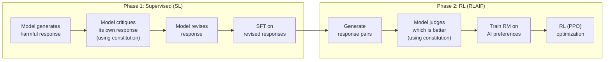

# Constitutional AI (CAI)

*Prerequisite: [05_RLAIF.md](05_RLAIF.md).*

Constitutional AI (Bai et al., 2022, Anthropic) is a training method that aligns LLMs using a **written set of principles (a "constitution")** instead of extensive human preference labels. The model critiques and revises its own outputs based on these principles, then is trained via RLAIF — making alignment more scalable, transparent, and principled.

> **Relationship to RLAIF**: CAI is the most prominent application of [RLAIF](./05_RLAIF.md). It uses the model itself as the AI judge, guided by constitutional principles, to generate preference labels for RL training.

---

## 1. Motivation

### 1.1 Problems with Pure RLHF for Safety

| Problem | Explanation |
|:--|:--|
| **Annotation cost** | Labeling harmful content is expensive — annotators must read and compare toxic outputs |
| **Annotator well-being** | Exposure to harmful content causes psychological harm to human annotators |
| **Inconsistent criteria** | Different annotators have different notions of "safe" — inter-annotator disagreement is high on sensitive topics |
| **Opaque values** | The values learned by the RM are implicit — hard to inspect what the model considers "safe" |
| **Hard to update** | Changing safety criteria requires re-annotation and re-training the RM from scratch |

### 1.2 The Constitutional Approach

Constitutional AI addresses these problems by making the alignment criteria **explicit and editable**:

- Safety rules are written as a **constitution** — a list of natural-language principles
- The model **self-critiques** using these principles (no human reads harmful outputs)
- Changing behavior means editing the constitution, not re-labeling data

## 2. The Constitution

### 2.1 What Is a Constitution?

A set of natural-language principles that define desired model behavior. Examples from Anthropic's original paper:

| # | Principle (abbreviated) |
|:--|:--|
| 1 | Choose the response that is least likely to be seen as harmful or offensive |
| 2 | Choose the response that is most supportive and encouraging of life |
| 3 | Choose the response that is least racist, sexist, or socially biased |
| 4 | Choose the response that is most respectful of everyone's right to their own beliefs |
| 5 | Choose the response that is least likely to be used to commit violence |
| ... | (16 principles total in the original paper) |

### 2.2 Key Properties

- **Human-readable**: Anyone can read the constitution and understand what the model is being trained to do
- **Editable**: Changing a principle changes the model's behavior without re-annotation
- **Composable**: Different constitutions for different use cases (e.g., stricter for children's products)
- **Auditable**: External reviewers can inspect and critique the alignment criteria

## 3. Two-Phase Training

Constitutional AI has two distinct phases:



### 3.1 Phase 1: Supervised Self-Critique (Red-teaming + Revision)

**Goal**: Generate a dataset of (harmful prompt, safe response) pairs through self-critique.

**Steps**:

1. **Red-team prompting**: Use the model to generate responses to harmful prompts (the model initially produces harmful outputs)

2. **Critique**: Ask the model to critique its own response using a constitutional principle:
   ```
   Prompt: [harmful question]
   Response: [harmful response from step 1]

   Critique Request: Identify specific ways in which the response
   is harmful, unethical, racist, sexist, toxic, dangerous, or illegal.

   Critique: [model identifies problems in its own response]
   ```

3. **Revision**: Ask the model to revise its response based on the critique:
   ```
   Revision Request: Please rewrite the response to remove any harmful,
   unethical, racist, sexist, toxic, dangerous, or illegal content.

   Revision: [model produces safer response]
   ```

4. **Iterate**: Repeat critique-revision multiple rounds with different principles

5. **SFT**: Fine-tune the model on (harmful prompt → final revised response) pairs

### 3.2 Phase 2: RLAIF (RL from AI Feedback)

**Goal**: Further refine the model using RL, with preferences labeled by the model itself.

**Steps**:

1. **Generate response pairs**: For each prompt, the Phase 1 model generates two candidate responses

2. **AI preference labeling**: The model judges which response is better, guided by constitutional principles:
   ```
   Consider the following two responses to the question "{prompt}":

   (A) {response_1}
   (B) {response_2}

   Which response is less harmful? Choose based on this principle:
   "{constitutional_principle}"
   ```

3. **Train Reward Model**: Use the AI-labeled preferences to train an RM (same as standard RLHF)

4. **RL optimization**: Use PPO with the RM to further align the model

### 3.3 Why Two Phases?

| Phase | Purpose | Limitation addressed by next phase |
|:--|:--|:--|
| **Phase 1 (SL)** | Teach basic safety through revised examples | SFT only shows "what to do," no preference signal; limited by revision quality |
| **Phase 2 (RL)** | Optimize for preferences at scale | — |

Phase 1 alone is insufficient (same SFT limitations from the [Overview](./01_Overview.md#22-sft-necessary-but-insufficient)). Phase 2 adds the preference-based optimization that SFT lacks.

## 4. Results

### 4.1 Helpfulness vs Harmlessness

A key finding from the CAI paper: standard RLHF creates a tension between helpfulness and harmlessness — making the model safer often makes it less helpful (the "alignment tax"). CAI reduces this tradeoff:

| Method | Helpfulness | Harmlessness |
|:--|:--|:--|
| RLHF (human feedback) | High | Moderate (or high, but with helpfulness cost) |
| CAI (Phase 1 only) | Moderate | High |
| CAI (Phase 1 + 2) | **High** | **High** |

Phase 2 (RLAIF) is critical — it recovers helpfulness that Phase 1 (SFT) alone sacrifices.

### 4.2 Scaling AI Feedback

The paper found that AI feedback quality improves with the judge model's capability:
- Larger, more capable models give better preference labels
- Chain-of-thought prompting improves judge accuracy
- Position debiasing (see [RLAIF](./05_RLAIF.md#33-position-bias)) is important

## 5. Self-Instruct: A Related Concept

**Self-Instruct** (Wang et al., 2023) is a related but distinct idea:

| Aspect | Self-Instruct | Constitutional AI |
|:--|:--|:--|
| **Goal** | Generate diverse instruction-following data | Align model for safety and helpfulness |
| **What model generates** | New (instruction, response) pairs | Critiques and revisions of existing responses |
| **Training signal** | SFT on self-generated data | SFT (Phase 1) + RLAIF (Phase 2) |
| **Focus** | Capability (instruction following) | Values (safety, harmlessness) |

Both use the model's own outputs for training, but serve different purposes. Self-Instruct bootstraps capability; Constitutional AI shapes values.

## 6. Advantages and Limitations

### 6.1 Advantages

1. **Transparent alignment** — The constitution is human-readable; stakeholders can inspect and debate the values being instilled
2. **Reduced human exposure to harm** — Annotators don't need to read and compare harmful outputs
3. **Scalable** — AI feedback can generate millions of preference labels at low cost
4. **Updatable** — Editing the constitution changes model behavior without full retraining
5. **Reduced helpfulness-harmlessness tradeoff** — Phase 2 RLAIF recovers helpfulness that pure safety SFT sacrifices

### 6.2 Limitations

1. **Depends on model capability** — The model must be capable enough to meaningfully critique and revise its own outputs; weak models produce poor self-critiques
2. **Constitution design is non-trivial** — Writing good principles requires careful thought; vague principles lead to vague behavior
3. **Self-reinforcing biases** — If the model has systematic blind spots, self-critique won't catch them
4. **Not a replacement for all human feedback** — Subjective preferences (style, tone, cultural norms) still benefit from human judgment
5. **Evaluation difficulty** — Hard to verify that the constitution is being followed correctly at scale

## 7. Impact and Adoption

Constitutional AI has influenced the broader field:

- **Anthropic** uses CAI as a core component of Claude's alignment process
- **The constitutional approach** inspired other principle-guided alignment work
- **RLAIF** (generalized from CAI) is now widely adopted (see [RLAIF Overview](./05_RLAIF.md))
- **Principle-based evaluation** (using LLMs to judge based on written criteria) is now standard practice in model evaluation (MT-Bench, Chatbot Arena)

## 8. Key References

- Bai et al., "Constitutional AI: Harmlessness from AI Feedback" (2022) — Original CAI paper
- Wang et al., "Self-Instruct: Aligning Language Models with Self-Generated Instructions" (2023) — Related self-training approach
- Lee et al., "RLAIF: Scaling Reinforcement Learning from Human Feedback with AI Feedback" (2023) — Generalized RLAIF
- Anthropic, "Claude's Constitution" (2023) — Public disclosure of Claude's constitutional principles
