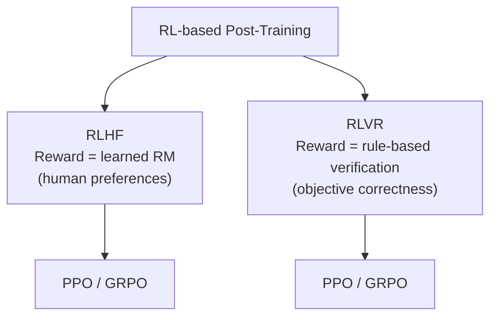
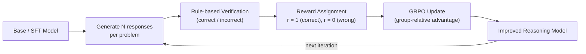
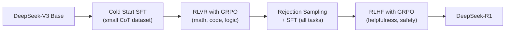

# RLVR (Reinforcement Learning from Verifiable Rewards)

*Prerequisite: [../02_Preference_Alignment/02_PPO.md](../02_Preference_Alignment/02_PPO.md).*

RLVR is the training paradigm behind the "reasoning revolution" of 2024–2025. DeepSeek-R1 is the most well-documented example; OpenAI's o1/o3 are widely believed to use a similar approach, though the training details have not been publicly disclosed. Unlike RLHF where rewards come from a learned model trained on human preferences, RLVR uses **verifiable, rule-based rewards** — the answer is either correct or incorrect, checkable without any human or model judge.

> **Relationship to RLHF**: RLVR and RLHF share the same RL optimization algorithms (PPO, GRPO) but differ in the **reward source**. RLHF learns what humans prefer; RLVR verifies what is objectively correct.

---

## 1. RLVR vs RLHF

| Dimension | RLHF | RLVR |
|:--|:--|:--|
| **Reward source** | Learned Reward Model (trained on human preferences) | Rule-based verification (exact match, code execution, proof checker) |
| **Signal quality** | Noisy (inter-annotator disagreement, RM imperfections) | Clean (binary correct/incorrect, no ambiguity) |
| **Applicable tasks** | Open-ended (helpfulness, safety, style) | Tasks with verifiable answers (math, code, logic, factual QA) |
| **Reward hacking risk** | High (model exploits RM weaknesses) | Low (hard to hack objective correctness) |
| **Data requirement** | Human preference annotations (expensive) | Problems with known solutions (abundant) |
| **Key examples** | InstructGPT, Claude, Llama 3 | DeepSeek-R1, OpenAI o1/o3 |

### 1.1 Why RLVR Now?

Two converging trends made RLVR practical in 2024:

1. **GRPO eliminated the Critic** — RLVR generates many candidate responses per prompt; GRPO's group-relative advantage naturally fits this workflow (see [GRPO](./02_GRPO.md))
2. **Reasoning benchmarks matured** — MATH, GSM8K, AIME, and code benchmarks provide large-scale verifiable problems

## 2. The RLVR Pipeline

### 2.1 Reward Functions

| Task Type | Verification Method | Example |
|:--|:--|:--|
| **Math** | Extract final answer, compare to ground truth | "The answer is 42" vs known answer 42 → r = 1 |
| **Code** | Execute against test cases | Pass all tests → r = 1, fail any → r = 0 |
| **Logic / Proof** | Formal checker (Lean, Isabelle) | Proof compiles → r = 1 |
| **Factual QA** | Exact match / F1 against gold answer | Match → r = 1 |

### 2.2 Why GRPO is the Natural Fit

For each prompt, RLVR generates a **group** of N responses (e.g., N = 64). Some are correct, some are wrong. GRPO computes advantage by comparing within the group:

- Correct responses → positive advantage (above group mean)
- Incorrect responses → negative advantage (below group mean)

No Critic model needed — the group statistics provide the baseline. This is exactly the scenario GRPO was designed for.

### 2.3 Format Reward

Beyond correctness, RLVR often adds a **format reward** to encourage structured reasoning output:

| Reward Component | Signal | Purpose |
|:--|:--|:--|
| **Accuracy reward** | 1 if correct, 0 if wrong | Core learning signal |
| **Format reward** | 1 if output follows `<think>...</think><answer>...</answer>` structure | Encourage chain-of-thought |

## 3. DeepSeek-R1: The RLVR Case Study

DeepSeek-R1 (2025) is the most documented RLVR success, demonstrating that **pure RL on verifiable rewards can induce reasoning capabilities** without explicit chain-of-thought supervision.

### 3.1 Training Pipeline

Key stages:

| Stage | Purpose | Method |
|:--|:--|:--|
| **Cold Start SFT** | Teach basic CoT format | SFT on thousands of long-CoT examples |
| **RLVR** | Develop reasoning capabilities | GRPO with rule-based rewards on math/code |
| **Rejection Sampling + SFT** | Extend reasoning to general tasks | Sample best-of-N from RLVR model, SFT on all domains |
| **RLHF** | Align for helpfulness and safety | GRPO with preference-based RM |

### 3.2 Emergent Behaviors

During RLVR training, DeepSeek-R1 spontaneously developed:

- **Self-verification**: Re-checking its own answers before finalizing
- **Reflection**: "Wait, let me reconsider..." patterns
- **Extended reasoning**: Spending more tokens on harder problems

These behaviors were **not taught through SFT** — they emerged purely from the RL optimization pressure to be correct.

### 3.3 DeepSeek-R1-Zero

An ablation experiment: skip Cold Start SFT entirely, apply RLVR directly to the base model.

Result: The model still learned to reason and developed chain-of-thought patterns, but with readability issues (language mixing, poor formatting). This demonstrates that RLVR alone is sufficient for reasoning capability, but SFT is needed for usability.

## 4. Relationship to Other Methods

### 4.1 RLVR vs Rejection Sampling

| Aspect | RLVR (with GRPO) | Rejection Sampling |
|:--|:--|:--|
| **Update mechanism** | Policy gradient update (online RL) | Keep best response, discard rest, SFT on best |
| **Learns from failures** | Yes — incorrect responses get negative advantage | No — incorrect responses are simply discarded |
| **Exploration** | Policy evolves, explores new strategies | Static policy, no exploration improvement |
| **Efficiency** | More sample-efficient (uses all N responses) | Wasteful (only uses ~1 of N responses) |

### 4.2 RLVR vs Expert Iteration

Expert Iteration (Anthony et al., 2017; also covered in Stanford CS336) is similar to Rejection Sampling but iterative:
1. Generate N responses, keep correct ones
2. SFT on correct responses
3. Repeat with the improved model

RLVR with GRPO addresses the same setting but uses policy gradient updates instead of SFT — it can learn from both correct and incorrect responses, and the policy evolves through RL exploration rather than repeated imitation.

## 5. Process Reward Models (PRM) vs Outcome Reward Models (ORM)

For reasoning tasks, there are two ways to assign rewards:

| Aspect | ORM (Outcome) | PRM (Process) |
|:--|:--|:--|
| **What is evaluated** | Final answer only | Each reasoning step |
| **Signal** | Sparse (1 reward at the end) | Dense (reward per step) |
| **Credit assignment** | Hard (which step caused the error?) | Easy (error localized to specific step) |
| **Training cost** | Low (just check final answer) | High (need step-level annotations) |
| **Performance** | Good for simple problems | Better for complex multi-step reasoning |

RLVR typically uses ORM (verify the final answer). PRM can improve RLVR further but requires step-level verification data, which is expensive to create.

## 6. Challenges

1. **Limited to verifiable tasks** — RLVR requires objective correctness criteria; doesn't apply to creative writing, open-ended dialogue, or subjective tasks
2. **Reward sparsity** — Binary correct/incorrect is a very sparse signal, especially for hard problems where most attempts fail
3. **Reward hacking on format** — Models may learn to game the format checker without genuine reasoning
4. **Compute intensive** — Generating N responses (N = 32–64) per prompt per iteration requires massive compute
5. **Distribution of training problems** — Which problems to train on, and at what difficulty level, significantly affects outcomes

## 7. Key References

- Shao et al., "DeepSeekMath: Pushing the Limits of Mathematical Reasoning" (2024) — GRPO origin
- DeepSeek-AI, "DeepSeek-R1: Incentivizing Reasoning Capability in LLMs via Reinforcement Learning" (2025) — RLVR at scale
- Lightman et al., "Let's Verify Step by Step" (2023) — Process Reward Models
- Uesato et al., "Solving math word problems with process- and outcome-based feedback" (2022) — PRM vs ORM
- Wang et al., "Math-Shepherd: Verify and Reinforce LLMs Step-by-step without Human Annotations" (2024)
