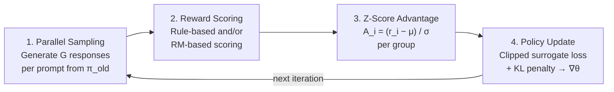
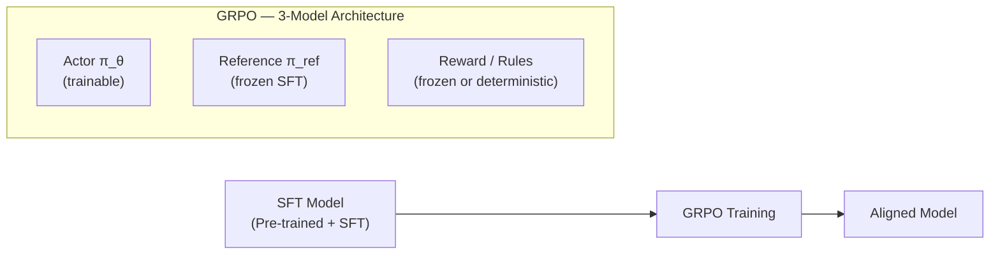
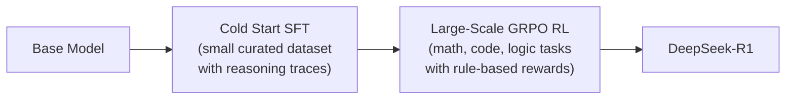

# GRPO (Group Relative Policy Optimization)

*Prerequisite: [01_RLVR.md](01_RLVR.md), [../02_Preference_Alignment/02_PPO.md](../02_Preference_Alignment/02_PPO.md).*

**GRPO** is a reinforcement learning alignment algorithm proposed by the DeepSeek team (DeepSeek-V3, DeepSeek-R1). Its core innovation: **completely remove the Critic model from PPO, and compute the advantage function from intra-group relative scores (Z-score).**

> **GRPO = PPO's policy gradient logic + Statistical baseline − Critic model**

---

## 1. Why GRPO?

### 1.1 PPO's Critic Pain Points

Standard PPO requires 4 models in memory simultaneously (see [02_PPO.md § 4](../02_Preference_Alignment/02_PPO.md#4-the-4-model-architecture-of-ppo-training)):

| Model | Trainable | Role |
|:--|:--|:--|
| Actor $\pi_\theta$ | Yes | Generate responses |
| **Critic** $V_\phi$ | **Yes** | **Estimate state value for advantage calculation** |
| Reference $\pi_{ref}$ | No | KL penalty anchor |
| Reward Model $r_\psi$ | No | Score response quality |

The Critic brings three problems:

1. **VRAM**: The Critic is typically the same size as the Actor — for a 7B model, that's an extra ~14 GB (bf16).
2. **Training difficulty**: $V(s)$ must accurately estimate expected return at every token position in a variable-length sequence — a hard regression problem in itself.
3. **Value estimation bias**: Inaccurate Critic predictions introduce bias into the advantage estimate, which propagates to the policy gradient and can destabilize training.

### 1.2 DPO's Limitations

DPO eliminates both the Reward Model and the Critic (2 models only), but trades off:

- **Offline only**: Trains on a fixed preference dataset; cannot explore and improve beyond that data.
- **No online exploration**: The policy never generates new responses during training — it only learns from pre-collected (chosen, rejected) pairs.
- **Static preference data**: Performance is bounded by the quality and coverage of the preference dataset.

### 1.3 GRPO's Core Insight

Replace **neural network estimation** (Critic $V(s)$) with **statistics** (intra-group Z-score):

- For the same prompt, generate $G$ responses in parallel.
- Score all $G$ responses, compute group mean and standard deviation.
- Each response's advantage = how far its reward deviates from the group mean, in standard deviation units.

This gives an **online RL** method (like PPO) without the Critic overhead (closer to DPO's simplicity).

### 1.4 Three-Way Comparison

| Property | PPO | DPO | **GRPO** |
|:--|:--|:--|:--|
| **Training mode** | Online RL | Offline | **Online RL** |
| **Models required** | 4 (Actor, Critic, Ref, RM) | 2 (Actor, Ref) | **3 (Actor, Ref, RM — no Critic)** |
| **Advantage function** | Estimated by Critic (GAE) | N/A (implicit in BT loss) | **Computed from group statistics (Z-score)** |
| **Stability** | Poor, hard to tune | Very stable | **Above average (much more stable than PPO)** |
| **Exploration** | Yes (on-policy sampling) | No (fixed dataset) | **Yes (on-policy sampling)** |
| **Best for** | General alignment | Preference tuning with static data | **Tasks with objective evaluation criteria** |

## 2. From PPO to GRPO: The Derivation

### 2.1 Review: PPO Objective and Advantage

Recall from [02_PPO.md § 6.5](../02_Preference_Alignment/02_PPO.md#65-ppo-clipped-objective), the PPO clipped objective:

$$\mathcal{L}_{PPO} = \mathbb{E}\Big[\min\big(\rho_t \cdot \hat{A}_t, \; \text{clip}(\rho_t, 1-\epsilon, 1+\epsilon) \cdot \hat{A}_t\big)\Big]$$

Where the advantage $\hat{A}_t$ is estimated via GAE using the **Critic** $V_\phi(s_t)$ (see [02_PPO.md § 6.4](../02_Preference_Alignment/02_PPO.md#64-advantage-estimation-gae)):

$$\hat{A}_t^{GAE} = \sum_{l=0}^{T-t} (\gamma \lambda)^l \cdot \delta_{t+l}, \quad \delta_t = r_t + \gamma \cdot V(s_{t+1}) - V(s_t)$$

The entire GAE computation depends on the Critic's value estimates $V(s_t)$.

### 2.2 Why $V(s)$ is Difficult in LLM Scenarios

In classic RL (Atari, robotics), the state space is fixed-dimensional and the Critic learns a compact mapping. For LLMs:

- **State = prompt + all tokens generated so far** — variable length, high dimensional.
- **Sparse reward** — the RM score arrives only at the last token; KL penalties are per-token but weak signals.
- The Critic must learn: _"given this prompt and these 147 tokens generated so far, what is the expected total reward for the rest of the response?"_ — this is a challenging sequence-level regression.

Result: the Critic is hard to train, slow to converge, and introduces bias when inaccurate.

### 2.3 Group Sampling

GRPO's alternative: for a single prompt $q$, sample a **group** of $G$ complete responses:

$$\{o_1, o_2, \ldots, o_G\} \sim \pi_{\theta_{old}}(\cdot \mid q)$$

Typical $G$ values: 8 – 64.

### 2.4 Group Relative Advantage (Z-Score)

Score each response with the reward function, yielding $\{r_1, r_2, \ldots, r_G\}$. Then normalize:

$$\boxed{A_i = \frac{r_i - \text{mean}(r_1, \ldots, r_G)}{\text{std}(r_1, \ldots, r_G)}}$$

**Why this works as a baseline replacement**:

- In PPO, the advantage $A_t = R_t - V(s_t)$ subtracts the Critic's estimate of expected return to reduce variance.
- In GRPO, the group mean $\text{mean}(R)$ serves as a **Monte Carlo estimate of expected return** for this prompt — no neural network needed.
- Dividing by $\text{std}(R)$ normalizes the scale, providing stable gradient magnitudes across different prompts.

The advantage is computed **per-response** (not per-token), then applied uniformly to all tokens in that response.

### 2.5 GRPO Complete Objective Function

**Probability Ratio** — measures how much the current policy has shifted from the sampling policy:

$$\rho_i(\theta) = \frac{\pi_\theta(o_i \mid q)}{\pi_{\theta_{old}}(o_i \mid q)}$$

In practice, this is computed at the token level:

$$\rho_i(\theta) = \prod_{t=1}^{|o_i|} \frac{\pi_\theta(o_{i,t} \mid q, o_{i,<t})}{\pi_{\theta_{old}}(o_{i,t} \mid q, o_{i,<t})}$$

**Clipped Surrogate Objective** (inherited from PPO):

$$\mathcal{L}_{clip}(\theta) = \mathbb{E}_{q, \{o_i\}}\left[\frac{1}{G}\sum_{i=1}^{G}\min\left(\rho_i(\theta) \cdot A_i,\; \text{clip}\left(\rho_i(\theta), 1-\epsilon, 1+\epsilon\right) \cdot A_i\right)\right]$$

**KL Divergence Penalty** — an **independent regularization term**, not inside the clip (unlike standard PPO's approach):

$$\boxed{\mathcal{L}_{GRPO}(\theta) = \mathcal{L}_{clip}(\theta) - \beta \cdot \mathbb{D}_{KL}\left(\pi_\theta \| \pi_{ref}\right)}$$

Key design choice: decoupling KL from clipping allows GRPO to control exploration (via $\epsilon$) and stability (via $\beta$) independently.

### 2.6 Side-by-Side with PPO

| Component | PPO | GRPO |
|:--|:--|:--|
| **Objective** | $\mathbb{E}\big[\min(\rho_t \hat{A}_t, \text{clip}(\rho_t) \hat{A}_t)\big]$ | $\mathbb{E}\big[\frac{1}{G}\sum_i \min(\rho_i A_i, \text{clip}(\rho_i) A_i)\big] - \beta D_{KL}$ |
| **Advantage** | $\hat{A}_t^{GAE} = \sum_l (\gamma\lambda)^l \delta_{t+l}$ (per-token, Critic-based) | $A_i = \frac{r_i - \mu}{\sigma}$ (per-response, statistics-based) |
| **KL handling** | Per-token penalty baked into reward signal | Independent regularization term outside the clip |
| **Granularity** | Token-level | Response-level |

## 3. GRPO Algorithm Mechanics

### 3.1 Four-Step Workflow



### 3.2 Reward Mechanism Design

GRPO supports two types of reward signals (often combined):

**Rule-based Deterministic Rewards** (primary in DeepSeek-R1):

| Reward Type | Verification Method | Example |
|:--|:--|:--|
| **Accuracy** | Compare final answer against ground truth | Math: is the numerical answer correct? |
| **Accuracy** | Execute and test | Code: does it compile and pass unit tests? |
| **Format** | Regex / structural check | Did the response use `<think>...</think>` tags? |

**Model-based Rewards** (optional, complementary):

- A learned Reward Model $r_\psi$ provides semantic quality scores.
- Used when no deterministic verification is possible (e.g., open-ended creative tasks).

Rule-based rewards avoid **RM hacking** — the model cannot exploit loopholes in a rule the way it can exploit a learned scorer.

### 3.3 Clipping Mechanism

Inherited directly from PPO (see [02_PPO.md § 6.5](../02_Preference_Alignment/02_PPO.md#65-ppo-clipped-objective)):

- If $A_i > 0$ (good response): $\rho_i$ is capped at $1 + \epsilon$ — limits how aggressively we reinforce good outputs.
- If $A_i < 0$ (bad response): $\rho_i$ is capped at $1 - \epsilon$ — limits how aggressively we suppress bad outputs.

### 3.4 Multi-Step Updates

Like PPO, one group of sampled data can be reused for **multiple epochs** of mini-batch updates (importance sampling makes this valid; clipping keeps it stable). This improves sample efficiency — the expensive sampling step is amortized over K gradient steps.

## 4. Training Pipeline and Code

### 4.1 Pipeline Overview



Compared to PPO's 4-model architecture, GRPO removes the Critic entirely.

### 4.2 Code Implementation

```python
import torch
import torch.nn.functional as F

# ──────────────────────────────────────────────
# Reusable utility (shared with PPO / DPO)
# ──────────────────────────────────────────────
def get_per_token_logprobs(model, input_ids):
    """Extract per-token log-probabilities for the generated tokens."""
    logits = model(input_ids).logits[:, :-1, :]         # (B, T-1, V)
    logprobs = F.log_softmax(logits, dim=-1)
    token_logprobs = logprobs.gather(2, input_ids[:, 1:].unsqueeze(-1)).squeeze(-1)
    return token_logprobs                                # (B, T-1)

# ──────────────────────────────────────────────
# GRPO-specific components
# ──────────────────────────────────────────────
def group_sample(actor, prompt_ids, group_size, max_new_tokens=256):
    """Generate G responses for each prompt in parallel.

    Args:
        actor: the policy model
        prompt_ids: (B, T_prompt)
        group_size: G — number of responses per prompt
    Returns:
        output_ids: (B*G, T_prompt + T_response)
        prompt_len: int
    """
    B, T_prompt = prompt_ids.shape
    # Repeat each prompt G times: [p1,p1,...,p2,p2,...] → (B*G, T_prompt)
    expanded = prompt_ids.repeat_interleave(group_size, dim=0)
    output_ids = actor.generate(expanded, max_new_tokens=max_new_tokens, do_sample=True)
    return output_ids, T_prompt

def compute_group_advantages(rewards, group_size):
    """Compute Z-score normalized advantages within each group.

    Args:
        rewards: (B*G,) — scalar reward per response
    Returns:
        advantages: (B*G,) — normalized advantage per response
    """
    # Reshape to (B, G), normalize within each group
    grouped = rewards.view(-1, group_size)                # (B, G)
    mean = grouped.mean(dim=1, keepdim=True)              # (B, 1)
    std = grouped.std(dim=1, keepdim=True).clamp(min=1e-8)
    advantages = ((grouped - mean) / std).view(-1)        # (B*G,)
    return advantages

def grpo_loss(actor, ref_model, output_ids, old_logprobs,
              advantages, response_mask, prompt_len,
              epsilon=0.2, beta=0.04):
    """GRPO clipped surrogate loss + independent KL penalty.

    Args:
        actor: current policy π_θ
        ref_model: frozen reference π_ref
        output_ids: (B*G, T)
        old_logprobs: (B*G, T_resp) — logprobs from π_old at sampling time
        advantages: (B*G,) — per-response Z-score advantage
        response_mask: (B*G, T_resp) — mask for response tokens
        prompt_len: int
        epsilon: clipping parameter
        beta: KL penalty coefficient
    """
    # Current policy logprobs
    new_logprobs = get_per_token_logprobs(actor, output_ids)[:, prompt_len - 1:]

    # Per-token probability ratio
    ratio = torch.exp(new_logprobs - old_logprobs)        # (B*G, T_resp)

    # Expand per-response advantage to per-token
    adv = advantages.unsqueeze(1).expand_as(ratio)        # (B*G, T_resp)

    # Clipped surrogate (per-token, then averaged)
    surr1 = ratio * adv
    surr2 = torch.clamp(ratio, 1 - epsilon, 1 + epsilon) * adv
    clip_loss = (torch.min(surr1, surr2) * response_mask).sum() / response_mask.sum()

    # Independent KL penalty: D_KL(π_θ || π_ref)
    with torch.no_grad():
        ref_logprobs = get_per_token_logprobs(ref_model, output_ids)[:, prompt_len - 1:]
    kl = ((new_logprobs - ref_logprobs) * response_mask).sum() / response_mask.sum()

    loss = -clip_loss + beta * kl
    return loss, {"clip_loss": clip_loss.item(), "kl": kl.item()}

def grpo_train_step(actor, ref_model, reward_fn, prompts, tokenizer,
                    optimizer, group_size=16, epsilon=0.2, beta=0.04,
                    max_new_tokens=256, ppo_epochs=4):
    """Complete GRPO training step.

    Args:
        reward_fn: callable(output_ids, prompt_len) → (B*G,) scalar rewards
                   Can be a Reward Model, rule-based scorer, or combination.
    """
    prompt_ids = tokenizer(prompts, return_tensors="pt", padding=True).input_ids.cuda()

    # ── Step 1: Parallel group sampling ──
    with torch.no_grad():
        output_ids, prompt_len = group_sample(actor, prompt_ids, group_size, max_new_tokens)
        response_mask = (output_ids[:, prompt_len:] != tokenizer.pad_token_id).float()
        old_logprobs = get_per_token_logprobs(actor, output_ids)[:, prompt_len - 1:]

    # ── Step 2: Reward scoring ──
    with torch.no_grad():
        rewards = reward_fn(output_ids, prompt_len)       # (B*G,)

    # ── Step 3: Z-score advantage ──
    advantages = compute_group_advantages(rewards, group_size)

    # ── Step 4: Policy update (K epochs) ──
    for epoch in range(ppo_epochs):
        loss, metrics = grpo_loss(
            actor, ref_model, output_ids, old_logprobs,
            advantages, response_mask, prompt_len,
            epsilon=epsilon, beta=beta,
        )
        optimizer.zero_grad()
        loss.backward()
        torch.nn.utils.clip_grad_norm_(actor.parameters(), max_norm=1.0)
        optimizer.step()

    return {"loss": loss.item(), **metrics, "reward_mean": rewards.mean().item()}
```

### 4.3 Comparison with PPO Code

| Component | PPO | GRPO |
|:--|:--|:--|
| `get_per_token_logprobs` | Same | **Reused** |
| `compute_gae` (Critic + GAE) | Required | **Removed** |
| `critic_loss` | Required | **Removed** |
| `group_sample` | N/A | **New** (parallel G-response generation) |
| `compute_group_advantages` | N/A | **New** (Z-score normalization) |
| `ppo_clipped_loss` | Token-level advantage from GAE | Response-level advantage from Z-score |
| KL penalty | Baked into reward signal | **Independent regularization term** |
| Critic optimizer | Required | **Removed** |

## 5. Hyperparameters and Practical Challenges

### 5.1 Group Size $G$

| $G$ | Advantage Estimate | Sampling Cost |
|:--|:--|:--|
| 8 | Noisier (small sample) | Lower |
| 16 – 32 | Good balance | Moderate |
| 64 | More stable | Higher |

**Tradeoff**: Larger $G$ gives a more stable mean/std estimate (better baseline), but requires $G \times$ the sampling computation per prompt.

### 5.2 KL Coefficient $\beta$

- Controls the strength of the KL penalty against $\pi_{ref}$.
- Too large: model barely changes from SFT (underfitting).
- Too small: model drifts, potential reward hacking or mode collapse.
- Typical range: 0.01 – 0.1. Can use adaptive scheduling (same as PPO).

### 5.3 Clipping $\epsilon$

- Inherited from PPO, typically 0.1 – 0.3.
- Smaller $\epsilon$ = more conservative updates = more stable but slower convergence.

### 5.4 Reward Design Principles

| Task Type | Reward Strategy |
|:--|:--|
| Math | Accuracy reward: exact match on final numerical answer |
| Code | Accuracy reward: compile + pass test cases |
| Reasoning | Format reward (`<think>` tags) + accuracy reward |
| Open-ended | Learned Reward Model (semantic quality) |

### 5.5 Core Tradeoff

$$\underbrace{G \times \text{sampling cost}}_{\text{GRPO overhead}} \quad\text{vs}\quad \underbrace{\text{Critic VRAM + training cost}}_{\text{PPO overhead}}$$

GRPO trades **compute** (parallel generation) for **memory** (no Critic). On modern hardware with efficient batched generation (e.g., vLLM), the sampling overhead is often smaller than the Critic overhead.

## 6. DeepSeek-R1: GRPO in Practice

### 6.1 Two-Stage Training



- **Stage 1 (Cold Start SFT)**: Fine-tune on a small set of high-quality chain-of-thought examples to bootstrap reasoning behavior.
- **Stage 2 (GRPO RL)**: Large-scale reinforcement learning on tasks with verifiable answers, using rule-based rewards as the primary signal.

### 6.2 Reward Design in R1

| Reward | Weight | Verification |
|:--|:--|:--|
| **Accuracy** | Primary | Math: exact numerical match. Code: compile + test pass. |
| **Format** | Secondary | Must use `<think>...</think>` for reasoning, `<answer>...</answer>` for final output. |

No learned Reward Model for these tasks — entirely rule-based. This eliminates RM hacking and makes the reward signal perfectly calibrated.

### 6.3 Emergent Capabilities: The "Aha Moment"

During GRPO training, DeepSeek-R1 exhibited **spontaneous emergence** of advanced reasoning behaviors:

- **Self-reflection**: The model learned to re-examine its own reasoning steps and correct mistakes mid-generation.
- **Deep reasoning chains**: Without being explicitly trained on long CoT examples, the model began producing extended chains of thought.
- **"Aha Moment"**: At certain training checkpoints, the model suddenly acquired qualitatively new capabilities — analogous to a phase transition.

These capabilities were **not present in the SFT data** — they emerged from the RL optimization process itself. GRPO's online exploration allowed the model to discover reasoning strategies that no human annotator had demonstrated.

### 6.4 Distillation Path

```
DeepSeek-R1 (671B MoE)
    ├── R1-Distill-Qwen-32B
    ├── R1-Distill-Qwen-14B
    ├── R1-Distill-Qwen-7B
    ├── R1-Distill-Qwen-1.5B
    └── R1-Distill-LLaMA-8B / 70B
```

The reasoning capabilities learned via GRPO can be distilled into smaller dense models, retaining much of the performance at a fraction of the cost.

## 7. Engineering Practice

### 7.1 Tools

| Framework | Notes |
|:--|:--|
| **OpenRLHF** | Distributed RLHF/GRPO training; Ray-based orchestration |
| **veRL / ROLL** | ByteDance's RL training framework; native GRPO support |
| **TRL (HuggingFace)** | `GRPOTrainer` — most accessible single-node implementation |

### 7.2 VRAM Comparison

| Setup | PPO (4 models) | GRPO (3 models) | Savings |
|:--|:--|:--|:--|
| 7B (bf16) | ~56 GB | ~42 GB | **~25%** |
| 7B (bf16) + Critic=Actor size | ~56 GB | ~42 GB | **~25%** |
| With QLoRA | ~28 GB | ~21 GB | **~25%** |

In practice, the savings can approach **~50%** when accounting for Critic optimizer states and activations.

### 7.3 Larger Batch and Sequence Support

Freed VRAM from removing the Critic can be reallocated to:

- **Larger batch sizes** — more prompts per step, more stable gradients.
- **Longer sequences** — support longer reasoning chains without OOM.

### 7.4 Evaluation Metrics

| Metric | Purpose |
|:--|:--|
| Mean reward per group | Track alignment progress |
| Intra-group reward std | If too low, responses are too similar (low diversity) |
| KL divergence $D_{KL}(\pi_\theta \| \pi_{ref})$ | Monitor policy drift |
| Pass@1 (math/code) | Task-specific accuracy |
| Response length distribution | Detect reward hacking (length exploitation) |

## 8. Key References

- Shao et al., "DeepSeekMath: Pushing the Limits of Mathematical Reasoning in Open Language Models" (2024) — GRPO first introduced
- DeepSeek-AI, "DeepSeek-V3 Technical Report" (2024) — GRPO at scale
- DeepSeek-AI, "DeepSeek-R1: Incentivizing Reasoning Capability in LLMs via Reinforcement Learning" (2025) — Emergent reasoning via GRPO
- Schulman et al., "Proximal Policy Optimization Algorithms" (2017) — PPO foundation
- Rafailov et al., "Direct Preference Optimization" (2023) — DPO comparison baseline
