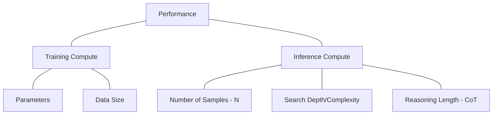

# Inference-Time Compute (Scaling Law for Inference)

*Prerequisite: [../03_Reasoning_Alignment/01_RLVR.md](../03_Reasoning_Alignment/01_RLVR.md), [../03_Reasoning_Alignment/02_GRPO.md](../03_Reasoning_Alignment/02_GRPO.md).*

---

The "Scaling Law" was traditionally applied to training compute (more parameters, more data, more training FLOPs). However, models like **OpenAI o1** and **DeepSeek-R1** have popularized a new paradigm: **scaling compute during inference**.

Instead of giving the first answer that comes to mind, the model "thinks" (searches, reasons, and verifies) before outputting the final response.

---

## 1. The Core Concept: "System 2" Thinking

Inspired by Daniel Kahneman's *Thinking, Fast and Slow*:
- **System 1 (Standard LLM)**: Fast, instinctive, and emotional. The model predicts the next token based on pattern matching.
- **System 2 (o1/R1)**: Slower, more deliberative, and logical. The model uses extra computation to search for a better solution.

## 2. Techniques for Scaling Inference Compute

### 2.1 Chain-of-Thought (CoT) Reasoning
- **Internal Monologue**: The model generates a `<thought>` process before the `<answer>`.
- **Implicit vs. Explicit**: While prompting can trigger CoT, **DeepSeek-R1** shows that training a model to always use CoT significantly improves its baseline capability.

### 2.2 Search & Verification (Best-of-N)
As discussed in [Rejection Sampling](./01_Rejection_Sampling.md), the model generates $N$ candidates and chooses the best one using a verifier.
- **Compute Scaling**: Increasing $N$ directly increases the probability of finding the correct answer.

### 2.3 Monte Carlo Tree Search (MCTS)
Used in AlphaGo and believed to be a component of OpenAI o1.
- **Process**: The model explores a tree of possible reasoning steps. It uses a **Value Model** to estimate which branch is most promising and a **Policy Model** to expand branches.
- **Scaling**: More time/compute spent on tree search leads to better solutions.

### 2.4 Self-Correction / Refinement
The model critiques its own intermediate steps and revises them if it detects an error.
- **Compute Scaling**: Allowing the model to iterate $K$ times on a problem increases the chance of success.

## 3. The New Scaling Law: Training vs. Inference

A key insight from OpenAI o1 is the **equivalence between training and inference compute**:
- You can achieve a certain performance level by training a massive model for a long time.
- Alternatively, you can achieve the **same performance** with a smaller model by allowing it more compute time during inference.

## 4. Why It Matters for Post-Training

1. **Smaller Models, Better Performance**: Distilled models (like DeepSeek-R1-Distill-Llama-70B) can outperform much larger models by utilizing the reasoning patterns learned during inference-time scaling.
2. **Dynamic Compute**: We can spend more compute on hard problems (calculus, competitive programming) and less on easy ones (greetings, summary).
3. **The "O1" Workflow**: Alignment is no longer just about style; it's about teaching the model how to effectively use its "thinking time."

## 5. Challenges and Constraints

| Challenge | Explanation |
|:--|:--|
| **Latency** | Users usually want fast responses. Waiting 30 seconds for a "thought" process is only acceptable for hard tasks. |
| **Token Cost** | Generating long CoT monologues costs more in terms of input/output tokens. |
| **Verification** | Search is only useful if you have a reliable way to verify the results. For open-ended creative tasks, "Best-of-N" is much harder than for math/code. |
| **Training Complexity** | Training a model to perform effective search/correction is much harder than standard SFT. |

## 6. Future Trends

- **Test-Time Compute Allocation**: Research into how to automatically decide how much compute to allocate to a given prompt.
- **Implicit Reasoning**: Can we "compress" the CoT process back into a fast System 1 model while retaining the performance?
- **Unified Training/Inference**: Models that learn to optimize their own search strategies during training.

---

## 7. Key References

1. **Wei et al. (2022)**: *Chain-of-Thought Prompting Elicits Reasoning in Large Language Models*.
2. **Snell et al. (2024)**: *Scaling LLM Test-Time Compute Optimally can be More Effective than Scaling Model Parameters*.
3. **DeepSeek-AI (2025)**: *DeepSeek-R1: Incentivizing Reasoning Capability in LLMs via Reinforcement Learning*.
