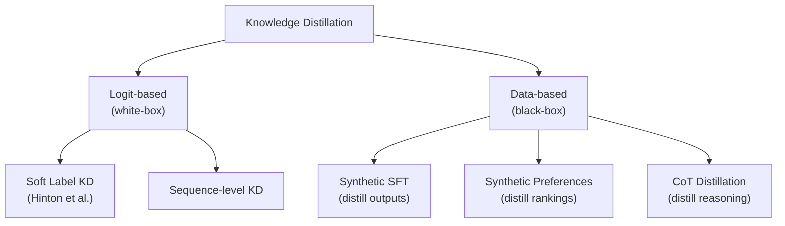
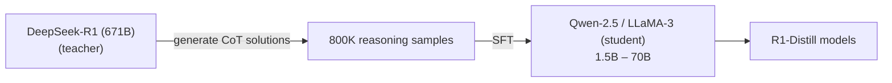

# Knowledge Distillation for LLMs

*Prerequisite: [../02_Alignment/01_Overview.md](../02_Alignment/01_Overview.md). For RLVR-based distillation (R1-Distill), see [../02_Alignment/03_Reasoning_Alignment/02_GRPO.md](../02_Alignment/03_Reasoning_Alignment/02_GRPO.md).*

---

Knowledge Distillation (KD) transfers capabilities from a large **teacher** model to a smaller **student** model, preserving much of the teacher's performance at a fraction of the compute cost. In the LLM era, distillation has become a core post-training technique — DeepSeek-R1-Distill, Phi series, and Orca series all rely heavily on it.

---

## 1. Why Distillation?

| Problem | Explanation |
|:--|:--|
| **Deployment cost** | A 671B parameter model (DeepSeek-R1) is impractical for most production use cases |
| **Latency** | Larger models generate tokens slower; end users need fast responses |
| **Capability gap** | Small models trained from scratch don't match large model quality, even with the same data |
| **Data scarcity** | High-quality training data is expensive; a teacher model can generate unlimited synthetic data |

Distillation bridges the gap: train a small model to **mimic the outputs of a large model**, getting large-model quality at small-model cost.

## 2. Distillation Taxonomy

### 2.1 Logit-based (White-box) Distillation

Requires access to the teacher's internal logits (probability distribution over vocabulary at each token).

**Classic KD Loss (Hinton et al., 2015):**

$$
\mathcal{L}_{KD} = \alpha \cdot \mathcal{L}_{CE}(y, \hat{y}_{student}) + (1 - \alpha) \cdot T^2 \cdot D_{KL}\!\big[\text{softmax}(z_S / T) \;\|\; \text{softmax}(z_T / T)\big]
$$

Where:
- $z_T, z_S$ = teacher and student logits
- $T$ = temperature (softens distributions, reveals "dark knowledge")
- $\alpha$ = balances hard label loss vs soft label loss

**LLM-specific variant (Generalized KD / GKD):**

Standard KD uses teacher-forced student inputs. GKD (Agarwal et al., 2024) generates from the student's own distribution, then matches the teacher's token-level probabilities — addressing exposure bias.

### 2.2 Data-based (Black-box) Distillation

Only requires the teacher's text outputs — no logits needed. This is the dominant approach when the teacher is a proprietary API (GPT-4, Claude).

| Method | What is distilled | Example |
|:--|:--|:--|
| **Synthetic SFT** | Teacher's responses to diverse prompts | Alpaca (GPT-3.5 → LLaMA 7B) |
| **Synthetic Preferences** | Teacher's rankings of response pairs | UltraFeedback (GPT-4 scores → train DPO) |
| **CoT Distillation** | Teacher's chain-of-thought reasoning | DeepSeek-R1-Distill, Orca |

## 3. DeepSeek-R1-Distill: Case Study

DeepSeek-R1-Distill demonstrates that **distilling reasoning traces is remarkably effective** — often outperforming direct RLVR on the student model.

### 3.1 Method

Key steps:
1. Use DeepSeek-R1 (671B) to generate long chain-of-thought solutions for 800K problems
2. SFT the student model (Qwen-2.5 or LLaMA-3, various sizes) on these solutions
3. No RLVR on the student — pure SFT on distilled data

### 3.2 Results

| Model | AIME 2024 | MATH-500 | Note |
|:--|:--|:--|:--|
| DeepSeek-R1-Distill-Qwen-32B | 72.6% | 94.3% | Distilled from R1 |
| QwQ-32B-Preview | 50.0% | 90.6% | Trained with RLVR directly |
| OpenAI o1-mini | 63.6% | 90.0% | Proprietary |

The 32B distilled model **outperforms** both a model trained with RLVR directly (QwQ) and OpenAI's o1-mini — demonstrating that distillation from a strong teacher can be more effective than training the student with RL from scratch.

### 3.3 Distillation vs RLVR on Small Models

DeepSeek also tested applying RLVR directly to small base models (without distillation):

| Approach | 7B model performance | 32B model performance |
|:--|:--|:--|
| RLVR from scratch | Moderate improvement | Good, but below distilled |
| Distillation from R1 | Strong | Best results |
| Distillation + RLVR | Marginal additional gain | Marginal additional gain |

**Conclusion**: For small models, distillation is the primary capability source; RLVR on top adds only marginal improvement.

## 4. Other Notable Distillation Examples

| Project | Teacher | Student | Method | Key Innovation |
|:--|:--|:--|:--|:--|
| **Alpaca** | GPT-3.5 | LLaMA 7B | Synthetic SFT (52K examples) | Self-Instruct pipeline |
| **Vicuna** | ChatGPT (ShareGPT conversations) | LLaMA 13B | Synthetic SFT | Multi-turn conversation distillation |
| **Orca** | GPT-4 | LLaMA 13B | CoT + system prompts | "Explanation tuning" — distill reasoning traces |
| **Orca 2** | GPT-4 | LLaMA 7B/13B | Task-specific reasoning strategies | Teach student different strategies per task |
| **Phi-1/2/3** | GPT-3.5 / GPT-4 | Small (1.3B–14B) | "Textbook quality" synthetic data | Data quality over quantity |
| **Zephyr** | GPT-4 (UltraFeedback) | Mistral 7B | Synthetic preferences → DPO | Distilled alignment |

## 5. Key Considerations

### 5.1 When to Distill vs When to Train with RL

| Criterion | Favor Distillation | Favor RLVR |
|:--|:--|:--|
| Teacher available | Strong teacher accessible | No suitable teacher |
| Student size | Small (< 14B) — gains most from distillation | Large (70B+) — can benefit from RL exploration |
| Task type | Broad capabilities | Specific reasoning improvement |
| Compute budget | Limited — SFT is cheaper than RL | Sufficient for multi-GPU RL training |
| Ceiling | Bounded by teacher quality | Can potentially exceed teacher (self-improvement) |

### 5.2 Legal and Ethical Considerations

- Many proprietary model terms of service **prohibit** using outputs to train competing models
- OpenAI, Anthropic, and Google have specific clauses about this
- Open-weight teachers (DeepSeek, LLaMA, Qwen) generally allow distillation
- Research use vs commercial use distinctions apply

### 5.3 Limitations

1. **Bounded by teacher** — Student cannot exceed teacher's capabilities (unlike RLVR which can discover novel solutions)
2. **Surface imitation risk** — Student may mimic teacher's output format without understanding (similar to SFT's exposure bias)
3. **Domain mismatch** — Teacher may not be strong in the student's target domain
4. **Evaluation contamination** — If teacher was trained on benchmark data, distilled student inherits this contamination

## 6. Key References

- Hinton et al., "Distilling the Knowledge in a Neural Network" (2015) — Original KD paper
- Kim & Rush, "Sequence-Level Knowledge Distillation" (2016) — Sequence-level KD for NLP
- Agarwal et al., "GKD: Generalized Knowledge Distillation for Auto-Regressive Sequence Models" (2024)
- Mukherjee et al., "Orca: Progressive Learning from Complex Explanation Traces of GPT-4" (2023)
- DeepSeek-AI, "DeepSeek-R1: Incentivizing Reasoning Capability in LLMs via Reinforcement Learning" (2025) — R1-Distill results
- Gunasekar et al., "Textbooks Are All You Need" (Phi-1, 2023)
- Tunstall et al., "Zephyr: Direct Distillation of LM Alignment" (2023)
