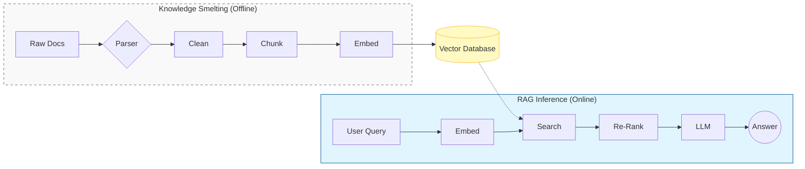
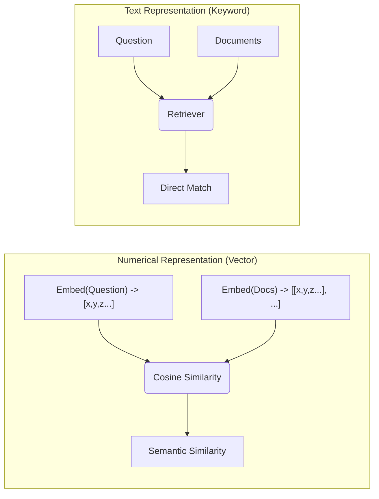
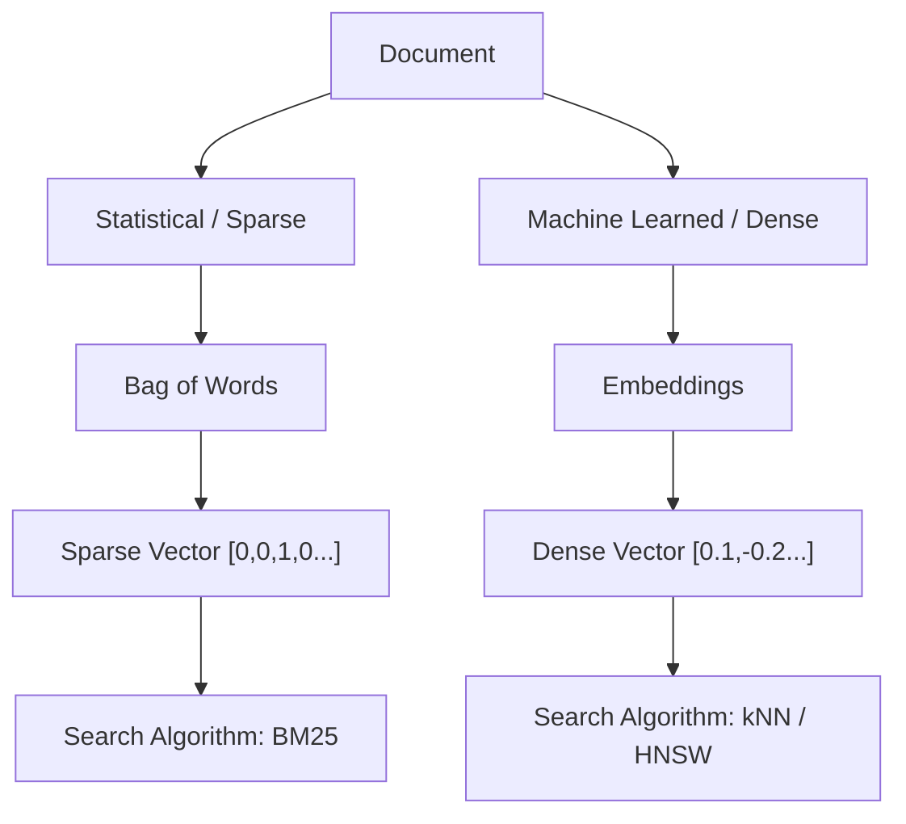

# Basic Architecture

*Prerequisite: [../../03_Memory/01_Theory/01_Memory_Systems.md](../../03_Memory/01_Theory/01_Memory_Systems.md).*
*See Also: [../../../04_Solutions/05_RAG_Architecture.md](../../../04_Solutions/05_RAG_Architecture.md) (domain RAG design), [../../../04_Solutions/07_Knowledge_Graph_Integration.md](../../../04_Solutions/07_Knowledge_Graph_Integration.md) (GraphRAG patterns).*

---

`Retrieval-Augmented Generation` (`RAG`) is a technique designed to optimize the output of a `Large Language Model` (`LLM`) by referencing an authoritative, external knowledge base outside its training data. The architecture is categorized into three primary phases: **Index**, **Retrieval**, and **Generation**.

## 1. Fundamental Concepts: Vector Representations

The transition from traditional keyword search to RAG is fundamentally a shift from text-based matching to **numerical representation search**.

### 1.1 Text vs. Numerical Representation

Traditional search relies on literal string matching, whereas RAG transforms queries and documents into mathematical coordinates (vectors) to enable **Semantic Retrieval**.

### 1.2 Statistical vs. Machine Learned Representations

Modern retrieval systems often utilize a multi-pronged approach, balancing precise keyword matching with broad semantic understanding.

- **Sparse Representations**: Primary for exact term matching (e.g., product IDs, person names) via `BM25`.
- **Dense Representations**: Optimized for latent semantic intent and conceptual similarity via `HNSW` or `kNN`.

## 2. Indexing Phase

The objective is to ingest, process, and transform raw unstructured data into a searchable `vector` representation.

### 2.1 Ingestion & Parsing

- **Data Modalities**: Support for heterogeneous sources including `PDF`, `HTML`, `Markdown`, and structured databases.
- **Parsing Engines**:
  - **OCR & Layout Analysis**: Intelligent extraction of text from visual elements, tables, and mathematical notations.
  - **Metadata Enrichment**: Tagging documents with relevant attributes (e.g., `timestamps`, `source URIs`) to enable filtered searches.

### 2.2 Document Chunking Strategies

Chunking optimizes the `semantic density` of retrieved segments. Strategies include:

- **Fixed-Size Chunking**: Deterministic splitting based on character or token counts.
- **Recursive Character Splitting**: Splitting based on hierarchical delimiters (e.g., paragraphs, sentences) to maintain structural integrity.
- **Overlapping Windows**: Intentional redundancy between adjacent chunks to mitigate `semantic fragmentation` at boundary points.
- **Semantic Chunking**: Dynamic splitting based on `embedding similarity` to ensure each chunk represents a cohesive concept.
- **Hierarchical/Sub-vector Chunking**: Creating parent-child relationships where large context blocks (parents) contain smaller, high-precision segments (children).
- **Summary-based Indexing**: Indexing generated summaries of larger documents to improve coarse-grained `recall`.

### 2.3 Embedding & Vector Storage

- **Embedding Models**: Conversion of text into high-dimensional `dense vectors` using models optimized for specific semantic tasks (e.g., `text-embedding-3-small`, `BGE-v1.5`).
- **Vector Database** (`VDB`): Persistent storage in specialized databases (e.g., `Chroma`, `Milvus`, `Qdrant`) utilizing indexing algorithms like `HNSW` (`Hierarchical Navigable Small World`) for efficient `approximate nearest neighbor` (`ANN`) search.

## 3. Retrieval Phase

The objective is to identify and surface the most relevant context segments relative to the user's latent `query intent`.

### 3.1 Query Pre-processing

- **Query Reformulation**: Re-writing ambiguous user queries into well-defined prompts using `LLM-based expansion`.
- **HyDE** (`Hypothetical Document Embeddings`): Generating a synthetic response to the query and using its `embedding` for retrieval to align the search space with document embeddings rather than query embeddings.
- **Sub-question Decomposition**: Breaking complex queries into `atomic units` for independent retrieval.

### 3.2 Retrieval Mechanisms

- **Hybrid Search**: Combining `Vector Search` (semantic similarity) with `Keyword Search` (e.g., `BM25` for sparse retrieval) using `Reciprocal Rank Fusion` (`RRF`) to balance `precision` and `recall`.
- **Graph-based Retrieval**: Traversing `Knowledge Graphs` (`KG`) to exploit explicit entities and relationships.

### 3.3 Post-processing & Reranking

- **Cross-Encoder Reranking**: Utilizing high-precision `reranker` models to evaluate the pointwise relevance of the `Top-K` retrieved candidates.
- **Context Filtering**: Pruning low-confidence segments to reduce noise and compute costs (`LLM token usage`).

## 4. Generation Phase

The objective is to synthesize a grounded response by augmenting the `LLM`'s prompt with the retrieved context.

### 4.1 Prompt Engineering & Augmentation

- **Instruction Grounding**: Strict `system prompts` requiring the `LLM` to answer _only_ based on the provided context to prevent `hallucinations`.
- **Context Injection**: Structuring retrieved segments into the `prompt window` while managing `token limits` and `position bias` (e.g., "Lost in the Middle").

### 4.2 Response Synthesis & Attribution

- **Model Selection**: Deploying models based on the required reasoning complexity vs. `inference latency`.
- **Citations & Provenance**: Implementing mechanisms to trace generated claims back to specific metadata in the external knowledge source.
- **Self-Correction/Critique**: Multi-step verification where the model assesses its own response against the retrieved evidence.
