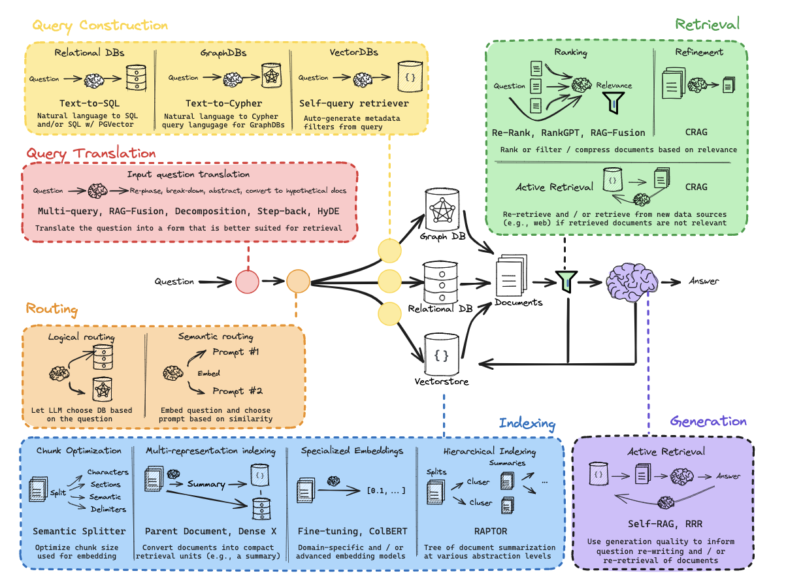

# Advanced RAG

*Prerequisite: [01_Architecture.md](01_Architecture.md).*

---

Beyond standard "Naive RAG," advanced implementations involve sophisticated strategies across query understanding, indexing, retrieval, and generation. This document decomposes the full Advanced RAG engineering roadmap.

### Advanced Engineering Roadmap

The following map provides a comprehensive overview of production-grade RAG components, including query construction, translation, routing, and advanced indexing techniques.



---

## 1. Query Construction

**Problem**: Not all knowledge lives in vector stores. Structured data (relational DBs, graph DBs) requires the query to be translated into a formal language before retrieval can happen.

### 1.1 Text-to-SQL

- **Scenario**: The user asks a natural language question; the system converts it into SQL to query relational databases.
- **Flow**: `Question → LLM → SQL → RDBMS → Result`
- **Key Techniques**:
  - **Schema Prompting**: Inject the table schema (DDL) into the LLM prompt so it knows which columns exist.
  - **Few-shot Examples**: Provide 3–5 (question, SQL) pairs to anchor the LLM's output format.
  - **SQL w/ PGVector**: Combine structured SQL with vector similarity search (e.g., `ORDER BY embedding <=> query_vec`) in PostgreSQL.
- **Pitfall**: LLMs may hallucinate column names. Always validate generated SQL against the schema before execution.

### 1.2 Text-to-Cypher

- **Scenario**: Knowledge graphs (Neo4j, etc.) store entity-relationship data. The system converts natural language into Cypher queries.
- **Flow**: `Question → LLM → Cypher → GraphDB → Subgraph/Result`
- **Key Techniques**:
  - Inject the graph schema (node labels, relationship types, property keys) into the prompt.
  - Use graph-specific few-shot examples: `"Who founded Tesla?" → MATCH (p:Person)-[:FOUNDED]->(c:Company {name:'Tesla'}) RETURN p.name`
- **Best For**: Multi-hop relational reasoning (e.g., "Which companies were founded by people who studied at Stanford?").

### 1.3 Self-Query Retrieval

- **Scenario**: The user's query contains both a **semantic intent** and **structured constraints** (metadata filters).
- **Flow**: `Question → LLM → { query: "semantic part", filter: {year: 2024, category: "finance"} } → VectorDB`
- **Key Techniques**:
  - The LLM auto-generates metadata filter expressions from the natural language query.
  - The vector store applies the filter **before** (pre-filtering) or **after** (post-filtering) the semantic search.
- **Example**: "Find papers about transformers published after 2023" → `query="transformers"`, `filter={year > 2023}`.

---

## 2. Query Translation

**Problem**: The user's raw query is often not in the optimal form for retrieval. Rephrasing, decomposing, or abstracting the question can dramatically improve recall.

### 2.1 Multi-Query

- **Idea**: A single question may have multiple valid phrasings. Generate **N diverse reformulations** using an LLM, retrieve for each, then merge results.
- **Flow**: `Question → LLM → [Q1, Q2, Q3] → Retrieve × 3 → Union/Deduplicate`
- **Benefit**: Reduces the risk of missing relevant documents due to phrasing mismatch.

### 2.2 RAG-Fusion

- **Idea**: Extends Multi-Query by applying **Reciprocal Rank Fusion (RRF)** to merge the results from multiple reformulated queries.
- **Flow**: `Question → LLM → [Q1, Q2, ..., Qn] → Retrieve × N → RRF Fusion → Top-K`
- **Benefit**: Combines the diversity of Multi-Query with a principled, rank-based fusion strategy. Documents that appear highly ranked across multiple query variants are boosted.

### 2.3 Decomposition

- **Idea**: Complex questions are broken into **sub-questions**, each answered independently, then synthesized.
- **Flow**: `Complex Question → LLM → [Sub-Q1, Sub-Q2, Sub-Q3] → Answer each → Synthesize`
- **Example**: "Compare the economic policies of the US and China in 2024" → Sub-Q1: "What are the US economic policies in 2024?" + Sub-Q2: "What are the China economic policies in 2024?"
- **Best For**: Multi-hop reasoning, comparative questions, or questions spanning multiple documents.

### 2.4 Step-Back Prompting

- **Idea**: Instead of answering a specific question directly, first ask a **more abstract/general** question to establish foundational context, then answer the original question.
- **Flow**: `Specific Question → LLM generates Step-back Question → Retrieve for both → Generate answer with combined context`
- **Example**: "Why does my Python code throw a MemoryError with 100M rows?" → Step-back: "How does Python manage memory for large datasets?"
- **Best For**: Questions that require understanding underlying principles before answering specifics.

### 2.5 HyDE (Hypothetical Document Embeddings)

- **Research**: _《Precise Zero-Shot Dense Retrieval without Relevance Labels》 (2022)_
- **Idea**: Instead of embedding the **question**, ask the LLM to generate a **hypothetical answer** (a fake document), then embed **that** for retrieval.
- **Flow**: `Question → LLM → Hypothetical Document → Embed → Retrieve by similarity`
- **Logic**: A hypothetical answer is semantically closer to real answer documents than the question itself, bridging the "query-document gap."
- **Pitfall**: If the LLM hallucinates a completely wrong answer, retrieval will go off-track. Works best when the LLM has reasonable domain knowledge.

---

## 3. Routing

**Problem**: Production RAG systems often have multiple data sources (vector DB, SQL DB, graph DB, web search). The system must decide **where** to route each query.

### 3.1 Logical Routing

- **Mechanism**: The LLM acts as a **classifier**. Given the question, it selects the appropriate data source or retrieval strategy.
- **Flow**: `Question → LLM (with data source descriptions) → Choice: {vectorstore | sql_db | graph_db | web_search}`
- **Implementation**: Typically uses structured output (JSON/enum) to force a clean routing decision.
- **Example**: "What was Apple's Q3 2024 revenue?" → Route to SQL DB (structured financial data). "Explain quantum entanglement" → Route to vector store (unstructured documents).

### 3.2 Semantic Routing

- **Mechanism**: Pre-define **N prompt templates** (one per data source or strategy). Embed the user's question and the prompts, then choose the prompt with the **highest cosine similarity**.
- **Flow**: `Question → Embed → Compare with [Prompt #1 embedding, Prompt #2 embedding, ...] → Best match`
- **Benefit**: No LLM call needed for routing — faster and cheaper. The prompt embeddings serve as learned "intent centroids."
- **Trade-off**: Less flexible than logical routing; requires well-crafted prompt templates that capture the semantic range of each route.

---

## 4. Indexing

Advanced indexing goes far beyond naive chunking. The roadmap identifies four pillars.

### 4.1 Chunk Optimization

**Problem**: Fixed-size chunking (e.g., 512 tokens) splits text at arbitrary points, breaking semantic units.

- **Character/Section/Delimiter Splitting**: Basic strategies using token count, headings, or punctuation.
- **Semantic Splitter**: Uses an embedding model to detect **semantic breakpoints**. Adjacent sentences are grouped while their cosine similarity stays above a threshold; a new chunk starts when similarity drops.
  - **Benefit**: Each chunk is a semantically coherent unit, improving embedding quality.

### 4.2 Multi-Representation Indexing

**Idea**: Decouple the **retrieval unit** (what gets searched) from the **return unit** (what gets sent to the LLM).

- **Parent Document Strategy**: Index small chunks for precise retrieval, but return the **full parent document/section** for generation context.
  - **Flow**: `Query → match small chunk → return parent document`
  - **Benefit**: Retrieval is precise; generation has full context.

- **Dense X (Propositions)**: Index atomic propositions (see Section 5.1), but link each back to the original passage.

### 4.3 Specialized Embeddings

- **Fine-tuned Embeddings**: Train or fine-tune embedding models on domain-specific data (legal, medical, financial) to improve in-domain retrieval.
- **ColBERT (Contextualized Late Interaction over BERT)**:
  - Unlike standard bi-encoder embeddings (one vector per document), ColBERT produces **per-token embeddings** for both query and document.
  - Relevance is computed via **MaxSim**: for each query token, find the maximum similarity with any document token, then sum.
  - **Benefit**: Captures fine-grained token-level interactions while remaining efficient (embeddings are precomputed and indexed).
  - **Best For**: Scenarios requiring high precision where bi-encoder embeddings lose nuance.

### 4.4 Hierarchical Indexing (RAPTOR)

**Research**: _《RAPTOR: Recursive Abstractive Processing for Tree-Organized Retrieval》 (Stanford University, 2024.01)_

- **Core Finding**: Traditional RAG struggles with "forest vs. trees" queries (e.g., "What is the overall theme of this book?"). RAPTOR solves this by building a tree-based index.
- **Technical Implementation**:
  - Recursively clusters document chunks and uses an LLM to generate **Abstractive Summaries** for each cluster, forming a hierarchical tree.
  - During inference, the system searches across both the detailed leaf nodes and the higher-level summary nodes simultaneously.
- **Conclusion**: RAPTOR improves accuracy in complex reasoning tasks by approximately **20%**, proving that "summarize-then-index" is critical for long-context understanding.

---

## 5. Data Refinement Strategies

In modern RAG systems, the primary competitive advantage has shifted from retrieval algorithms to **Data Refinement** (or "Data Smelting") capabilities. Research from leading AI labs (Anthropic, Stanford, BAAI, etc.) demonstrates that **Advanced RAG**, which utilizes refined pre-processing, typically achieves a **30% - 60%** improvement in retrieval accuracy over **Naive RAG** (Direct Parsing + Indexing).

Below are the four pillar research breakthroughs and technical solutions in this field.

### 5.1 Granularity Revolution: From Chunks to Propositions

**Research**: _《Dense X Retrieval: What Retrieval Granularity Should We Use?》 (2023.12)_

- **Core Finding**: Traditional chunking by character count (Passage) or sentence boundaries (Sentence) often yields suboptimal results. This research introduces **Proposition-level Indexing**.
- **Technical Implementation**:
  - A **Proposition** is defined as the smallest, atomic, and self-contained statement within a text.
  - **Methodology**: During pre-processing, an LLM is invoked to deconstruct paragraphs into multiple independent declarative sentences. It also resolves coreferences (e.g., replacing "it" or "the company" with specific names like "ACME Corp").
- **Conclusion**: Proposition-level indexing increases retrieval precision by **35%** compared to passage-level indexing by eliminating semantic noise within paragraphs and ensuring pure vector features.

### 5.2 Contextual Enrichment: Solving the "Fragmented Context" Problem

**Research**: _Anthropic Technical Report (2024.09)_

- **Core Finding**: Mechanical chunking often strips a segment of its broader context, leading to retrieval failure when the latent intent depends on surrounding information. Anthropic proposes **Contextual Retrieval**.
- **Technical Implementation**:
  - **Methodology**: In the pre-processing phase, an LLM generates a 50-100 word "contextual prefix" for every individual chunk. This prefix is concatenated with the original text before being embedded and stored.
  - **Example**: An original chunk might simply say "Loss of 20%". After refinement, it becomes: _"[This is a description of the hardware division's performance in ACME Corp's 2024 Q2 Earnings Report] Loss of 20%"_.
- **Conclusion**: This technique reduces retrieval failure rates by **49%** (and up to **67%** when combined with hybrid search).

### 5.3 Knowledge Distillation: Extracting Atomic Facts

**Research**: _《Extract-then-Retrieve》 Series_

- **Core Finding**: "Semantic noise" (filler words, complex adjectives, transitional phrases) in raw documents interferes with the quality of Vector Embeddings.
- **Technical Implementation**:
  - **Methodology**: Before indexing, a **Distillation** step is performed. An LLM extracts only the core **Facts**, **Entities**, and **Relations**, discarding the "noise."
  - **Result**: A 10MB raw document may be condensed into a 2MB "High-Density Fact Base."
- **Conclusion**: Increasing information density significantly enhances the **Semantic Discriminability** within the vector space, pushing unrelated concepts further apart.

### Summary: The Scientific RAG Workflow (Data Refinement)

To achieve maximum reliability and success rates, a modern RAG pre-processing pipeline should follow these steps:

1. **Clean**: Prune PDF/HTML artifacts and noise.
2. **Contextualize**: Add background prefixes to each chunk (Anthropic approach).
3. **Propositionalize**: Deconstruct chunks into atomic propositions (Dense X approach).
4. **Summarize**: Generate summaries for large sections to build hierarchical tree indices (RAPTOR approach).

**Success in RAG is no longer just about the model—it is about the quality of the "Data Smelting" process.**

---

## 6. Retrieval

Once the data is indexed, the retrieval stage determines which documents make it to the LLM.

### 6.1 Hybrid Search: The RRF Algorithm

- **Problem**: Vector Search (Dense) uses Cosine Similarity (0-1), while BM25 (Sparse) uses unbounded scores. Simple "Weighted Sum" fails because different scales drown each other out.
- **Solution**: **RRF (Reciprocal Rank Fusion)**.
- **The Formula**: $score(d) = \sum_{r \in R} \frac{1}{k + rank(r, d)}$
- **Logic**: RRF only cares about the **Rank** ($1^{st}, 2^{nd}, 3^{rd}$) in each result set. This makes it parameter-free and extremely robust. It ensures that any document appearing in the top of **both** lists is prioritized.

### 6.2 Hard Filtering (Metadata Constraint)

- **Problem**: "Semantic Drift." For example, a query for "iPhone 15 prices" might recall "iPhone 14 discounts" due to high semantic similarity.
- **Engineering Logic**:
  1. **QU Layer Extraction**: Use an LLM or NLP classifier to extract **Attribute-Value Pairs** (e.g., Brand=Apple, Model=15) from the user query.
  2. **Pre-filtering**: Apply these attributes as a **Pre-filter** in the vector database query.
  3. **The Rule**: **"Use keyword-hard filtering for constraints, and Vector Search for semantic relevance."** This is the "kill shot" for eliminating 90% of hallucination-prone retrieval errors.

### 6.3 Re-Ranking

**Problem**: First-stage retrieval (bi-encoder) is fast but coarse. A second-stage **cross-encoder** re-ranker scores each (query, document) pair jointly for fine-grained relevance.

- **Re-Rank (Cross-Encoder)**: Models like `bge-reranker`, `ms-marco-MiniLM` take the (query, document) pair as a single input and output a relevance score. More accurate but slower — applied only to the top-K candidates.
- **RankGPT**: Uses an LLM to re-rank documents via **listwise ranking**. The LLM receives a list of candidate documents and reorders them by relevance.
  - **Benefit**: Leverages the LLM's deep semantic understanding for ranking.
  - **Trade-off**: Expensive (one LLM call per re-ranking). Best for high-stakes or low-volume queries.
- **RAG-Fusion Re-Ranking**: Combines multi-query generation with RRF-based fusion (see Section 2.2) as an implicit re-ranking mechanism.

### 6.4 Refinement: CRAG (Corrective RAG)

**Research**: _《Corrective Retrieval Augmented Generation》 (2024)_

- **Problem**: Retrieved documents may be irrelevant, partially relevant, or even misleading. Blindly feeding them to the LLM causes hallucination.
- **Mechanism**:
  1. **Relevance Evaluator**: An LLM or lightweight classifier grades each retrieved document as `Correct`, `Ambiguous`, or `Incorrect`.
  2. **Branching Logic**:
     - `Correct` → Use the document directly.
     - `Incorrect` → Discard and trigger **web search** as a fallback knowledge source.
     - `Ambiguous` → Extract useful segments via knowledge refinement, then supplement with web search.
- **Benefit**: Self-correcting retrieval pipeline that gracefully handles retrieval failures instead of propagating errors to generation.

### 6.5 Active Retrieval

**Problem**: The system should not blindly trust the first round of retrieval. If retrieved documents are insufficient or irrelevant, it should **re-retrieve** from new sources.

- **CRAG (Active Mode)**: Beyond document-level correction (6.4), CRAG can actively switch data sources (e.g., from internal knowledge base to web search) when confidence is low.
- **Iterative Retrieval**: Some systems perform multiple rounds of retrieval, refining the query based on the previous round's results, progressively converging on the right context.

---

## 7. Generation

The final stage: the LLM generates an answer grounded in the retrieved documents. Advanced techniques make this step self-aware.

### 7.1 Self-RAG

**Research**: _《Self-RAG: Learning to Retrieve, Generate, and Critique through Self-Reflection》 (2023)_

- **Idea**: The LLM learns to emit **special reflection tokens** during generation that control the RAG pipeline dynamically:
  - `[Retrieve]` — Should I retrieve? (Yes/No)
  - `[IsRelevant]` — Is this retrieved passage relevant? (Yes/No)
  - `[IsSupported]` — Is my generated statement supported by the passage? (Fully/Partially/No)
  - `[IsUseful]` — Is the overall response useful? (1–5)
- **Flow**: `Question → LLM decides whether to retrieve → If yes, retrieve → LLM critiques relevance → Generate with self-grounding → LLM critiques support`
- **Benefit**: The model becomes its own judge, reducing hallucination without external components. It can also skip retrieval when the question is trivial (e.g., "What is 2+2?").

### 7.2 RRR (Rewrite-Retrieve-Read)

- **Idea**: If the initial generation is poor, use the LLM to **rewrite** the query based on what it learned from the first attempt, then retrieve again and regenerate.
- **Flow**: `Question → Retrieve → Read/Generate → Evaluate quality → If poor: Rewrite question → Retrieve again → Generate final answer`
- **Benefit**: Closed-loop self-improvement. The generation quality informs better retrieval in the next iteration.

---

## 8. End-to-End Architecture: Putting It All Together

A production-grade Advanced RAG pipeline chains these modules together:

```
User Query
    │
    ├── 1. Query Construction ──► Structured DB (SQL/Cypher)
    │
    ├── 2. Query Translation ──► Reformulated queries (Multi-Query / HyDE / Decomposition)
    │
    ├── 3. Routing ──► Select data source(s)
    │
    ├── 4. Indexing (offline) ──► Chunks / Propositions / Summaries / ColBERT
    │
    ├── 5. Retrieval ──► Hybrid Search + RRF → Re-Rank → CRAG Correction
    │
    └── 6. Generation ──► Self-RAG / RRR → Final Answer
```

The key insight: **each module is independently tunable and evaluable**. A team can improve retrieval without touching generation, or swap indexing strategies without rewriting the query layer.
