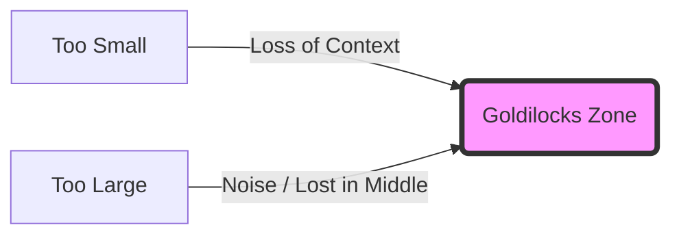
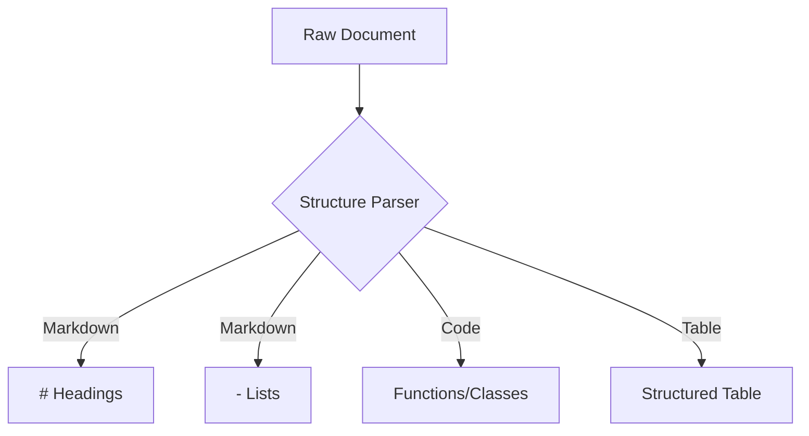
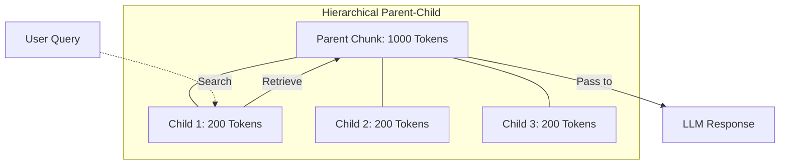
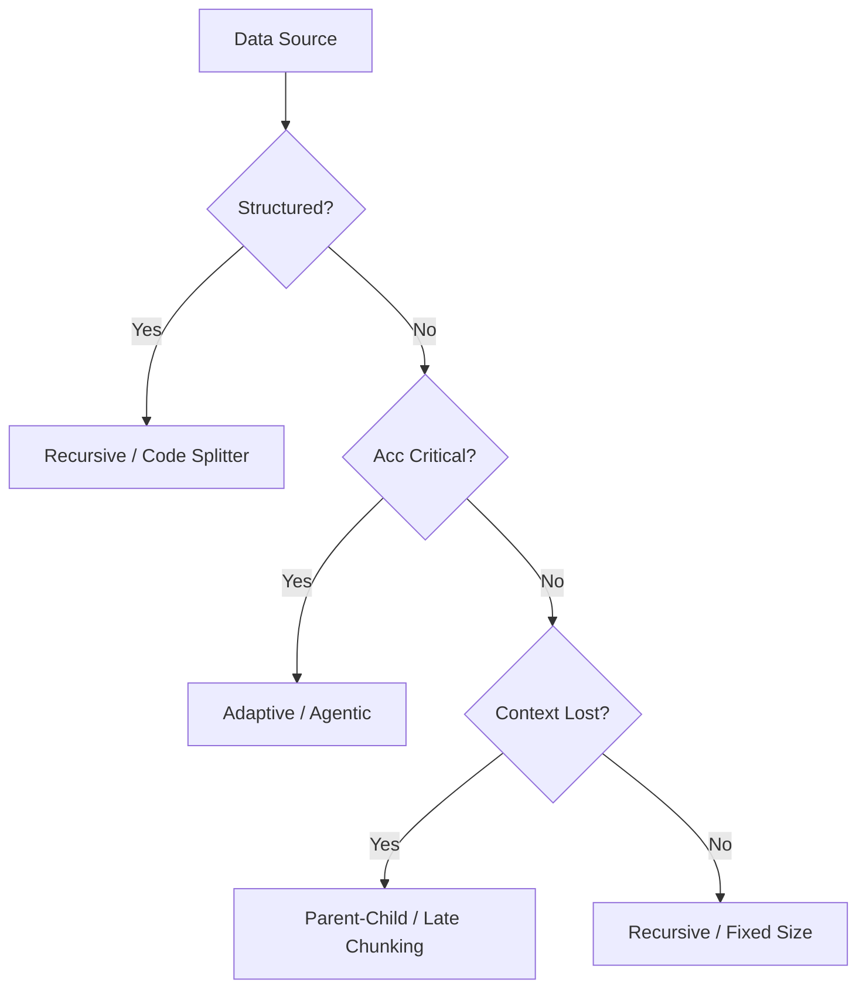

# Data Ingestion: The "Knowledge Smelting" Manual

*Prerequisite: [01_Architecture.md](01_Architecture.md).*

---

To achieve high-precision retrieval (aiming for 100% success), document preprocessing must evolve from simple "splitting" into a deep "smelting" of knowledge.

**Executive Summary: The Life Cycle of Knowledge Smelting**
This manual follows a rigorous lifecycle: **Mechanical Preprocessing (Phase 1)** → **Structural Parsing & Analysis (Phase 2)** → **Governance & Pruning (Phase 3)** → **Semantic Smelting (Phase 4)** → **Indexing Architecture (Phase 5)**.

- **Highlights**: Transforms the "100% Success Rate" goal into executable engineering steps (e.g., Coreference Resolution, Schema-based Filtering, Atomic Propositions).
- **Technical Depth**: Introduces **Proposition-Based** and **Adaptive Chunking**, the watershed between "proof-of-concept" and "production-grade" systems.

## 1. Guiding Principles

### 1.1 The Goldilocks Problem

Optimal chunking must solve the trade-off between **High Precision** (small chunks) and **Full Context** (large chunks).

- **Too Small**: Loss of context (e.g., pronouns like "it" lose their referents).
- **Too Large**: Triggers the **"Lost in the Middle"** phenomenon where LLMs ignore information in the center of long contexts, and increases noise.

### 1.2 The Three Golden Rules for RAG Success

1. **Data is Smelted, Not Just Split**: Raw parsing/indexing results in ~70% success. **Abstractive Summarization** and **Coreference Resolution** push it to 90%+.
2. **Vectors Are Not Everything**: For logical contradictions (Large vs. Small, Can vs. Cannot), you must rely on **Metadata Hard Filtering**.
3. **Context is the Lifeline**: Use **Contextual Prefixing** so that every chunk is self-contained.

## 2. The Ingestion Lifecycle

### Phase 1: Mechanical Preprocessing (The Baseline)

Establish a standard retrieval foundation (Level 1) before applying advanced optimizations.

- **Recursive Character Splitting**: The recommended Baseline for general text is **Chunk Size 512, Overlap 10%**.
- **AST-based Code Splitting**: Utilize Abstract Syntax Tree parsers to split code by logic units (Classes, Functions) rather than line counts, preserving functional integrity.
- **Fixed-size Splitting**: Controlling chunk length by character or token count.
- **Overlap (Sliding Window)**: Maintaining a **15%-25% overlap** as a semantic buffer.
- **Parameter Tuning**: Balancing `Chunk Size` and `Chunk Overlap` based on the downstream model's attention window.

### Phase 2: Advanced Parsing & Structuring (Depth)

High-quality parsing is the prerequisite for deep smelting; without layout awareness, semantic refinement cannot accurately perceive document hierarchy.

Transform raw data into "digital skeletons" that machines can accurately navigate.

#### 2.1 Layout-aware Parsing

- **Standardization**: Use tools like `Docling` or `LlamaParse` to preserve semantic markers (Headings, Lists).
- **Table Extraction**: Never use plain text splitters for PDF tables. Convert complex tables into **Markdown** or **HTML** to preserve 2D relationships. For extreme complexity, index a "Table Summary" generated by an LLM.
- **OCR & Formula Restoration**: Perform high-quality OCR and unify mathematical formulas into **LaTeX**.
- **JSON/XML Parsing**: Maintaining hierarchy while splitting structured data formats.

#### 2.2 Semantic Refinement (The Smelting Core)

- **Coreference Resolution**: Use LLMs to replace ambiguous pronouns ("it", "they", "this policy") with specific nouns to resolve semantic ambiguity.
- **Schema-based Extraction (Automated Metadata)**: Define a **JSON Schema** (e.g., `{Logic_Attr: [Large, Small, Normal]}`) and use LLMs to extract structured attributes during preprocessing. This transforms "Hard Filtering" from keyword matching into deterministic **SQL-style Queries**, eliminating logical contradictions (like size conflicts).
- **Entity Normalization**: Standardizing terms to ensure consistent vector representation across the corpus.

### Phase 3: Data Governance & Pruning (Subtraction)

Eliminate noise and redundancy to reduce interference (Vercel best practices).

- **Noise Filtering**: Use **Regex** or pre-trained **Classifiers** to strip headers, footers, copyright notices, and garbled text before indexing.
- **Semantic De-duplication**: Utilize **SimHash** or **MinHash** to identify documents with >90% similarity. Merge or retain only the latest version.
- **Knowledge Lifecycle Management (Hot/Cold)**: Implemented automated **Knowledge Expiration**. If a new document's summary conflicts with or supersedes an older entry, automatically flag the old record as `is_deprecated: true` to prevent hallucinated contradictions.
- **Versioning & Timeliness**: Inject `version_id` and metadata tags. Ensure the 2024 version is prioritized over conflicting 2023 data via hard filtering.
- **PII Masking**: Encrypt or remove sensitive information for compliance.

### Phase 4: Strategic Chunking & Semantic Enrichment

Ensure every chunk can "self-identify" its context through advanced metadata and summarizing.

#### 4.1 Advanced Retrieval Strategies

- **Hierarchical Parent-Child Indexing**: Index small **Child Chunks** (100-200 tokens) for matching, but retrieve larger **Parent Chunks** (500-1000 tokens) for LLM generation.
- **Semantic Chunking (Level 2: Semantic Understanding)**:
  - _Mechanism_: Calculate the **Cosine Similarity** between embeddings of consecutive sentences.
  - _Decision Logic_: Monitor the similarity curve; a "valley" (sharp drop in similarity) indicates a **Topic Shift**, serving as the optimal breakpoint.
  - _Advantage_: Ensures high **Topic Coherence** within each chunk, ideal for narrative text without clear headings.
- **Agentic/LLM-based Chunking**: Utilizing an LLM agent to dynamically determine chunk boundaries based on semantic completeness.
- **Late Chunking**: Performing embedding on the entire long document first to capture global semantic dependencies, then splitting into chunks.

#### 4.2 Proposition-Based Chunking (Atomic Precision)

_Ref: PDF Page 7_

- **Mechanism**: Use an LLM to decompose complex, long sentences into independent, **Atomic Propositions** (Facts).
- **Process**: `Complex Input` -> `LLM Extraction` -> `Atomic Fact 1, 2, 3`.
- **Advantage**: Extreme retrieval precision by eliminating irrelevant modifiers; perfect for dense knowledge or fact-checking.
- **Trade-off**: High preprocessing cost and loss of original narrative flow.

#### 4.3 Multi-Representation Indexing (Decoupling)

- **Mechanism**: Decouple the "Retrieval Unit" from the "Generation Unit".
- **Strategy**: Instead of indexing raw text, index **Summaries** or **Hypothetical Questions** that map to the parent chunk.
- **Advantage**: Aligns user query intent (often a question) with the indexed unit (also a question), significantly boosting semantic recall.

#### 4.4 Hierarchical Summarization (RAPTOR)

- **Mechanism**: Recursively cluster and summarize document segments to create a tree-based index.
- **Advantage**: Allows the retriever to navigate at different "Altitudes" — fetching coarse-grained global context from upper nodes or fine-grained local details from leaves. This solves the "Lost in the Middle" problem for book-length documents.

#### 4.5 Adaptive Chunking (The Clinical Standard)

_Ref: PDF Page 9 (NIH/Mayo Clinic Case)_

- **Mechanism**: Dynamically adjust the chunk window based on content rather than fixed limits.
- **Logic Flow**:
  1. Check if `Similarity > 0.8`. If yes, continue grouping.
  2. If similarity drops, check if `Chunk Length < 500 words`.
  3. If neither, add a **Micro-Header** (LLM generated) to anchor context before finalizing.
- **Advantage**: Ensures critical "Instruction + Time + Exception" sets stay grouped. Accuracy boost: **50% → 87%**.

#### 4.6 Semantic Context Enrichment

- **Hierarchical Prefixing**: Inject document paths: `[Title] > [Chapter] > [Sub-heading]`.
- **Contextual Retrieval (Anthropic Strategy)**: Write a one-sentence background for every single chunk to anchor local context (**Retrieval failure rate reduced by 49%**).
- **Hypothetical Questions (HyDE)**: Match the user query against LLM-generated potential questions for each chunk.

### Phase 5: Indexing Architecture Design

Ensure deterministic recall by utilizing dual search paths.

- **Hybrid Search**: Combine **Sparse (BM25)** for keywords/model IDs and **Dense (HNSW)** for semantic intent.
- **Late Interaction (ColBERT)**: Utilizing models that represent documents as multiple token-level embeddings, allowing for deep, fine-grained interaction between query and document tokens during retrieval, surpassing single-vector retrieval accuracy.
- **Cross-Encoder Reranking**: Even if the top 50 chunks are retrieved, vector scores can be deceptive. Use a **Reranker (e.g., BGE-Reranker)** to perform a deep interaction calculation between the Query and candidates, ensuring the most accurate chunk is ranked #1.
- **Metadata Hard Filtering**: Filter by category first (using schema-extracted fields), then search by vector to eliminate "Hallucinatory Retrieval".

### Phase 6: Evaluation & Iteration Loop

- **Performance Metrics**: Track `Recall@K`, `MRR`, `Faithfulness`, and `Relevancy`. Use frameworks like **RAGAS** or **F1 Score** for systematic A/B testing and quality quantification.
- **Robustness Testing**: Use **Conflict Tests** (latest version identification) and **Antonym Tests** (distinguishing Large from Small).
- **Golden Dataset (Regression)**: Manually build a set of core Q&A pairs for automated regression testing after every algorithm update.

## 3. Ecosystem & Strategy

### 3.1 Industry Benchmarks & Case Studies

- **Standard RAG Performance**: High retrieval failure rates when missing context.
- **Contextual Retrieval (Anthropic)**: Injecting contextual prefixes can reduce retrieval failure rates by **49%**.
- **Adaptive Chunking (NIH / Mayo Clinic)**: In clinical RAG systems, dynamically adjusting windows to keep "Instruction + Time + Safety" together improved accuracy from **50% to 87%**.

### 3.2 Decision Framework

- **Strategy Matrix**:
  - _Structured (JSON/Code)_ -> Recursive/AST Splitter.
  - _High Accuracy (Medical/Legal)_ -> Adaptive/Agentic Chunking.
  - _High Context Dependency_ -> Late Chunking / Parent-Child.

### 3.3 Implementation Ecosystem (Recommended Stack)

_Ref: PDF Page 14_

1. **Ingestion & Parsing**: `Unstructured.io` / `Docling` / `LlamaParse` (PDF/HTML Cleaning).
2. **Chunking Logic**: `LangChain` / `LlamaIndex` (Semantic, Recursive, & Agentic Splitters).
3. **Enrichment**: `Claude` / `Gemini` (Generating Contextual Headers & Atomic Facts).
4. **Storage & Retrieval**: `Weaviate` / `LanceDB` / `Pinecone` (Hybrid Search Support).

### 3.4 Strategy Comparison Matrix

| Strategy        | Compute Cost | Retrieval Precision | Context Preservation | Best Use Case                    |
| :-------------- | :----------: | :-----------------: | :------------------: | :------------------------------- |
| **Fixed-size**  |      ●       |          ○          |          ○           | Prototyping / Simple Text        |
| **Recursive**   |      ○       |          ◐          |          ◐           | General Purpose / Code           |
| **Semantic**    |      ◐       |          ●          |          ●           | Narrative / Long Docs            |
| **Proposition** |      ●●      |         ●●          |          ○           | Fact-checking / Dense Knowledge  |
| **Adaptive**    |      ●       |          ●          |          ●●          | Medical / Legal (High Precision) |
| **Contextual**  |      ●       |          ●          |          ●●          | Context-dependent Docs           |
