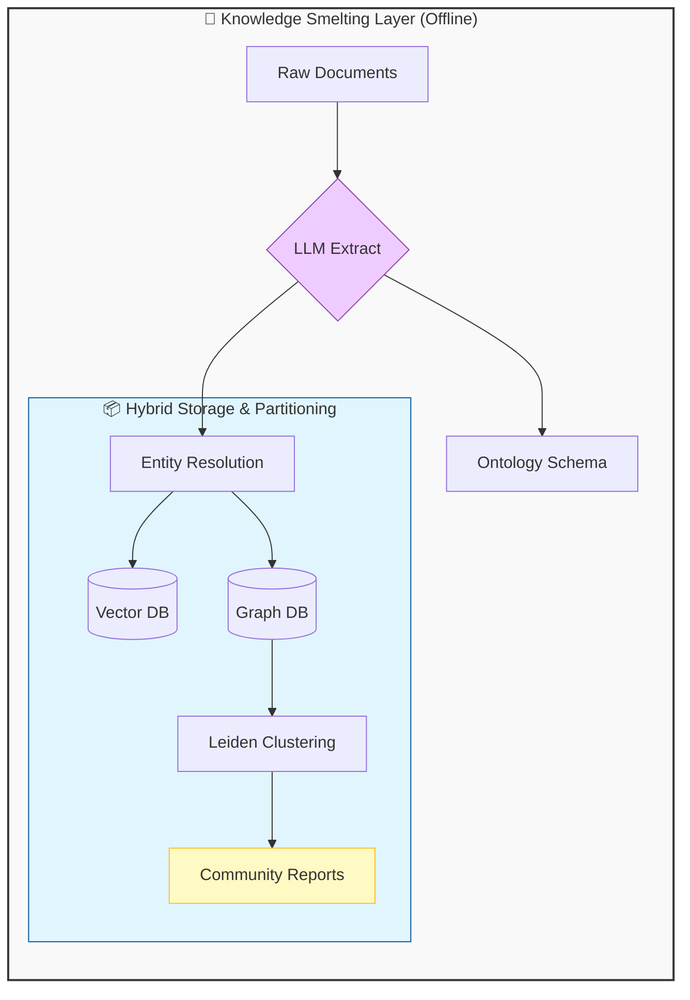
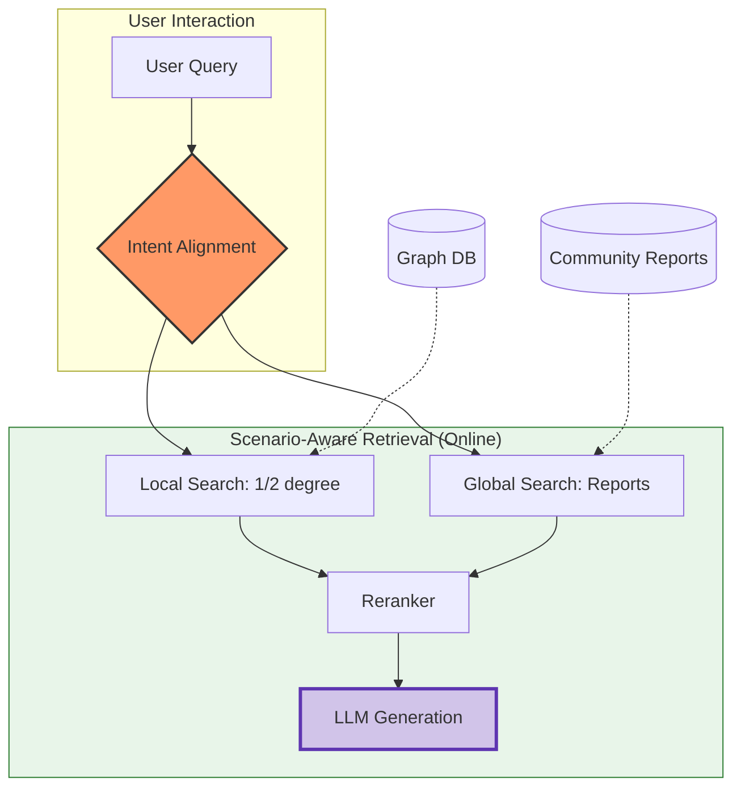

# GraphRAG: Logical Topology & Deep Knowledge Smelting

*Prerequisite: [02_Advanced_RAG.md](02_Advanced_RAG.md).*

---

To achieve 100% retrieval success in complex reasoning scenarios, systems must evolve from semantic "cloud" matching (Vectors) to deterministic "mesh" connectivity (Graphs).

**Executive Summary: The Bridge from Semantic to Logic**
This manual addresses the "Logic Ceiling" of traditional RAG by introducing **Graph-Augmented Generation**. While Vectors find similar fragments, Graphs reconstruct the logical backbone of knowledge, enabling multi-hop reasoning and global dataset synthesis.

### 🛠️ The Dual-Engine Architecture

To achieve determinism, GraphRAG operates on two distinct timelines: **Offline Knowledge Smelting** (building the logical map) and **Online Scenario-Aware Retrieval** (navigating the map).

#### 1. Offline: Knowledge Smelting (The Logic Foundation)

#### 2. Online: Scenario-Aware Retrieval (The Reasoning Engine)

## 1. Why Vector RAG Hits the "Logic Ceiling"

Traditional Vector-only RAG excels at local semantic search but fails in three critical industrial scenarios:

- **The Multi-hop Reasoning Gap**: If a query requires connecting facts across Document A (Product Warranty) and Document B (Recall Notice), a vector search for "Warranty" may never surface the "Recall" context.
- **The Global Summarization Failure**: Questions like "What are the common failure patterns in the last 12 months?" require a holistic view that cannot be captured by retrieving the Top-K most similar text chunks.
- **Semantic vs. Logical Ambiguity**: Vectors might retrieve "Product X is Large" and "Product X is Small" as equally similar, failing to resolve the logical contradiction without explicit property nodes.

## 2. Knowledge Modeling: Deep Logic Smelting

Transforming raw text into a Knowledge Graph (KG) is the ultimate form of "Knowledge Smelting."

### 2.1 From Strings to Things: Ontology-Driven Extraction

- **The Pitfall of Open Extraction**: Simply extracting any `(Subject, Predicate, Object)` triplets creates "Noise Edges" (e.g., `[A] -> [mentioned in] -> [B]`).
- **Schema-Driven Ontology**: Defined fixed classes and relationship types (e.g., `is_part_of`, `caused_by`, `contradicts`). This ensures the "topology" of the graph reflects the ground truth of the business domain.

### 2.2 Entity Resolution (Deduplication)

- **The 100% Precision Anchor**: In large datasets, the same entity appears in multiple forms (e.g., "DeepSeek-V3" and "DS-V3").
- **Resolution Strategy**: Use LLMs or clustering algorithms to merge nodes. Failure to unify entities leads to a fragmented graph where logical paths are broken.

## 3. The Microsoft GraphRAG Paradigm: Hierarchical Insights

Microsoft's GraphRAG introduces a revolutionary way to handle massive datasets by partitioning the graph.

### 3.1 Leiden Community Detection

- **Knowledge Partitioning**: Automatically groups the graph into hierarchical "Communities" (e.g., Districts -> Streets -> Rooms).
- **Global Coverage**: By partitioning, the system can generate a **Community Report** (Generative Summary) for every cluster.

### 3.2 Solving "Lost in the Middle"

- Instead of feeding the LLM 50 divergent chunks, the system feeds it **Summarized Reports** from relevant communities, providing high-density context without the noise of raw text.

## 4. Search Modalities & Scenario Adaptation

Different business needs require different graph traversal strategies.

### 4.1 Local Search: Chat & Specific Facts

- **Mechanism**: Navigates 1st or 2nd-degree neighbors of a specific entity.
- **Scene**: "What are the dimensions of Product A's battery?"
- **Context Expansion**: When a query is vague ("Is there any issue?"), use graph neighbors (DRIFT Navigation) to expand the intent to relevant recall notices or safety warnings.

### 4.2 Global Search: Research & Synthesis

- **Mechanism**: Aggregates Community Reports from top-level clusters.
- **Scene**: "What are the overall risks of deploying this software in a high-security environment?"
- **Synthesis Flow**: LLM reads multiple community summaries -> Synthesizes a structured final answer.

### 4.3 NL2SQL & Text-to-Cypher: Graph as the Schema Bridge

- **NL2SQL Conversion**: Convert DB **ER Diagrams** into a Knowledge Graph. When generating SQL, the LLM traverses the graph to determine which tables must be `JOINed`, significantly outperforming vector-based schema selection.
- **Text-to-Cypher**: For deterministic, real-time queries (e.g., "Which products share the same supplier as Product A?"), use an LLM to generate a structured `Cypher` query. This transforms the graph into a **Computational Knowledge Base**, providing exact answers rather than semantic approximations.

## 5. Engineering & Cost Optimization (Vercel Pruning)

### 5.1 The Cost of Depth

- **The 50x Rule**: Graph indexing (Entity Extraction + Community Summarization) can be 50x more expensive in tokens/latency than baseline RAG.
- **Selective Graphing**: Apply the 80/20 rule. Index 80% of data via Vector RAG; only use Graph RAG for the 20% high-value "Logic-Dense" documents (e.g., policy manuals, technical specs).

### 5.2 Hybrid Indexing (Keyword + Vector + Graph)

- **100% Success Formula**:
  1. **BM25** for exact Product IDs.
  2. **Vector** for broad semantic intent.
  3. **Graph** for logical constraint validation and multi-hop connectivity.

## 6. The "100% Success" Evaluation for Graphs

- **Multi-hop Connectivity Test**: Can the system answer a question that requires jumping from Doc A to Doc B?
- **Logical Contradiction Test**: Does the Graph correctly identify `Attr: Size=Large` and `Attr: Size=Small` as a conflict?
- **Summarization Faithfulness**: Comparing the "Community Report" against the original raw chunks to ensure no hallucination during summarization.

## 7. Intent Anchoring: Adaptive Intent Alignment (Self-Aware RAG)

To reach the "100% Deterministic Success" ceiling, RAG systems must implement **Self-Awareness**—the ability to perceive the context of the knowledge base before rewriting the user query. This prevents semantic ambiguity and "context fracture."

### 7.1 The 4-Step Adaptive Workflow

1. **Probe Retrieval (The Vibe Check)**:
   - **Action**: Execute a fast, low-latency search using the original user query (Top-3).
   - **Goal**: Capture initial "environmental signals" from the vector database.
2. **Domain Distillation (Topic Extraction)**:
   - **Action**: Feed the probe results to a lightweight LLM.
   - **Prompt**: _"Identify the professional domain and 5 core topics based on these fragments."_
   - **Output**: `[Large Language Models, RAG Architecture, Vector DB, Persistence, AI Memory]`
3. **Dynamic Persona Construction**:
   - **Action**: Inject distilled topics into the Multi-Query template.
   - **Result**: Transforms a generic assistant into a domain-specific expert prompt (e.g., "You are an expert in Vector Databases and AI Memory...").
4. **Refined Multi-Query & Execution**:
   - **Action**: Generate high-specialization variants of the original question based on the now-anchored intent.

### 7.2 Why "Self-Awareness" Matters

| Metric                 | Adaptive Intent Alignment                          | Static Multi-Query                   |
| :--------------------- | :------------------------------------------------- | :----------------------------------- |
| **Precision**          | **Near-Perfect** (Contextually corrected)          | Moderate (Prone to polysemy)         |
| **Adaptability**       | **Universal** (One code for any domain)            | Poor (Requires manual domain tuning) |
| **Ambiguity Handling** | **High** (Resolves ambiguous terms via Vibe Check) | Low                                  |

### 7.3 Industrial Optimization (The 100% Formula)

To achieve determinism without sacrificing the "60FPS" responsiveness of modern chat interfaces:

- **Background Knowledge Smelting (Async Layer)**:
  - **Workflow**: Once data is ingested or the set of documents changes, a background thread/worker automatically triggers the "Smelting" process.
  - **Result**: The **Global Intent Mirror (GIM)** is pre-calculated and cached. When the user asks a question, the system doesn't wait to "learn" about the index—it already knows its logical bounds.
- **Zero-Latency Anchoring**:
  - By using the cached GIM, the **Persona Construction** and **Disambiguation** steps happen in sub-second time.
  - **Parallel Execution**: While the LLM is refining the intent, the system can concurrently pre-fetch potentially relevant nodes from the Graph or Vector store, minimizing perceived latency.
- **Incremental Mirror Syncing (IMS)**:
  - **Dynamicity**: In production systems with streaming data, the Smelter doesn't restart from zero. It performs an incremental analysis on new ingestions to update the GIM boundaries dynamically.
- **Session-Aware Intent Drift (SAID)**:
  - In multi-turn chat, the "Anchor" is adjusted based on session history. If the user shifts from "How to set up Chroma" to "Is it free?", the system dynamically shifts the anchoring domain from _Technical_ to _Business/Pricing_ based on the conversation trajectory.
- **Topic Revisioning**: Only trigger a Topic Distillation update if a "Topic Shift" (a significant change in session semantics) is detected in multi-turn conversations, handled as an asynchronous background check.
- **Lightweight Distillers**: Use small models (e.g., Qwen-1.5B) for topic extraction to minimize latency and token costs.
