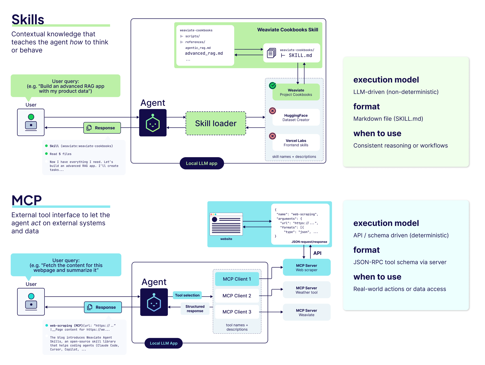

# Agent Skills

*Prerequisite: [05_MCP_Protocol.md](05_MCP_Protocol.md).*

---

While the **Model Context Protocol (MCP)** provides a standardized way for agents to access tools and data, **Agent Skills** represent the higher-level intelligence and specialized workflows that use those tools to solve complex problems.

## 1. What is an Agent Skill?

A **Skill** is a modular, high-level capability. In modern agentic frameworks (like Claude Code), a skill is often a **Markdown-based set of behavioral instructions**.

Unlike a primitive tool (which is code-heavy and deterministic), a skill uses **Natural Language** to guide how an agent should approach specific tasks. It typically involves:
- **Behavioral Guidance**: Markdown files that teach the agent "how to think" about a domain.
- **Local Execution**: Skills run locally within the agent's context, requiring minimal setup.
- **Fine-grained Control**: Provides precise instructions on behavior without necessarily writing imperative code.
- **Intent-Action Mapping**: Guides the reasoning of which MCP tools to call and how to structure the inputs.

### The Hierarchy of Capability

1.  **Primitive Tools (L1)**: Atomic operations (`read_file`, `http_get`).
2.  **MCP Tools (L2)**: Standardized, decoupled tool access via protocol.
3.  **Agent Skills (L3)**: High-level, "human-intent" based capabilities (`CommitCode`, `ResearchTopic`).
4.  **Workflows/MAS (L4)**: Orchestrating multiple skills and agents to solve a complete project.

---

## 2. Implementation Pattern: Tool vs. Skill

To understand why Skills are superior for complex tasks, compare the interaction patterns for a "GitHub Commit" task.

### 2.1 The Tool-Heavy Approach (Fragmented)
The Agent must orchestrate every atomic step.
1. **Agent** calls `git_status` → **Tool** returns output.
2. **Agent** reasons about which files to add.
3. **Agent** calls `git_add` for each file.
4. **Agent** reasons about a commit message.
5. **Agent** calls `git_commit`.
*Result: High risk of reasoning errors at each step; high token usage for multiple turns.*

### 2.2 The Skill-Based Approach (Encapsulated)
The Agent delegates the **Intent** to a specialized Skill.
1. **Agent** calls `CommitSkill(intent="Fix bug in auth")`.
2. **Skill** (internal logic):
   - Runs `git status` internally.
   - Filters relevant files.
   - Generates a draft message using a specialized "Git Expert" prompt.
   - Executes the commit.
3. **Skill** returns a single "Success" confirmation to the Agent.
*Result: Robust, atomic, and efficient.*

---

## 3. Comparison: Skills vs. MCP

It is common to confuse "Skills" with "MCP Tools." They are two complementary capability systems. The following table clarifies their fundamental differences across nine key dimensions.

| Dimension | **Skills** | **MCP** |
| :--- | :--- | :--- |
| **Definition** | Markdown-based behavioral instruction set that guides how the Agent handles specific task types. | Open protocol standard that standardizes how Agents connect to external tools and data sources. |
| **Core Philosophy** | **Behavior-Driven** — Define *"how to do things"* via natural language. | **Protocol-Driven** — Define *"how to connect"* via standard interfaces. |
| **Implementation** | Markdown files (plain-text instructions). | Code-implemented Servers (TypeScript / Python). |
| **Execution Location** | **Local** (within the Agent process). | **External** (separate process / remote service). |
| **Control Method** | Agent autonomously triggers (based on task-intent matching). | Agent invokes on demand (via JSON-RPC calls). |
| **Security** | Inherently safe — only text instructions, no code execution. | Requires permission management — involves real system operations. |
| **Core Advantage** | Zero-code, plug-and-play, easy to modify and share. | Standardized, reusable, rich ecosystem. |
| **Use Cases** | Defining workflows, coding standards, review criteria, communication style. | Connecting databases, APIs, file systems, third-party services. |
| **Analogy** | An **Operations Manual** for the employee. | A **Vendor Integration Protocol** for the company. |



---

## 4. Synergy: Skills + MCP in Action

An agent rarely uses only one. The most powerful pattern is **Skill-Guided Tool Use**, where Skills and MCP form a two-layer architecture:

- **Skills** tell the Agent **"How to do it"** — defining workflow and decision logic (Strategy Layer).
- **MCP** gives the Agent **"The ability to do it"** — providing tool and data access (Execution Layer).

```
                    Synergy Architecture
                    ═══════════════════

  User Intent: "Review this PR for security issues"
       │
       ▼
  ┌─────────────────────────────────────────────────┐
  │          Skills (Strategy Layer)                 │
  │  ┌───────────────────────────────────────────┐  │
  │  │  "security-review" Skill (Markdown)       │  │
  │  │  ● Check for OWASP Top 10 patterns       │  │
  │  │  ● Review auth/authz boundaries           │  │
  │  │  ● Flag hardcoded secrets                 │  │
  │  │  ● Output structured report               │  │
  │  └───────────────────────────────────────────┘  │
  │  Defines: WHAT to check, in WHAT order,         │
  │           and HOW to report findings.            │
  └──────────────────────┬──────────────────────────┘
                         │ Guides reasoning
                         ▼
  ┌─────────────────────────────────────────────────┐
  │          MCP (Execution Layer)                   │
  │                                                  │
  │  ┌──────────┐  ┌──────────┐  ┌──────────────┐  │
  │  │ GitHub   │  │ Grep     │  │ Semgrep      │  │
  │  │ Server   │  │ Server   │  │ Server       │  │
  │  │(fetch PR)│  │(search)  │  │(SAST scan)   │  │
  │  └──────────┘  └──────────┘  └──────────────┘  │
  │  Provides: The actual TOOLS to fetch code,       │
  │            search patterns, and run analysis.    │
  └──────────────────────┬──────────────────────────┘
                         │
                         ▼
                   External Systems
              (GitHub API, File System, ...)
```

### The Division of Responsibility

| | **Skills (Strategy)** | **MCP (Execution)** |
| :--- | :--- | :--- |
| **Question Answered** | *"What should I do and how?"* | *"What can I access and call?"* |
| **Without the other** | Knows the plan, but has no hands. | Has tools, but no strategy. |
| **Combined** | Intelligent, goal-directed action with real-world impact. | |

### Practical Example: Weaviate Hybrid Search

1. **The Skill** (Markdown) provides the "Best Practice" instructions for Weaviate schema management — e.g., "always use hybrid search with alpha=0.75 for knowledge bases."
2. **The Agent** follows the Skill's reasoning to plan the query structure.
3. **The Agent** executes the query via the **Weaviate MCP Server** (deterministic API call).

As discussed in the **Vercel Lesson** (see [04_Multi_Agent_Systems.md](04_Multi_Agent_Systems.md)), the modern trend is moving away from "micro-managing" agents with too many tiny tools.

**Skills represent the "Sweet Spot":**
- **Instead of 100 tools**, give the agent **5 powerful skills**.
- Each skill handles the "boring" low-level orchestration, allowing the main LLM to focus on the high-level strategy.
- **Example**: Instead of giving an agent separate tools for `git add`, `git commit`, and `git push`, give it a `CommitSkill`. This skill can handle the logic of checking the status, staging the right files, and generating a high-quality message internally.

---

## 5. Designing Effective Skills

A good Agent Skill should follow these principles:

1.  **Intent-Based**: Name the skill after the user's intent (`Refactor`) rather than the technical action (`EditFile`).
2.  **Self-Contained**: Handle common errors (like file not found) within the skill logic rather than letting the error propagate to the main LLM.
3.  **Telemetry-Friendly**: Provide clear logging of what the skill is doing so the user (and the orchestrator) can follow along.
4.  **Compositional**: Use MCP as the "southbound" interface (to talk to systems) and provide a "northbound" interface to the Agent.

## 6. Advanced Skill Patterns

### 6.1 Skill Discovery & Registration
How does the Agent know it has a skill?
- **Static**: Hard-coded in the system prompt.
- **Dynamic (Registry)**: The Agent queries a `/list-skills` endpoint (often an MCP tool itself) to see available high-level capabilities and their descriptions.

### 6.2 Human-in-the-Loop (HITL)
Skills that perform "Write" or "Execute" operations should include internal checkpoints:
1. **Prepare**: The skill stages the changes (e.g., draft a PR).
2. **Authorize**: The skill presents a summary to the user and waits for a `confirm` signal.
3. **Commit**: The skill executes the final action.

### 6.3 Skill Evolution & Model Agnosticity
As the underlying model becomes smarter (e.g., from Claude 3 to Claude 4):
- **Simplify**: Remove internal "chain-of-thought" steps within the skill that the model can now handle natively.
- **Widen**: Increase the complexity of the "Intent" the skill can accept.

## 7. Summary: When to Use Which?

- Use **MCP** when you need to **connect** to a new data source or API in a standard way.
- Use **Skills** when you need to **teach** the agent a new, complex workflow that combines several steps into one logical unit.

---

## Key References
- [Claude Code: Understanding Skills](https://docs.anthropic.com/en/docs/agents-and-tools/claude-code)
- [Building Modular Agent Systems](https://huyenchip.com/2023/04/11/llm-engineering.html)
- [Claude Agent Skills Development Guide](../claude_agent_skills_development_guide.md) — hands-on guide covering Skill structure, development workflow, testing, and iteration patterns for Claude Code.
- **The Complete Guide to Building Skill for Claude** (`materials/papers/09_Agent/`) — comprehensive reference for Skill design patterns, YAML frontmatter spec, and best practices.
