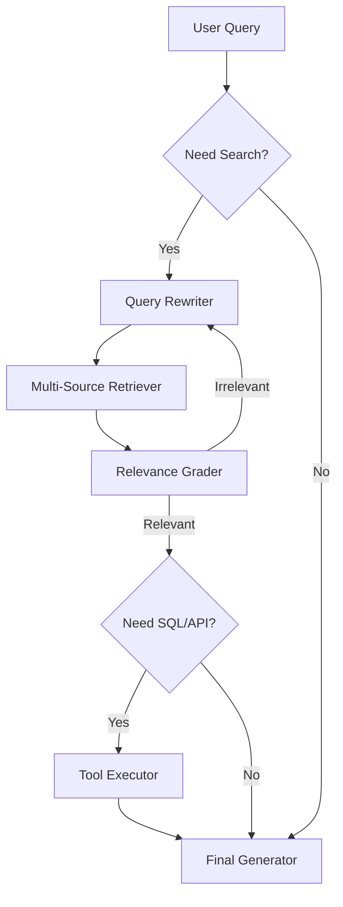

# RAG Architecture: Designing Retrieval Systems for Domain Applications

*Prerequisite: [../03_Engineering/04_RAG/](../03_Engineering/04_RAG/).*

---

This document focuses on architectural decisions when building RAG systems for specific domains. For RAG fundamentals, see 03_Engineering/04_RAG. Here we address: given a domain requirement, how do you design the retrieval pipeline?

## 1. RAG is Not One Thing

The term "RAG" covers a wide spectrum of architectures. Choosing the right variant is the first design decision.

### 1.1 The RAG Spectrum

```
Simple                                                              Complex
  |                                                                    |
  Naive RAG          Advanced RAG           Modular RAG          Agentic RAG
  (retrieve→generate) (query rewrite,       (routing, multi-     (autonomous
                       re-rank, hybrid)      source, iterative)   tool use)
```

| Variant | Description | When to Use |
| :--- | :--- | :--- |
| **Naive RAG** | Single retrieval step, top-k chunks → LLM | Prototyping, simple Q&A over small corpus |
| **Advanced RAG** | Query rewriting, hybrid search, re-ranking | Production Q&A systems, most domain applications |
| **Modular RAG** | Multiple retrievers, routing logic, iterative retrieval | Multi-source knowledge bases, complex queries |
| **Agentic RAG** | LLM decides when/what/how to retrieve | Open-ended research tasks, multi-step reasoning |

**Default recommendation**: Start with Advanced RAG. It covers 80% of domain use cases with manageable complexity.

## 2. Chunking Strategy

Chunking is the most underrated decision in RAG design. Bad chunking ruins everything downstream.

### 2.1 Strategies Compared

| Strategy | How It Works | Pros | Cons | Best For |
| :--- | :--- | :--- | :--- | :--- |
| **Fixed-size** | Split every N tokens with overlap | Simple, predictable | Breaks mid-sentence, mid-paragraph | Homogeneous text (news, articles) |
| **Recursive** | Split by paragraph → sentence → token | Respects natural boundaries | Uneven chunk sizes | General-purpose, good default |
| **Semantic** | Use embedding similarity to find topic boundaries | Coherent chunks | Slower, model-dependent | Long documents with topic shifts |
| **Document-structure** | Split by headings, sections, tables | Preserves logical units | Requires structured input | Technical documents, specifications |
| **Hierarchical** | Parent chunks (large) + child chunks (small) | Multi-granularity retrieval | Complex indexing | When both overview and detail matter |

### 2.2 Domain-Specific Chunking Considerations

For technical/engineering domains:
- **Tables**: Extract tables as separate chunks with their captions. Tables in construction specs contain critical data that gets destroyed by naive text splitting.
- **Figures/diagrams**: Store figure captions and surrounding text as chunks. Reference the figure ID for traceability.
- **Cross-references**: "See Section 3.2" is meaningless in a chunk. Either resolve references during chunking or store section metadata.
- **Numbered lists/procedures**: Keep procedural steps together. Splitting step 3 from step 4 of a safety procedure is dangerous.

### 2.3 Chunk Size Guidelines

| Use Case | Recommended Size | Reasoning |
| :--- | :--- | :--- |
| **Factual Q&A** | 256-512 tokens | Small chunks = precise retrieval |
| **Analytical questions** | 512-1024 tokens | Need more context for reasoning |
| **Document summarization** | 1024-2048 tokens | Larger context per chunk |
| **Code retrieval** | Function/class level | Semantic units, not token counts |

Overlap: 10-20% of chunk size. Ensures no information falls in the gap between chunks.

## 3. Retrieval Pipeline Design

### 3.1 Embedding Model Selection

| Model Category | Examples | Strengths | Weaknesses |
| :--- | :--- | :--- | :--- |
| **General-purpose** | BGE-large, E5-large, GTE | Good baseline, multilingual | May miss domain-specific semantics |
| **Instruction-tuned** | BGE-M3, E5-mistral | Better at asymmetric queries | Slightly slower |
| **Domain-fine-tuned** | Custom trained on domain pairs | Best domain relevance | Requires training data and effort |

**Decision path**:
1. Start with a strong general-purpose model (BGE-large-zh-v1.5 for Chinese, BGE-M3 for multilingual)
2. Evaluate retrieval quality on domain queries
3. If recall@10 < 80%, consider fine-tuning the embedding model on domain query-document pairs
4. Fine-tuning data: 1K-10K (query, positive_doc, negative_doc) triples

### 3.2 Hybrid Search: Dense + Sparse

Dense retrieval (embeddings) captures semantic similarity but misses exact keyword matches. Sparse retrieval (BM25) captures exact terms but misses paraphrases. Combining both is almost always better.

```
User Query → ┬→ Dense Retrieval (vector similarity) → Results A
             └→ Sparse Retrieval (BM25 keyword)      → Results B
                                                          ↓
                                              Reciprocal Rank Fusion (RRF)
                                                          ↓
                                                  Merged Results → Re-ranker → Top-k → LLM
```

**Why hybrid matters for domain applications**:
- Domain terminology is often precise. "FIDIC Red Book" must match exactly — semantic similarity alone might retrieve "construction contract templates" instead.
- Abbreviations and codes (e.g., "GB 50300-2013") are essentially keywords. BM25 handles these perfectly; embeddings struggle.

### 3.3 Re-ranking

The retriever casts a wide net (top-50 to top-100). The re-ranker narrows it down (top-3 to top-5) with higher precision.

| Re-ranker Type | Examples | Latency | Quality |
| :--- | :--- | :--- | :--- |
| **Cross-encoder** | BGE-reranker, Cohere Rerank | 50-200ms | High |
| **LLM-based** | GPT-4 as judge | 500ms-2s | Highest |
| **Lightweight** | ColBERT, late interaction | 10-50ms | Medium-high |

**Default**: Cross-encoder re-ranker. Best quality-latency trade-off for most applications.

### 3.4 Query Processing

Raw user queries are often poor retrieval queries. Processing them before retrieval significantly improves results.

| Technique | What It Does | When to Use |
| :--- | :--- | :--- |
| **Query rewriting** | LLM rephrases query for better retrieval | Always (low cost, high impact) |
| **HyDE** | Generate hypothetical answer, use it as query | When queries are short/vague |
| **Query decomposition** | Split complex query into sub-queries | Multi-aspect questions |
| **Query expansion** | Add synonyms, related terms | Domain with rich terminology |

## 4. Generation Pipeline Design

### 4.1 Prompt Template Structure

```
[System instruction: role, constraints, output format]

[Retrieved context]
Document 1: {title} ({source}, {date})
{content}

Document 2: {title} ({source}, {date})
{content}

[User question]

[Output instructions: cite sources, admit uncertainty, format requirements]
```

Key design decisions:
- **Context ordering**: Most relevant first? Chronological? By source type? Research shows models attend more to the beginning and end of context.
- **Source attribution**: Include source metadata so the model can cite. "According to [Document Title, Section X]..."
- **Uncertainty handling**: Explicitly instruct: "If the provided documents do not contain sufficient information to answer, say so. Do not fabricate."

### 4.2 Context Window Management

When retrieved content exceeds the context window:

1. **Truncation**: Simple but loses information. Only acceptable for naive RAG.
2. **Map-reduce**: Summarize each chunk independently, then synthesize. Good for analytical questions.
3. **Iterative refinement**: Process chunks sequentially, refining the answer. Good for comprehensive answers.
4. **Selective inclusion**: Use the re-ranker score to decide how many chunks to include. Dynamic context sizing.

## 5. Multi-Source & Agentic RAG Architecture

Domain applications often need to query multiple knowledge sources and handle complex, multi-step reasoning.

### 5.1 The Evolution: From Pipeline to Graph

| Pattern | Control Flow | Key Capability | Use Case |
| :--- | :--- | :--- | :--- |
| **Modular RAG** | Linear/DAG | Pre-defined routing between sources. | Customer support across docs + orders. |
| **Self-RAG** | Loop | Model critiques its own retrieval and relevance. | Fact-critical technical analysis. |
| **Agentic RAG** | Dynamic Graph | Model plans tool calls (search, SQL, calculate). | Financial research, comparative analysis. |
| **GraphRAG** | Map-Reduce | Global summarization over entity clusters. | "What are the common risks in all projects from 2023?" |

### 5.2 Agentic RAG Decision Logic (LangGraph Pattern)



**Implementation Components:**
1. **Query Decomposer**: Splits complex questions into sub-questions (e.g., "Compare Project A and B" -> "Retrieve A", "Retrieve B").
2. **State Manager**: Keeps track of what has been found and what is missing.
3. **Corrective RAG (CRAG)**: If the local knowledge base fails, automatically triggers a web search (e.g., Tavily or Google Search) as a fallback.
4. **Self-Correction**: If the generated answer is not grounded in the context, the model re-retrieves or re-writes.

## 6. Evaluation Metrics for RAG

### 6.1 Retrieval Quality

| Metric | What It Measures | Target |
| :--- | :--- | :--- |
| **Recall@k** | % of relevant docs in top-k results | > 80% at k=10 |
| **MRR** | Rank of first relevant result | > 0.7 |
| **NDCG@k** | Ranking quality considering relevance grades | > 0.6 |

### 6.2 Generation Quality

| Metric | What It Measures | How to Evaluate |
| :--- | :--- | :--- |
| **Faithfulness** | Does the answer stick to retrieved context? | LLM-as-judge or human review |
| **Relevance** | Does the answer address the question? | LLM-as-judge or human review |
| **Completeness** | Are all aspects of the question covered? | Human review |
| **Hallucination rate** | % of claims not supported by context | Automated claim verification |

### 6.3 End-to-End

| Metric | What It Measures |
| :--- | :--- |
| **Answer accuracy** | Compared against gold-standard answers |
| **User satisfaction** | Thumbs up/down, explicit feedback |
| **Task completion rate** | Did the user get what they needed? |

## 7. Common Failure Modes and Mitigations

| Failure | Symptom | Root Cause | Mitigation |
| :--- | :--- | :--- | :--- |
| **Retrieval miss** | Correct answer exists but wasn't retrieved | Poor embedding, wrong chunk size | Hybrid search, query rewriting, chunk optimization |
| **Context poisoning** | Irrelevant chunks mislead the model | Low retrieval precision | Re-ranking, stricter top-k cutoff |
| **Lost in the middle** | Model ignores relevant context in the middle | LLM attention bias | Reorder context, use map-reduce |
| **Hallucination despite context** | Model generates plausible but unsupported claims | Weak grounding instruction | Stronger system prompt, citation requirement |
| **Stale knowledge** | Answer based on outdated information | Index not updated | Automated ingestion pipeline, metadata filtering by date |
| **Cross-document contradiction** | Sources disagree, model picks one arbitrarily | No conflict resolution logic | Surface contradictions explicitly, let user decide |

---

## Key References

1. **Lewis et al. (2020)**: *Retrieval-Augmented Generation for Knowledge-Intensive NLP Tasks*.
2. **Gao et al. (2024)**: *Retrieval-Augmented Generation for Large Language Models: A Survey*.
